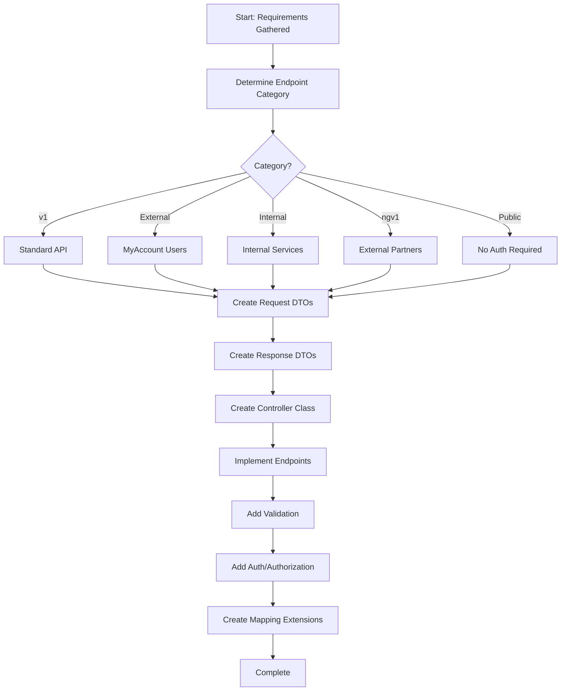

# Step: Implement Controller Layer

## Description

Implement ASP.NET Core API controllers following the project's service flow architecture pattern. Creates controllers with proper versioning, request/response DTOs, validation, authentication/authorization, and mapping.

## Purpose & Usage

Use this step when you need to:
- Implement new API endpoints for any feature
- Add endpoints to existing controllers
- Create versioned or category-specific endpoints
- Set up request/response DTOs with mapping

**Output**: Controller class, request/response DTOs, mapping extensions.

## Quick Reference

| Category | Auth | Use Case |
|----------|------|----------|
| v1 | Standard | Standard API endpoints |
| External | MyAccount | External user-facing endpoints |
| Internal | Service | Internal service communication |
| ngv1 | Partner | External partner APIs |
| Public | None | Public endpoints |

## Flow

