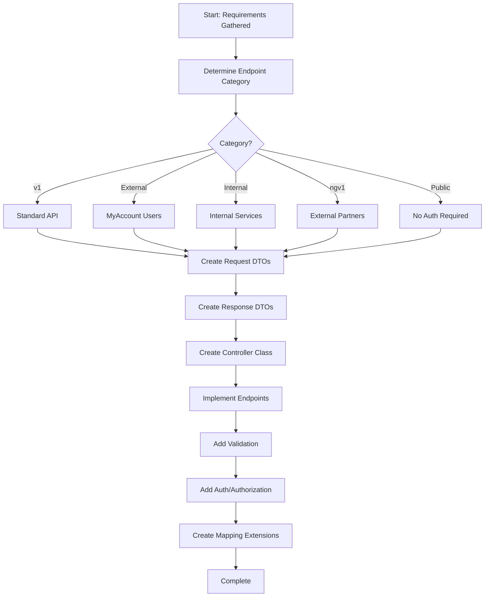

<!--
Step: Implement Controller Layer
Purpose: Implement ASP.NET Core API controllers with proper versioning, DTOs, validation, and authentication
-->

# Step: Implement Controller Layer

## Description

Implement ASP.NET Core API controllers following the project's service flow architecture pattern. Creates controllers with proper versioning, request/response DTOs, validation, authentication/authorization, and mapping.

## Purpose & Usage

Use this step when you need to:
- Implement new API endpoints for any feature
- Add endpoints to existing controllers
- Create versioned or category-specific endpoints
- Set up request/response DTOs with mapping

**Output**: Controller class, request/response DTOs, mapping extensions.

## Quick Reference

| Category | Auth | Use Case |
|----------|------|----------|
| v1 | Standard | Standard API endpoints |
| External | MyAccount | External user-facing endpoints |
| Internal | Service | Internal service communication |
| ngv1 | Partner | External partner APIs |
| Public | None | Public endpoints |

---

## Agent Layer

### Required Components

- [mandatory-logging.md](../_components/mandatory-logging.md) - Logging guidelines
- Project-specific API design and authentication patterns documentation

### Metadata
- **Prerequisites**: Understanding of required endpoints, authentication requirements, service layer contracts
- **Outputs**: Controller class in `WebApi/Controllers/{category}/`, Request DTOs, Response DTOs, Mapping extensions

### Guidance

<!-- @include: _components/mandatory-logging.md -->

**Specific Actions:**

1. **Determine Endpoint Category** - Identify the appropriate controller category based on API consumers
2. **Create Request DTOs** - Define input models in `Contracts/Requests/`
3. **Create Response DTOs** - Define output models in `Contracts/Responses/`
4. **Create Controller Class** - Implement controller with proper attributes and versioning
5. **Implement Endpoints** - Add action methods with proper HTTP verbs and routing
6. **Add Validation** - Add validation attributes to DTOs
7. **Add Authentication/Authorization** - Apply appropriate security attributes
8. **Create Mapping Extensions** - Add mappers between DTOs and service arguments/results

### Flow

### Substeps

- [ ] **Substep 1: Determine Endpoint Category**
  - Identify API consumers (internal, external, partners, public)
  - Select appropriate controller folder and versioning

- [ ] **Substep 2: Study Existing Patterns**
  - Search for similar controllers in the category
  - Review request/response DTO patterns
  - Check mapping extension patterns

- [ ] **Substep 3: Create Request/Response DTOs**
  - Create request DTOs in `Contracts/Requests/`
  - Create response DTOs in `Contracts/Responses/`
  - Add validation attributes

- [ ] **Substep 4: Create Controller Class**
  - Create controller with proper naming and attributes
  - Add route prefix and API version attributes
  - Inject required services

- [ ] **Substep 5: Implement Endpoints**
  - Add action methods for each endpoint
  - Apply HTTP verb attributes
  - Add response type attributes
  - Implement mapping and service calls

- [ ] **Substep 6: Create Mapping Extensions**
  - Create mapping methods for DTOs to service arguments
  - Create mapping methods for service results to DTOs

### Memory File Usage

**Write to**: Current step section in memory.md
- Information Produced: Endpoints created, DTOs, controller location
- Files Modified/Created: Controller, DTOs, mapping extensions
