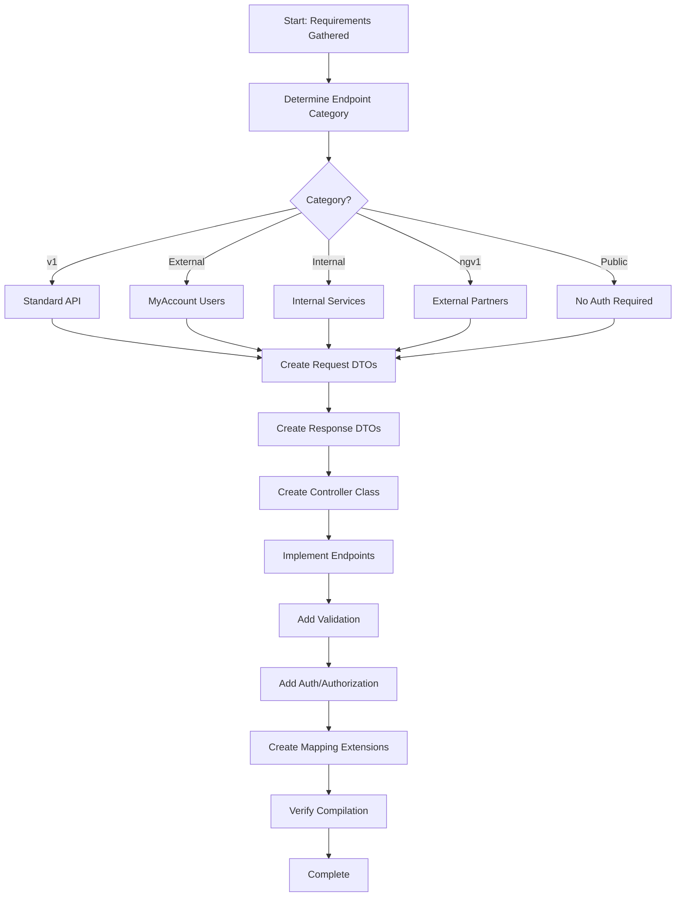

# Process Step: Implement Controller Layer

## Required Components

- [mandatory-logging.md](_components/mandatory-logging.md) - Logging guidelines
- `.github/instructions/code-conventions.instructions.md` - Code conventions
- Project-specific API design best practices documentation
- Project-specific authentication patterns documentation
- Project-specific API versioning patterns documentation
- Project-specific service layer patterns documentation
- Project-specific dependency injection patterns documentation
- Project-specific logging patterns documentation

## Metadata
- **Prerequisites**: 
  - Understanding of required endpoints (HTTP verbs, routes, data)
  - Authentication/authorization requirements identified
  - Service layer contracts (Arguments, Results) should exist before creating mappings
- **Outputs**:
  - Controller class in `WebApi/Controllers/{category}/`
  - Request DTOs in `Contracts/Requests/`
  - Response DTOs in `Contracts/Responses/`
  - Mapping extensions in `WebApi/Mapping/`

## Description
Implements ASP.NET Core API controllers following the project's service flow architecture pattern. This step creates controllers with proper versioning, request/response DTOs, validation, authentication/authorization, and mapping between API contracts and service arguments/results.

## When to Use This Step
- Implementing new API endpoints for any feature
- Adding endpoints to existing controllers
- Creating versioned or category-specific endpoints

## Process Flow

## Guidance

<!-- @include: _components/mandatory-logging.md -->

## Implementation Steps

### 1. Gather Requirements
- [ ] Identify or confirm:
  - Controller name and category (v1, External, Internal, ngv1, Public)
  - All endpoints needed (HTTP verbs, routes, parameters)
  - Request/Response DTOs needed
  - Service dependencies required (which manager/service will handle business logic)
  - Authentication/Authorization requirements
  - Validation rules for inputs

### 2. Determine Controller Category and Location
Based on the endpoint's intended audience:

| Category | Path | Purpose | Auth Required |
|----------|------|---------|---------------|
| `v1/` | `WebApi/Controllers/v1/` | Standard API endpoints | Yes |
| `External/` | `WebApi/Controllers/External/` | MyAccount user endpoints | Yes |
| `Internal/` | `WebApi/Controllers/Internal/` | Internal service endpoints | Yes (Service-to-Service) |
| `ngv1/` | `WebApi/Controllers/ngv1/` | External partner endpoints | Yes (Partner Auth) |
| `Public/` | `WebApi/Controllers/Public/` | Public endpoints | No |

### 3. Create Request DTOs

**Location**: `Contracts/Requests/{FeatureName}/`

Create Request DTOs with proper validation attributes for input validation.

**Reference**: See project-specific API design best practices for request DTO patterns and validation examples

### 4. Create Response DTOs

**Location**: `Contracts/Responses/{FeatureName}/`

Create Response DTOs that define what data is returned to API consumers.

**Reference**: See project-specific API design best practices for response DTO patterns and examples

### 5. Create Controller Class

**Location**: `WebApi/Controllers/{Category}/{ControllerName}Controller.cs`

Create the controller class using AutoConstruct for dependency injection and following project patterns.

**References**:
- Project-specific API design best practices - Controller structure and implementation patterns
- Project-specific dependency injection patterns - AutoConstruct usage
- Project-specific logging patterns - Structured logging

### 6. Implement All Endpoints

Implement each endpoint following REST conventions and project patterns for GET, POST, PUT, and DELETE operations.

**Reference**: See project-specific API design best practices for complete endpoint implementation examples for all HTTP verbs

### 7. Add Authentication and Authorization

Apply appropriate authentication and authorization based on the endpoint's category and audience.

**References**:
- Project-specific authentication patterns - Authentication patterns for different audiences
- Project-specific API versioning patterns - Versioning attributes and patterns

### 8. Create Mapping Extensions

**Location**: `WebApi/Mapping/{FeatureName}/{ActionName}Mapping.cs`

Create mapping extensions to convert between API contracts and service contracts.

**Note**: This step requires service layer contracts (Arguments, Results) to exist. If implementing API and service layers concurrently, this step should be done after service contracts are defined.

**Reference**: See project-specific service layer patterns for mapping patterns and examples

### 9. Verify Compilation

- [ ] Build the solution: `dotnet build`
- [ ] Resolve any compilation errors
- [ ] Ensure all dependencies are correctly injected
- [ ] Verify AutoCtor generated constructors properly

## Checklist

Before marking this step complete:
- [ ] All Request DTOs created with proper validation
- [ ] All Response DTOs created with appropriate properties
- [ ] Controller class created with AutoCtor
- [ ] All endpoints implemented following templates
- [ ] Appropriate authentication/authorization applied
- [ ] Mapping extensions created for all requests/results
- [ ] Solution compiles without errors
- [ ] Code follows project conventions and SOLID principles
