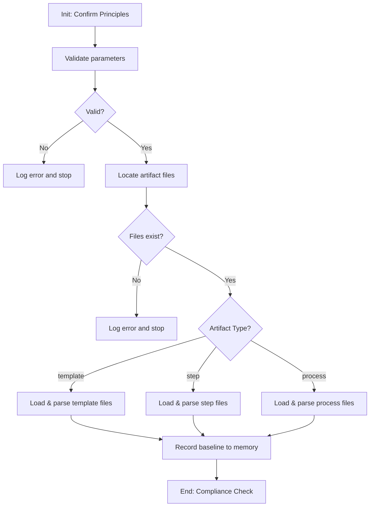

<!--
Step: analyze-current-artifact-state
Purpose: Load and analyze an existing framework artifact to document its current state
-->

# Step: Analyze Current Artifact State

## Required Components

- [mandatory-logging.md](../_components/mandatory-logging.md) - Logging guidelines

## Description

Load and analyze an existing framework artifact (template, step, or process) to document its current state before making updates. This step provides a parameterized analysis capability that adapts its parsing logic based on artifact type. It is a **read-only** step — it does not modify the artifact, only documents its structure and state.

## Purpose & Usage

Use this step when:
- Before updating a template — understand current structure (steps, parameters)
- Before modifying a step — understand substeps, guidance, and dependencies
- Before refactoring a process — understand flow, metadata, and state
- For auditing — generate a structural analysis of any artifact
- Before migration — document what exists for comparison after changes
- For onboarding — understand how an artifact is structured

**Output**: Baseline analysis recorded to memory.json (no artifacts created).

## Quick Reference

| Parameter | Required | Description |
|-----------|----------|-------------|
| `artifactType` | Yes | Type of artifact: `template` \| `step` \| `process` |
| `artifactPath` | Yes | Path to the artifact to analyze (relative to project root) |
| `focusArea` | No | Free-form description of what aspect to focus on |

| Artifact Type | Expected Files | Parse Targets |
|---------------|----------------|---------------|
| template | `{path}.md`, `{path}.json` | Steps array, parameters, metadata, flow |
| step | `{path}/{stepName}.md`, `{path}/{stepName}.json` | Substeps, guidance, dependencies, memory usage |
| process | `{path}/process.json`, `{path}/process.md`, `{path}/memory.json` | Steps list, current state, subprocess state |

### Focus Area Behavior

- **If omitted**: Full analysis of the entire artifact
- **If provided**: Agent interprets the free-form description and focuses analysis on the relevant parts

**Example values:**
- `"only the parameters"` — Focus on parameter definitions
- `"step references and their validity"` — Check step references
- `"current status and progress"` — For processes, focus on state
- `"dependencies and what files it needs"` — Focus on dependencies

## Flow

### Substeps

- [ ] **Substep 0**: Init-Step — Read operating principles and confirm for this step
- [ ] **Substep 1**: Validate parameters — Confirm artifactType, artifactPath, and interpret focusArea if provided
- [ ] **Substep 2**: Locate artifact files — Construct expected file paths based on artifact type and verify they exist
- [ ] **Substep 3**: Load primary files — Read the main artifact files identified in Substep 2
- [ ] **Substep 4**: Parse structure — Apply type-specific parsing logic, scoped by focusArea if provided
- [ ] **Substep 5**: Record baseline to memory — Write analysis results to memory.json
- [ ] **Substep 6**: End-Step — Verify compliance with operating principles

## Memory File Usage

**Read from**: Process parameters (`artifactType`, `artifactPath`, `focusArea`)

**Write to**: Current step section in memory.json
- `artifactType` — Type analyzed (template/step/process)
- `artifactPath` — Path analyzed
- `artifactName` — Extracted name
- `focusArea` — Area analyzed (null if full analysis)
- `currentStructure` — Parsed structure object (type-specific, full or partial based on focusArea)
- `baselineTimestamp` — When analysis was performed
