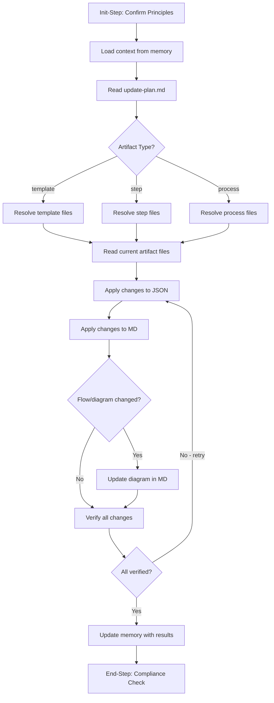

<!--
Step: apply-artifact-updates
Purpose: Apply approved changes from update-plan.md to artifact files and verify correctness
-->

# Step: Apply Artifact Updates

## Required Components

- [mandatory-logging.md](../../_components/mandatory-logging.md) - Logging guidelines

## Description

Apply approved changes from `update-plan.md` to artifact files (JSON and MD), executing each planned modification according to the artifact type and verifying changes were applied correctly. This is the "apply" phase in the **Analyze → Plan → Apply → Review** pipeline.

The step reads the approved update plan, resolves the artifact's files based on type, applies each change sequentially, and then verifies all changes match the plan's expected "after" state. If verification fails, it retries the failed changes.

## Purpose & Usage

Use this step when:
- After `plan-artifact-updates` has produced an approved `update-plan.md`
- Applying structural changes to a template (steps array, parameters, metadata, mermaid diagram)
- Applying changes to a step (substeps, guidance, dependencies, flow diagram)
- Applying changes to a process (step configuration, parameters, subprocess state)
- Any approved modification to a framework artifact's JSON and MD files

**Output**: Modified artifact files (JSON and MD), plus memory updates with verification results.

## Quick Reference

| Parameter | Required | Description |
|-----------|----------|-------------|
| `artifactType` | Yes | Type of artifact: `template` \| `step` \| `process` |
| `artifactPath` | Yes | Path to the artifact (relative to project root) |

| Artifact Type | Target Files | Change Targets | Diagram Type |
|---------------|-------------|----------------|--------------|
| template | `{path}.json`, `{path}.md` | Steps array, parameters, metadata, references, flow diagram, MD docs | Mermaid flowchart (step sequence) |
| step | `{path}/{name}.json`, `{path}/{name}.md` | Substeps, guidance, dependencies, references, memory usage | Mermaid flowchart (substep flow) |
| process | `{path}/process.json`, `{path}/process.md` | Step config, parameters, subprocess state, metadata | None typically |

## Flow

### Substeps

- [ ] **Substep 0**: Init-Step — Read operating principles and confirm for this step
- [ ] **Substep 1**: Load context from memory — Get `updatePlanRef`, `artifactPath`, `artifactType` from prior steps
- [ ] **Substep 2**: Read update plan — Parse `update-plan.md` into list of changes with before/after states
- [ ] **Substep 3**: Resolve and read artifact files — Determine file paths by type, read current state, verify against plan's "before"
- [ ] **Substep 4**: Apply changes to JSON — Execute each JSON modification using type-specific change targets
- [ ] **Substep 5**: Apply changes to MD — Execute each MD modification using type-specific change targets
- [ ] **Substep 6**: Update diagram (conditional) — Update mermaid diagram in MD if flow changed
- [ ] **Substep 7**: Verify changes applied — Re-read files, verify each change; retry from Substep 4 if any fail
- [ ] **Substep 8**: Update memory with results — Record changes applied, files modified, verification results
- [ ] **Substep 9**: End-Step — Verify compliance with operating principles

## Memory File Usage

**Read from**: Process parameters (`artifactType`, `artifactPath`) and previous step's plan (`updatePlanRef` from `plan-artifact-updates`)

**Write to**: Current step section in memory.json
- `changesApplied` — List of changes with status (applied/failed)
- `filesModified` — List of modified file paths
- `verificationResults` — Pass/fail summary per change
- `diagramUpdated` — Whether the mermaid diagram was updated
