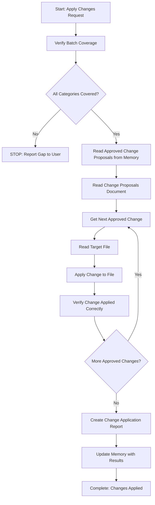

# Step: Apply Changes

## Description

Apply all user-approved changes to relevant files based on approved change proposals. This step executes approved proposals without making decisions about what changes to make - it simply applies what was approved.

## Purpose & Usage

Use this step when you need to:
- Apply previously approved change proposals to files
- Execute a set of file modifications systematically
- Document all changes made in a change application report

**Output**: Modified files, change application report (`changes-applied.md`), memory update with results.

## Quick Reference

| Action | Tool |
|--------|------|
| Read approved proposals | `read_file` on memory.json |
| Read target files | `read_file` |
| Modify existing content | `search_replace` |
| Create/replace files | `write` |
| Verify changes | `read_file` |

## Flow

