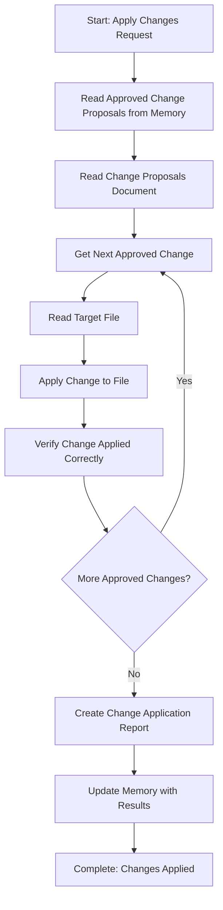

<!--
Step: Apply Changes
Purpose: Apply all user-approved changes to relevant files based on approved change proposals. Read approved change proposals from memory, apply each change to the target file using the detailed change instructions provided, ensure changes are applied correctly and completely, and document which changes were applied and to which files.
-->

# Step: Apply Changes

## Description

Apply all user-approved changes to relevant files based on approved change proposals. This step executes approved proposals without making decisions about what changes to make - it simply applies what was approved.

## Purpose & Usage

Use this step when you need to:
- Apply previously approved change proposals to files
- Execute a set of file modifications systematically
- Document all changes made in a change application report

**Output**: Modified files, change application report (`changes-applied.md`), memory update with results.

## Quick Reference

| Action | Tool |
|--------|------|
| Read approved proposals | `read_file` on memory.md |
| Read target files | `read_file` |
| Modify existing content | `search_replace` |
| Create/replace files | `write` |
| Verify changes | `read_file` |

---

## Agent Layer

### Required Components

- [mandatory-logging.md](../_components/mandatory-logging.md) - Logging guidelines
- [mandatory-consultation.md](../_components/mandatory-consultation.md) - Consultation requirements when uncertain

### Output (Detailed)

- **Modified files** - All files that had approved changes applied
- **Change application report** - `changes-applied.md` documenting all changes made, including:
  - Summary (total changes applied, files modified)
  - For each change applied: Change ID, file path, change description, status
  - List of all files modified
- **Memory update** - Summary written to memory.md with report path, files modified, and results

### Guidance

<!-- @include: _components/mandatory-logging.md -->

**Specific Actions:**

Follow the substeps below in sequence. The workflow involves reading approved change proposals from memory, reading the change proposals document, applying each approved change to the target files, verifying changes were applied correctly, and documenting all changes made.

**Files/Folders:**
- Read: `memory.md` (previous step section: approved change IDs list, change proposals document path reference)
- Read: Change proposals document (path from memory.md reference)
- Read: Target files that need changes applied
- Create: `changes-applied.md` (change application report)
- Update: Files with approved changes applied
- Update: `memory.md` (current step section with results)
- Update: `log.md` (actions taken, progress, user interactions)

**Tools:**
- Use `read_file` to read memory.md and change proposals document
- Use `read_file` to read target files before applying changes
- Use `search_replace` to apply changes that modify existing content
- Use `write` to apply changes that create new files or completely replace file content
- Use `read_file` to verify changes were applied correctly after modification

**Best Practices:**
- Read approved change proposals systematically - process each approved change ID
- For each approved change, read the target file to understand current state before applying
- Apply changes exactly as specified in the change instructions
- Verify each change was applied correctly by reading the file after modification
- Log progress for each change applied
- Document all changes in the change application report

### Memory File Usage

**When to Use Memory:**
- Always use memory for this step - change application results are needed by later steps

**Memory Usage for This Step:**
- **Read from**: 
  - Previous step section in memory.md - approved change IDs list
  - Previous step section in memory.md - change proposals document path reference
- **Write to**: Current step section in memory.md
  - Information Produced:
    - Change application report path (e.g., `changes-applied.md`)
    - Total changes applied
    - List of files modified
    - Summary of changes applied
  - Decisions Made:
    - Any decisions made during change application (if applicable)
  - Files Modified/Created:
    - List of all files that were changed
    - `changes-applied.md` report file
    - memory.md (results summary)
  - Notes:
    - Any issues encountered during change application
    - Observations about the changes applied

### Flow

### Substeps

- [ ] **Substep 1: Read Approved Change Proposals from Memory**
  - Read from memory.md previous step section:
    - Approved change IDs list (get all IDs and total count)
    - Change proposals document path reference
  - Verify approved change IDs list is available and not empty
  - Log in log.md: "Found {count} approved changes to apply"

- [ ] **Substep 2: Read Change Proposals Document**
  - Read the change proposals document using the path from memory.md
  - For each approved change ID, extract:
    - Change ID and location (file path, line number if applicable)
    - Current state and proposed change
    - Change instructions (step-by-step)
    - Rationale (if provided)
  - Log in log.md: "Read change proposals document, extracted details for {count} approved changes"

- [ ] **Substep 3: Apply Each Approved Change**
  - For each approved change in the list:
    - Log progress: "Applying change {change ID} ({current} of {total})"
    - Read the target file using read_file to understand current state:
      - Read the file completely to see current content
      - Understand the file structure and context around the change location
      - Verify the current state matches what's described in the change proposal
    - Apply the change using the appropriate tool:
      - Modify existing content: use `search_replace` with exact old_string and new_string
      - Create new file or replace content: use `write` with complete new content
      - Follow change instructions exactly as specified
    - Verify the change was applied correctly:
      - Read the file again and verify the modification matches the change proposal
      - Confirm the change is correct and complete
    - Log progress in log.md: "Applied change {change ID} to {file path}"

- [ ] **Substep 4: Create Change Application Report**
  - Create `changes-applied.md` document with:
    - Header: Change Application Report
    - Summary section:
      - Total changes applied: {count}
      - Total files modified: {count}
      - Application status: Complete
    - For each change applied (organized by change ID):
      - Change ID
      - File path
      - Change description (brief summary of what was changed)
      - Status: Applied successfully
    - List of all files modified:
      - File path for each modified file
      - Number of changes applied to each file
  - Update memory.md current step section with:
    - Change application report path: `changes-applied.md`
    - Total changes applied: {count}
    - Total files modified: {count}
    - List of files modified: [list of file paths]
  - Document in log.md: "Created changes-applied.md report with {count} changes applied to {count} files"

- [ ] **Substep 5: Update Memory with Results**
  - Write to current step section in memory.md:
    - Information Produced:
      - Change application report path: `changes-applied.md`
      - Total changes applied: {count}
      - Total files modified: {count}
      - List of files modified: [list of file paths]
    - Decisions Made:
      - Any decisions made during change application (if applicable)
    - Files Modified/Created:
      - List of all files that were changed (with full paths)
      - `changes-applied.md` report file
      - memory.md (results summary)
    - Notes:
      - Any issues encountered during change application
      - Observations about the changes applied
  - Log completion in log.md: "Step complete - {count} changes applied to {count} files"

**Notes:**
- The step is designed to be simple and focused - it executes approved proposals, doesn't make decisions
- Verification ensures changes were applied correctly, not whether they resolve underlying issues
- The step is generic and reusable across different process types and domains
