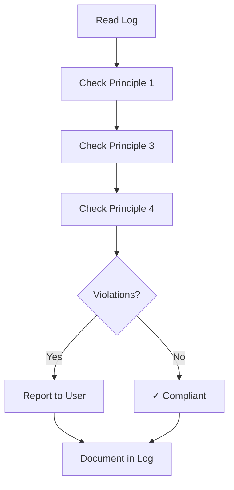

# Step: End Process Validation

## Description

Validate that all operating principles were followed throughout the process. This is a mandatory final step for all processes.

## Purpose & Usage

This step ensures that:
- All user interactions were logged before responses
- Approval checkpoints were properly handled
- No external todos were created
- Mandatory actions had output confirmations

**Output**: Compliance report documenting adherence or violations.

## Quick Reference

| Aspect | Value |
|--------|-------|
| Position | Final step |
| Mandatory | Yes - cannot be skipped |
| Output | Compliance report or "✓ All operating principles followed" |

## Compliance Checklist

| # | Principle | What to Check |
|---|-----------|---------------|
| 1 | LOG FIRST | All user interactions logged before responses |
| 2 | READ JSON | Step JSON files read for guidance |
| 3 | STOP AT CHECKPOINTS | Approval checkpoints waited for user |
| 4 | NO TODOS | todo_write not used during process |
| 5 | VERIFY ACTIONS | Mandatory actions had confirmations |

## Flow

