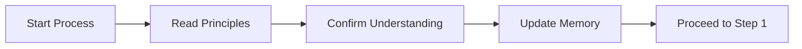

# Step: Init Process Principles

## Description

Load and confirm understanding of the agent operating principles before beginning any process work. This is a mandatory first step for all processes.

## The 3 Core Principles

### 1. READ JSON FOR GUIDANCE
Step instructions live in `.json` files, not `.md` files.

### 2. VERIFY MANDATORY ACTIONS
For MANDATORY/CRITICAL instructions: do action, then output confirmation.
- **Verification**: Output "✓ [Action] completed"

### 3. USE SUBAGENTS FOR STEPS
Delegate step execution to `step-executor` subagent. Do NOT execute steps directly in the main conversation.
- **Verification**: Each step must be executed via Task tool with `subagent_type='step-executor'`

## Quick Reference

| Aspect | Value |
|--------|-------|
| Position | First step (Step 0) |
| Mandatory | Yes - cannot be skipped |
| Output | "✓ Operating principles loaded and understood" |

## Flow

