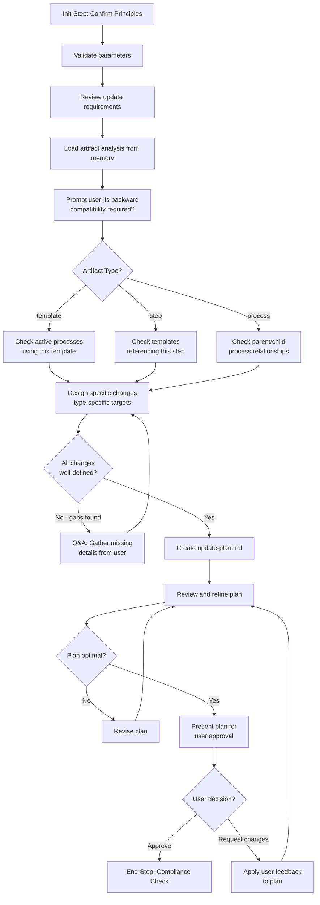

<!--
Step: plan-artifact-updates
Purpose: Plan specific changes to an existing framework artifact and produce an update-plan.md for approval
-->

# Step: Plan Artifact Updates

## Required Components

- [mandatory-logging.md](../../_components/mandatory-logging.md) - Logging guidelines
- [qa-session.md](../../_components/qa-session.md) - Q&A session pattern (conditional)

## Description

Plan specific changes to an existing framework artifact (template, step, or process) by reviewing the update description, loading the baseline analysis from a prior step, prompting the user about backward compatibility, checking for active consumers, and producing an `update-plan.md` document for approval. This step adapts its behavior based on artifact type — the same parameterized approach used by `analyze-current-artifact-state`.

This step does **not** apply changes — it only plans them. A subsequent "apply" step reads the approved plan and executes it.

## Purpose & Usage

Use this step when:
- Before updating a template — plan changes to steps, parameters, flow, documentation
- Before modifying a step — plan changes to substeps, guidance, dependencies, references
- Before refactoring a process — plan changes to state, configuration, metadata
- Any workflow that modifies an existing framework artifact and needs an approved plan first

**Output**: `update-plan.md` artifact in the process folder, plus memory updates.

## Quick Reference

| Parameter | Required | Description |
|-----------|----------|-------------|
| `artifactType` | Yes | Type of artifact: `template` \| `step` \| `process` |
| `artifactPath` | Yes | Path to the artifact (relative to project root) |
| `updateDescription` | Yes | Description of what changes are needed |
| `changeScope` | No | Scope: `"minor"` \| `"major"`. If omitted, agent determines from analysis |
| `preserveActiveConsumers` | No | Whether to warn if active consumers use this artifact |

| Artifact Type | Change Targets | Consumer Check |
|---------------|----------------|----------------|
| template | Steps array, parameters, metadata, flow diagram, MD docs | Active processes in `.user-processes/active/` |
| step | Substeps, guidance, dependencies, references, memory usage | Templates referencing via `@framework-step:` |
| process | Step config, parameters, subprocess state, metadata | Parent/child process relationships |

### Backward Compatibility

**Important**: Backward compatibility is NOT a parameter. The step **prompts the user** during execution:

> "Is backward compatibility required for this update?"

- If **yes**: Changes must not break active consumers
- If **no**: Breaking changes are allowed

## Flow

### Substeps

- [ ] **Substep 0**: Init-Step — Read operating principles and confirm for this step
- [ ] **Substep 1**: Validate parameters — Confirm artifactType, artifactPath, updateDescription
- [ ] **Substep 2**: Review update requirements — Understand requested changes and scope
- [ ] **Substep 3**: Load artifact analysis from memory — Read baseline from prior step
- [ ] **Substep 4**: Prompt user for backward compatibility — Ask and log response
- [ ] **Substep 5**: Check for active consumers — Type-specific consumer search
- [ ] **Substep 6**: Design specific changes — Before/after for each change, type-specific targets
- [ ] **Substep 7**: Q&A session (conditional) — Gather missing details if gaps found
- [ ] **Substep 8**: Create update-plan.md — Write detailed change plan document
- [ ] **Substep 9**: Review and refine plan — Self-review for quality, completeness, consistency
- [ ] **Substep 10**: Present plan for user approval — Summarize and wait for approve/request-changes
- [ ] **Substep 11**: End-Step — Verify compliance with operating principles

## Memory File Usage

**Read from**: Process parameters (`artifactType`, `artifactPath`, `updateDescription`) and previous step's analysis (`currentStructure` from `analyze-current-artifact-state`)

**Write to**: Current step section in memory.json
- `backwardCompatibility` — User's decision and implications
- `activeConsumersCheck` — Results of consumer search
- `changeDesign` — Designed changes summary
- `updatePlanRef` — Reference to update-plan.md artifact
