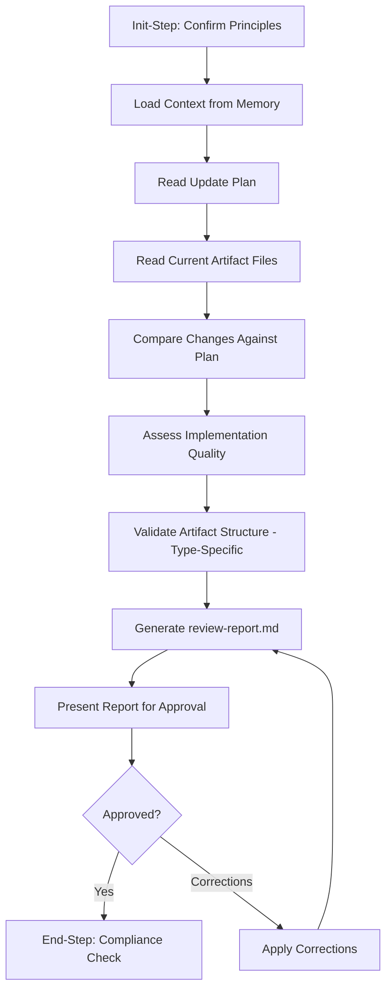

<!--
Step: review-and-validate-artifact-updates
Purpose: Review applied changes against approved plan, assess implementation quality, and validate artifact structure
-->

# Step: Review and Validate Artifact Updates

## Required Components

- [mandatory-logging.md](../../_components/mandatory-logging.md) - Logging guidelines

## Description

Review and validate changes applied to a framework artifact (template, step, or process) by comparing actual modifications against the approved update plan, assessing implementation quality, and performing type-specific structural validation. This is the "review" phase in the **Analyze → Plan → Apply → Review** pipeline.

This step goes beyond mechanical checklist verification. It evaluates whether changes were implemented in the best possible way — checking clarity, consistency, simplicity, completeness, and alignment with framework best practices. When better approaches exist, it produces concrete improvement suggestions with severity levels.

Produces `review-report.md` with plan comparison results, quality assessment findings, structural validation results, and an overall recommendation.

## Purpose & Usage

Use this step when:
- After `apply-artifact-updates` has completed and changes are applied to artifact files
- Verifying each planned change was correctly applied (no missing or partial changes)
- Detecting unplanned changes not in the approved plan
- Assessing whether the implementation is high quality (naming, consistency, simplicity, completeness)
- Performing structural validation of the updated artifact (schema, references, diagrams)
- Producing a review report for user approval before finalizing the update workflow

**Output**: `review-report.md` in the process folder, plus memory updates with comparison, quality, and validation results.

## Quick Reference

| Parameter | Required | Description |
|-----------|----------|-------------|
| `artifactType` | Yes | Type of artifact: `template` \| `step` \| `process` |
| `artifactPath` | Yes | Path to the artifact (relative to project root) |

| Artifact Type | Target Files | Validation Checks | Quality Dimensions |
|---------------|-------------|-------------------|-------------------|
| template | `{path}.json`, `{path}.md` | Steps array, step refs exist, params defined, mermaid syntax, diagram matches steps | Step descriptions, param naming, flow logic, approval placement |
| step | `{path}/{name}.json`, `{path}/{name}.md` | Substeps numbered, guidance complete, self-contained, mermaid syntax, kebab-case | Substep action specificity, guidance actionability, best practices relevance, memory usage |
| process | `{path}/process.json`, `{path}/process.md` | Step UUIDs valid, currentState refs valid, subProcessState valid, status enum, sequential numbers | Step sequence logic, parameter scoping, state consistency |

## Flow

### Substeps

- [ ] **Substep 0**: Init-Step — Read operating principles and confirm for this step
- [ ] **Substep 1**: Load context from memory — Get `updatePlanRef`, `changesApplied`, `filesModified`, `artifactType`, `artifactPath` from prior steps
- [ ] **Substep 2**: Read update plan — Parse `update-plan.md` into list of expected changes with before/after states
- [ ] **Substep 3**: Read current artifact files — Resolve file paths by artifact type, read current state of modified files
- [ ] **Substep 4**: Compare changes against plan — Verify each planned change was applied; categorize as applied/missing/partial/unplanned
- [ ] **Substep 5**: Assess implementation quality — Evaluate clarity, consistency, simplicity, completeness, missed opportunities, best practices alignment; produce findings with severity levels
- [ ] **Substep 6**: Validate artifact structure (type-specific) — Run structural validation checks based on artifact type
- [ ] **Substep 7**: Generate review-report.md — Create comprehensive report with comparison, quality, and validation results
- [ ] **Substep 8**: Present report for approval — Summarize findings, wait for user approval or correction requests
- [ ] **Substep 9**: End-Step — Verify compliance with operating principles

## Memory File Usage

**Read from**: Previous steps' memory sections (`updatePlanRef` from `plan-artifact-updates`, `changesApplied`/`filesModified`/`verificationResults` from `apply-artifact-updates`, `artifactType`/`artifactPath` from `analyze-current-artifact-state`)

**Write to**: Current step section in memory.json
- `planComparisonResults` — Status of each planned change (applied/missing/partial/unplanned)
- `qualityAssessment` — Quality findings with severity (suggestion/recommendation/concern)
- `structuralValidationResults` — Pass/fail per validation check
- `reviewReportRef` — Path to generated review-report.md
- `overallStatus` — One of: approve, approve-with-suggestions, fix-required
