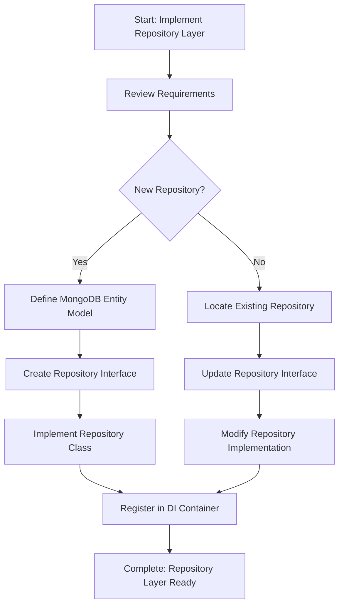

<!--
Step: Implement Repository Layer
Purpose: Implement data access layer using Repository pattern with MongoDB
-->

# Step: Implement Repository Layer

## Description

Implement the data access layer using the Repository pattern with MongoDB. Creates repository interfaces and implementations that encapsulate database operations for specific entities.

## Purpose & Usage

Use this step when you need to:
- Create new data access components for MongoDB entities
- Add new CRUD operations to existing repositories
- Modify existing repository methods
- Add custom query methods for business requirements

**Output**: Repository interfaces, implementations, and MongoDB entity models.

## Quick Reference

| Parameter | Description |
|-----------|-------------|
| `entityName` | Name of the entity (e.g., "LendingOffer") |
| `collectionName` | MongoDB collection name |
| `operations` | Operations to add/modify/remove |
| `category` | Repository category folder |
| `isNewRepository` | Whether creating new or modifying existing |

---

## Agent Layer

### Required Components

- [mandatory-logging.md](../_components/mandatory-logging.md) - Logging guidelines
- Project-specific repository and MongoDB patterns documentation

### Step Metadata
- **Prerequisites**: Domain models defined, MongoDB collections designed
- **Outputs**: Repository interfaces, implementations, MongoDB entity models

### Context Parameters

- `{{entityName}}`: The name of the entity (e.g., "LendingOffer", "Transaction")
- `{{collectionName}}`: MongoDB collection name (e.g., "lending_offers")
- `{{operations}}`: List of operations to add, modify, or remove
- `{{category}}`: Repository category/folder (e.g., "Offers", "Transactions")
- `{{isNewRepository}}`: Whether creating new (true) or modifying existing (false)

### Guidance

<!-- @include: _components/mandatory-logging.md -->

**Specific Actions:**

1. **Review Requirements** - Understand entity and operations needed
2. **Study Existing Patterns** - Search for similar repositories
3. **Create/Update Interface** - Define repository contract
4. **Create/Update Implementation** - Implement MongoDB operations
5. **Register in DI Container** - Add repository registration

### Flow

### Substeps

- [ ] **Substep 1: Review Requirements and Study Patterns**
  - Understand entity structure and required operations
  - Search for similar repositories in `Data/Repositories/`
  - Review MongoDB entity patterns in `Data/Entities/`

- [ ] **Substep 2: Create/Update MongoDB Entity Model** (if new)
  - Create entity class in `Data/Entities/`
  - Map to MongoDB collection
  - Add appropriate attributes

- [ ] **Substep 3: Create/Update Repository Interface**
  - Create interface in `Data/Repositories/Interfaces/`
  - Define method signatures for required operations
  - Include async methods with CancellationToken support

- [ ] **Substep 4: Implement Repository Class**
  - Create implementation in `Data/Repositories/{category}/`
  - Inject MongoDB client/database
  - Implement each operation using MongoDB driver
  - Add error handling and logging

- [ ] **Substep 5: Register in Dependency Injection**
  - Add repository registration to DI container
  - Follow existing registration patterns

### Memory File Usage

**Write to**: Current step section in memory.md
- Information Produced: Repository created, operations implemented
- Files Modified/Created: Entity model, interface, implementation
