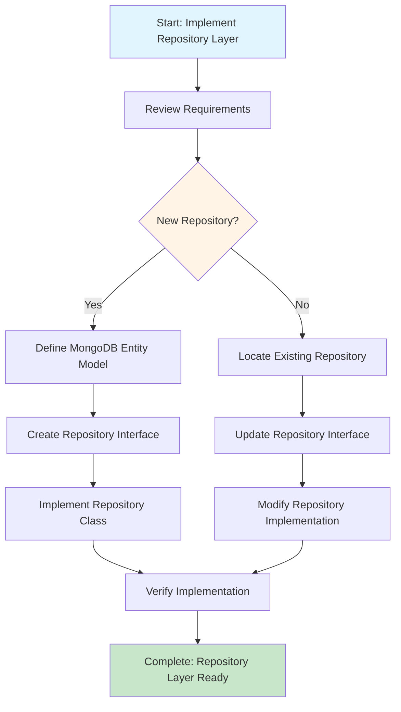

# Process Step: Implement Repository Layer

## Required Components

- [mandatory-logging.md](_components/mandatory-logging.md) - Logging guidelines
- `.user-processes/guidelines/code-conventions.instructions.md` - Code conventions
- `.user-processes/guidelines/solid.instructions.md` - SOLID principles
- Project-specific repository pattern best practices documentation
- Project-specific MongoDB best practices documentation
- Project-specific error handling patterns documentation
- Project-specific logging patterns documentation
- Project-specific dependency injection patterns documentation

## Step Metadata
- **Prerequisites**: Domain models defined, MongoDB collections designed
- **Outputs**: Repository interfaces, implementations, and MongoDB entity models

## Description

This step guides the implementation of the data access layer using the Repository pattern with MongoDB. It creates repository interfaces and implementations that encapsulate database operations for specific entities, following the project's established MongoDB patterns. This includes creating new repositories or extending existing ones with additional operations (Create, Read, Update, Delete, or custom queries).

## When to Use This Step

Use this step when you need to:
- Create new data access components for MongoDB entities
- Add new CRUD operations (Create, Read, Update, Delete) to existing repositories
- Modify existing repository methods to handle new requirements
- Add custom query methods for specific business requirements
- Remove obsolete repository methods
- Establish or extend the data layer for a feature or user story

## Context Parameters

The following parameters should be provided when executing this step:

- `{{entityName}}`: The name of the entity (e.g., "LendingOffer", "Transaction")
- `{{collectionName}}`: MongoDB collection name (e.g., "lending_offers")
- `{{operations}}`: List of operations to add, modify, or remove (e.g., "Add: CreateAsync, GetByIdAsync", "Modify: UpdateAsync to include validation", "Remove: DeleteAsync")
- `{{category}}`: Repository category/folder (e.g., "Offers", "Transactions", "Funds")
- `{{isNewRepository}}`: Whether creating a new repository (true) or modifying existing (false)

## Step Flow

## Guidance

<!-- @include: _components/mandatory-logging.md -->

## Implementation Steps

### 1. Review Requirements and Context
- [ ] Understand the entity structure and required data fields
- [ ] Review the list of operations to add, modify, or remove ({{operations}})
- [ ] Check if this is a new repository ({{isNewRepository}}) or modification of existing
- [ ] If modifying existing: Locate the repository in `Repositories/Mongo/{{category}}/`
- [ ] Review existing repository patterns in `Repositories/Mongo/`
- [ ] Identify any custom queries or complex operations needed
- [ ] Determine the appropriate repository category folder ({{category}})

### 2. Define or Update MongoDB Entity Model
**Skip this step if the entity already exists and doesn't need changes.**
- [ ] Create entity class in `Model/Mongo/LendingPartnerships/`
- [ ] Add `[BsonElement]` attributes for property mapping
- [ ] Include `_id` field with proper type (string, ObjectId, etc.)
- [ ] Follow existing entity patterns in `Model/Mongo/LendingPartnerships/`
- [ ] Reference project-specific data access best practices

### 3. Create or Update Repository Interface

**For New Repositories:**
- [ ] Create interface in `Repositories/Mongo/{{category}}/`
- [ ] Name it `I{{entityName}}Repository`
- [ ] Define method signatures for all operations from {{operations}}
- [ ] Use `Task<T>` for async operations
- [ ] Include proper nullable annotations
- [ ] Follow existing interface patterns in `Repositories/Mongo/`

**For Existing Repositories:**
- [ ] Open existing interface `I{{entityName}}Repository`
- [ ] Add new method signatures for operations marked "Add" in {{operations}}
- [ ] Modify method signatures for operations marked "Modify" in {{operations}}
- [ ] Remove method signatures for operations marked "Remove" in {{operations}}

### 4. Implement or Update Repository Class

**For New Repositories:**
- [ ] Create implementation class in same folder as interface
- [ ] Set up dependency injection following project patterns (reference project-specific dependency injection patterns)
- [ ] Inject `IMongoProvider` for database access
- [ ] Inject `ILogger<{{entityName}}Repository>` for logging
- [ ] Implement all interface methods
- [ ] Add error handling and logging
- [ ] Use MongoDB.Driver methods (InsertOneAsync, FindAsync, UpdateOneAsync, DeleteOneAsync, etc.)
- [ ] Follow existing repository patterns in `Repositories/Mongo/`

**For Existing Repositories:**
- [ ] Open existing implementation class `{{entityName}}Repository`
- [ ] Add implementations for new methods (marked "Add" in {{operations}})
- [ ] Modify implementations for changed methods (marked "Modify" in {{operations}})
- [ ] Remove implementations for obsolete methods (marked "Remove" in {{operations}})
- [ ] Update error handling and logging as needed
- [ ] Ensure all changes follow existing patterns in `Repositories/Mongo/`

### 5. Verification Checklist
- [ ] Repository interface follows naming convention: `I{{entityName}}Repository`
- [ ] Implementation follows project DI patterns (reference project-specific dependency injection patterns)
- [ ] All methods are async with proper Task return types
- [ ] Logging is implemented for all operations
- [ ] Error handling is consistent
- [ ] MongoDB collection name matches entity configuration
- [ ] Code follows SOLID principles and project conventions

## Best Practices

Refer to the following resources for implementation guidance:

**Repository-Specific Best Practices:**
- **MongoDB Patterns**: Review existing implementations in `Repositories/Mongo/` for CRUD operations, filtering, pagination, and error handling
- **Repository Pattern**: Reference project-specific repository pattern best practices
- **MongoDB Best Practices**: Reference project-specific MongoDB best practices

## Output

Upon completion of this step, you should have:

1. **Entity Model**: `Model/Mongo/LendingPartnerships/{{entityName}}.cs`
2. **Repository Interface**: `Repositories/Mongo/{{Category}}/I{{entityName}}Repository.cs`
3. **Repository Implementation**: `Repositories/Mongo/{{Category}}/{{entityName}}Repository.cs` (following project DI patterns)
4. **Ready for Use**: Repository can be injected into services for data access
