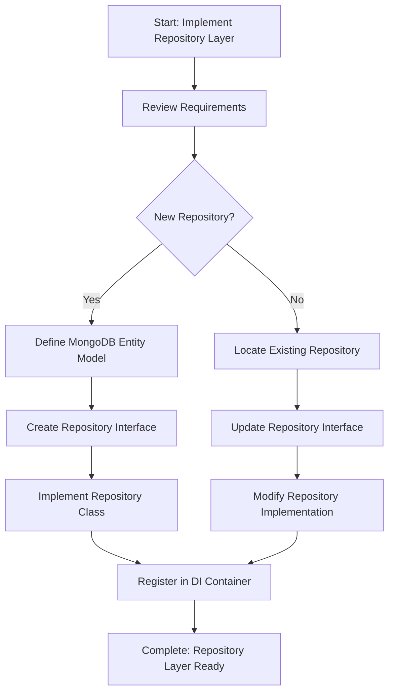

# Step: Implement Repository Layer

## Description

Implement the data access layer using the Repository pattern with MongoDB. Creates repository interfaces and implementations that encapsulate database operations for specific entities.

## Purpose & Usage

Use this step when you need to:
- Create new data access components for MongoDB entities
- Add new CRUD operations to existing repositories
- Modify existing repository methods
- Add custom query methods for business requirements

**Output**: Repository interfaces, implementations, and MongoDB entity models.

## Quick Reference

| Parameter | Description |
|-----------|-------------|
| `entityName` | Name of the entity (e.g., "LendingOffer") |
| `collectionName` | MongoDB collection name |
| `operations` | Operations to add/modify/remove |
| `category` | Repository category folder |
| `isNewRepository` | Whether creating new or modifying existing |

## Flow

