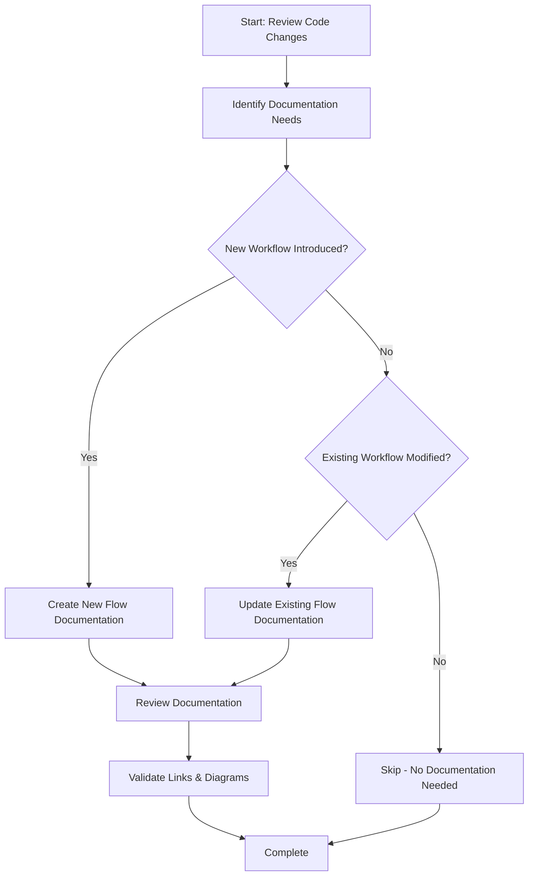

<!--
Step: Update Documentation
Purpose: Update flow documentation, component documentation, and other relevant docs for new features
-->

# Step: Update Documentation

## Required Components

- [mandatory-logging.md](_components/mandatory-logging.md) - Logging guidelines

## Description

Update flow documentation after implementing a new feature or making significant changes to existing workflows. This step ensures that flow documentation is kept in sync with the code changes and clearly explains how features work.

**Critical Requirements:**
- Review all code changes to identify if flows were affected
- Create flow documentation if a new end-to-end workflow was introduced
- Update existing flow documentation if the workflow was modified
- Ensure documentation is clear, concise, and follows existing patterns

## Output

- Created or updated flow documentation in `ai/docs/flows/`
- Documentation includes:
  - Clear description of what was added/changed
  - How the feature works (workflow, data flow)
  - Integration points with existing systems
  - Configuration requirements (if applicable)

## Guidance

<!-- @include: _components/mandatory-logging.md -->

### Documentation Scope Decision Tree 📋

Before writing documentation, use this decision tree to determine the scope and approach:

**Step 1: Determine Documentation Type**
- [ ] **New End-to-End Flow?** (e.g., webhook trigger → process → notification)
  - ✅ Yes → Create new flow documentation in `ai/docs/flows/`
  - ❌ No → Continue to Step 2
- [ ] **New Component/Service?** (e.g., new API client, new service manager)
  - ✅ Yes → Create component documentation in `ai/docs/components/`
  - ❌ No → Continue to Step 2

**Step 2: Identify Existing Documentation**
- [ ] Search for related documentation: `file_search` in `ai/docs/**/*.md`
- [ ] Use keywords: feature name, service names, API endpoints, workflow terms
- [ ] List found documentation that might need updates

**Step 3: Determine Update Scope**
- [ ] **New Step in Existing Flow?** (e.g., new calculation, new validation)
  - ✅ Yes → Update existing flow doc, add step to mermaid diagram
- [ ] **New Component in Existing System?** (e.g., new publisher, new repository)
  - ✅ Yes → Update existing component doc, add new component section
- [ ] **Configuration Change?** (e.g., new settings, new environment variables)
  - ✅ Yes → Update configuration documentation, add new settings section
- [ ] **Minor Enhancement?** (e.g., bug fix, small refactor, internal change)
  - ✅ Yes → Minimal or no documentation needed (code comments sufficient)

**Step 4: Level of Detail Required**
- [ ] **Comprehensive** (new feature, new integration, architectural change)
  - Include: Overview, mermaid diagrams, component responsibilities, data flow, error handling, integration points
- [ ] **Targeted** (enhancement to existing feature, new component)
  - Include: What changed, updated diagram, integration with existing components
- [ ] **Minimal** (small change, configuration update)
  - Include: Brief description, updated configuration example

**Step 5: Validation Checklist**
- [ ] Documentation type determined (new flow/component vs. update)
- [ ] Existing related documentation identified and reviewed
- [ ] Update scope clearly defined (comprehensive/targeted/minimal)
- [ ] Mermaid diagrams render correctly
- [ ] All links and references work
- [ ] Follows existing documentation patterns and style
- [ ] Terminology consistent with project conventions

---

**Specific Actions:**

1. **Identify Documentation Needs**
   - Review all code changes (new files, modified files)
   - **Use the Documentation Scope Decision Tree above** to determine what to document
   - Determine if a new end-to-end workflow was introduced → needs new flow documentation
   - Determine if an existing workflow was modified → needs flow documentation update
   - If no flows affected, skip this step

2. **Create or Update Flow Documentation**
   - For new workflows: Create new flow document in `ai/docs/flows/`
   - For modified workflows: Update existing flow document in `ai/docs/flows/`
   - Follow existing flow documentation patterns
   - Include:
     - Overview of the flow
     - Step-by-step sequence (with mermaid diagram)
     - Components involved and their responsibilities
     - Data transformations and validations
     - Error handling and edge cases
     - Integration points with external systems

3. **Review and Validate**
   - Ensure documentation is clear and accurate
   - Check that diagrams render correctly
   - Verify links and references work
   - Ensure consistency with existing documentation style

**Files/Folders:**
- Work in: `ai/docs/flows/` directory
- Create/Update: `ai/docs/flows/{flow-name}.md` (for new workflows)
- Reference: Existing documentation in `ai/docs/flows/` for patterns and style

**Documentation Patterns:**
- Follow existing documentation structure and style
- Use mermaid diagrams for visual representation
- Include code examples where helpful
- Link to related documentation
- Use clear headings and sections
- Keep it concise but comprehensive

**Tools:**
- Use `file_search` to find existing documentation: `ai/docs/**/*.md`
- Use `read_file` to understand existing documentation patterns
- Use `semantic_search` to find related documentation to reference
- Use mermaid for flowcharts, sequence diagrams, and architecture diagrams

**Best Practices:**
- Documentation should be written for developers who are new to the codebase
- Use examples to clarify complex concepts
- Document both the "what" and the "why"
- Keep documentation up-to-date - don't let it drift from code
- Use consistent terminology across all documentation
- Reference project conventions from `.user-processes/guidelines/`
- Link to related flows when relevant

## Memory File Usage

**When to Use Memory Files:**
- Use when this step needs to reference implementation details from earlier steps
- Use when documentation needs to track which flows/components were updated

**Memory Files for This Step:**
- **Read from**: previous implementation step in memory.md - What was implemented (files created, services added)
- **Read from**: planning step section in memory.md - Feature overview and key requirements
- **Write to**: current step section in memory.md (optional) - Track which docs were updated

## Flow

### Substeps

- [ ] **Substep 1**: Review all code changes (new files, modified services, new controllers)
- [ ] **Substep 2**: Identify if a new workflow was introduced or existing workflow was modified
- [ ] **Substep 3**: Create new flow documentation or update existing flow documentation (skip if no flows affected)
- [ ] **Substep 4**: Review documentation for clarity, accuracy, and consistency
- [ ] **Substep 5**: Validate that all diagrams render correctly and links work

**Notes:**
- If no flows were affected, this step can be skipped entirely
- Both new flows and modifications to existing flows need documentation updates
- Focus on end-to-end flows, not individual components
- Mermaid diagrams are highly valuable for complex flows
