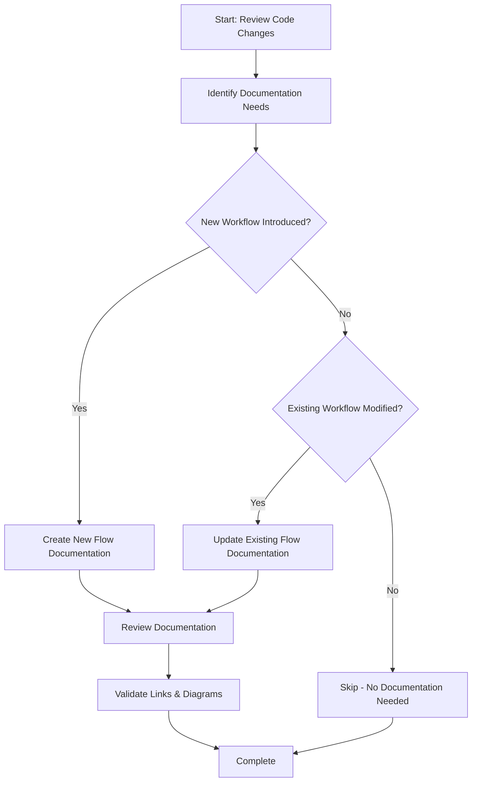

<!--
Step: Update Documentation
Purpose: Update flow documentation, component documentation, and other relevant docs for new features
-->

# Step: Update Documentation

## Description

Update flow documentation after implementing a new feature or making significant changes to existing workflows. This step ensures that documentation stays in sync with code changes and clearly explains how features work.

## Purpose & Usage

Use this step when you need to:
- Create flow documentation for a new end-to-end workflow
- Update existing flow documentation after modifying a workflow
- Add component documentation for new services or API clients
- Document configuration changes or new settings

**Output**: Created or updated documentation in `ai/docs/flows/` or `ai/docs/components/`.

## Quick Reference

| Documentation Type | When to Use | Location |
|--------------------|-------------|----------|
| Flow | New end-to-end workflow | `ai/docs/flows/{flow-name}.md` |
| Component | New service or API client | `ai/docs/components/{component-name}.md` |
| Configuration | New settings or env vars | Update existing config docs |
| Minimal/None | Bug fix, small refactor | Code comments sufficient |

## Flow

