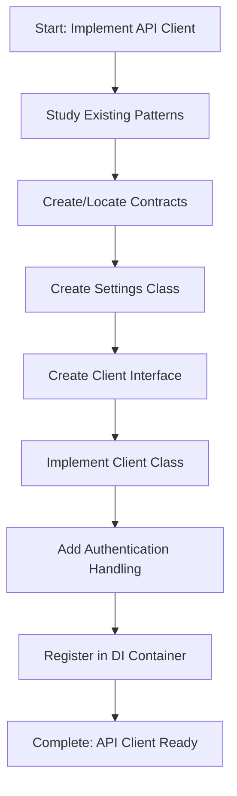

<!--
Step: Implement External API Client
Purpose: Implement a complete external API client including contracts, settings, interface, and implementation
-->

# Step: Implement External API Client

## Description

Implement a complete external API client for integrating with external HTTP APIs. Includes contracts, settings, interface, and implementation following project patterns.

## Purpose & Usage

Use this step when you need to:
- Integrate with a new external HTTP API
- Create API client with proper authentication handling
- Implement request/response contracts for external service

**Output**: Complete API client with contracts, settings, interface, and implementation.

## Quick Reference

| Auth Pattern | Use Case |
|--------------|----------|
| Apigee | Enterprise API gateway |
| ApiKey | Simple key authentication |
| OAuth | OAuth 2.0 flows |
| BearerToken | JWT/Bearer tokens |
| Custom | Custom authentication |

---

## Agent Layer

### Required Components

- [mandatory-logging.md](../_components/mandatory-logging.md) - Logging guidelines
- [pre-implementation-patterns.md](../_components/pre-implementation-patterns.md) - Pattern verification
- Project-specific HTTP client patterns documentation

### Metadata
- **Prerequisites**: API documentation, authentication requirements, request/response contracts
- **Dependencies**: HTTP client wrapper, credentials management system

### Context Parameters

- `apiName` (required): Name of the external API
- `serviceLocation` (required): Path for API client
- `authenticationPattern` (required): Type of authentication
- `endpoints` (required): List of endpoints with method, path, contracts
- `contracts` (optional): Contracts to locate or create
- `settingsProperties` (required): Configuration properties needed

### Guidance

<!-- @include: _components/mandatory-logging.md -->

<!-- @include: _components/pre-implementation-patterns.md -->

**API Client-Specific Pattern Checks:**
- [ ] Search for similar contract models in `ExternalServices/*/Contracts/`
- [ ] Search for similar API integrations in `ExternalServices/`
- [ ] Identify authentication patterns used
- [ ] Review HTTP client wrapper usage
- [ ] Check settings configuration patterns

### Flow

### Substeps

- [ ] **Substep 1: Study Existing Patterns**
  - Search for similar API clients
  - Review authentication patterns
  - Check HTTP client wrapper usage

- [ ] **Substep 2: Create/Locate Contracts**
  - Check if contracts already exist
  - Create request/response DTOs if needed
  - Follow existing naming conventions

- [ ] **Substep 3: Create Settings Class**
  - Create settings class with configuration properties
  - Register in configuration binding

- [ ] **Substep 4: Create Client Interface**
  - Define interface with methods for each endpoint
  - Include async methods with CancellationToken support

- [ ] **Substep 5: Implement Client Class**
  - Create implementation using HTTP client wrapper
  - Add authentication header handling
  - Implement each endpoint method
  - Add error handling and logging

- [ ] **Substep 6: Register in DI Container**
  - Add client registration
  - Configure HTTP client settings

### Memory File Usage

**Write to**: Current step section in memory.md
- Information Produced: API client created, endpoints implemented
- Files Modified/Created: Contracts, settings, interface, implementation
