# Process Step: Implement External API Client

## Required Components

- [mandatory-logging.md](_components/mandatory-logging.md) - Logging guidelines
- [pre-implementation-patterns.md](_components/pre-implementation-patterns.md) - Pattern verification
- `.user-processes/guidelines/code-conventions.instructions.md` - Code conventions
- Project-specific HTTP client patterns documentation
- Project-specific error handling patterns documentation
- Project-specific logging patterns documentation

## Metadata
- **Step Name**: implement-api-client
- **Prerequisites**: 
  - Understanding of external API to integrate with
  - API documentation and endpoint specifications
  - Authentication requirements (API keys, OAuth, custom headers, etc.)
  - Understanding of request/response contracts
- **Dependencies**: 
  - Existing HTTP client wrapper (`IHttpClientWrapper` or similar)
  - Credentials management system (AWS Secrets Manager, configuration, etc.)
  - Contract definitions (request/response models)

## Context Parameters

When invoking this step, provide:

- `apiName` (required): Name of the external API (e.g., "IpcnSender", "PaymentGateway")
- `serviceLocation` (required): Path where the API client will be created (e.g., "ExternalServices/Communications", "ExternalServices/Payments")
- `authenticationPattern` (required): Type of authentication ("Apigee", "ApiKey", "OAuth", "BearerToken", "Custom")
- `endpoints` (required): List of endpoints to implement, each with:
  - `method`: HTTP method (GET, POST, PUT, DELETE)
  - `path`: Endpoint path
  - `requestContract`: Request model (if applicable)
  - `responseContract`: Response model (if applicable)
- `contracts` (optional): List of contracts to locate or create
- `settingsProperties` (required): Configuration properties needed (e.g., BaseUrl, ApiKey, SendPath)

## Description

Implements a complete external API client including contracts, settings, interface, and implementation. This step handles integration with external HTTP APIs following the project's patterns for HTTP communication, authentication, error handling, and configuration management. The resulting API client can be injected into services via dependency injection.

<!-- @include: _components/pre-implementation-patterns.md -->

**API Client-Specific Pattern Checks:**
- [ ] Search codebase for similar contract models (request/response DTOs)
- [ ] Check if contract already exists in `ExternalServices/*/Contracts/`
- [ ] Search for similar API integrations in `ExternalServices/` subdirectories
- [ ] Identify authentication patterns used (Apigee, JWT, OAuth, API keys)
- [ ] Review HTTP client wrapper usage (`IHttpClientWrapper`, extension methods)
- [ ] Check retry policies and error handling patterns
- [ ] Review existing `*Settings.cs` files for naming conventions
- [ ] Check `appsettings.*.json` structure and organization
- [ ] Verify DI registration patterns in `WebApi/Registrars/ClassesRegistrations.cs`
- [ ] For Apigee: Review existing Apigee integration patterns
- [ ] For API keys: Check credential management patterns (AWS Secrets, config)
- [ ] For OAuth: Review token management and refresh patterns
- [ ] Review exception types thrown by existing API clients
- [ ] Check logging patterns for API calls (success, failure, performance)

## Flow Diagram

```mermaid
flowchart TD
    Start([Start: Implement API Client]) --> CheckContracts[Check Contract Requirements]
    
    CheckContracts --> LocateContracts{Contracts Exist?}
    LocateContracts -->|No| CreateContracts["Create Contract Models in serviceLocation/Contracts/"]
    LocateContracts -->|Yes| VerifyContracts[Verify Contract Properties]
    CreateContracts --> VerifyContracts
    
    VerifyContracts --> CreateSettings["Create Settings Class ApiNameApiSettings.cs"]
    
    CreateSettings --> AddSettingsProps["Add Configuration Properties: BaseUrl, Endpoint paths, Timeouts, Other API-specific settings"]
    
    AddSettingsProps --> CreateInterface["Create API Interface IApiNameApi.cs"]
    
    CreateInterface --> DefineInterface[Define Interface Methods for each endpoint]
    
    DefineInterface --> CreateImplementation["Create API Implementation ApiNameApi.cs"]
    
    CreateImplementation --> AddAutoCtor["Add [AutoConstruct] Attribute"]
    
    AddAutoCtor --> InjectDeps["Inject Dependencies: IHttpClientWrapper, ApiNameApiSettings, ILogger, Credentials if needed"]
    
    InjectDeps --> ImplementEndpoints[Implement Endpoint Methods]
    
    ImplementEndpoints --> ApplyAuth{Authentication Required?}
    ApplyAuth -->|Yes| AddAuthLogic["Apply Authentication: Headers, Tokens, Credentials"]
    ApplyAuth -->|No| BuildRequests[Build HTTP Requests]
    AddAuthLogic --> BuildRequests
    
    BuildRequests --> AddErrorHandling["Add Error Handling: HTTP errors, Timeouts, Deserialization errors"]
    
    AddErrorHandling --> AddLogging["Add Logging: Request/response, Errors, Performance metrics"]
    
    AddLogging --> AddConfigSection[Add Configuration Section to appsettings.local.json]
    
    AddConfigSection --> RegisterSettings[Register Settings in DI in ClassesRegistrations.cs]
    
    RegisterSettings --> VerifyAutoCtor{AutoCtor Registration Works?}
    VerifyAutoCtor -->|No| FixRegistration[Fix DI Registration]
    FixRegistration --> VerifyAutoCtor
    VerifyAutoCtor -->|Yes| CompileCheck{Code Compiles?}
    
    CompileCheck -->|No| FixErrors[Fix Compilation Errors]
    FixErrors --> CompileCheck
    CompileCheck -->|Yes| End([End: API Client Implemented])
    
    style Start fill:#e1f5e1
    style End fill:#e1f5e1
    style CreateContracts fill:#e1f0ff
    style CreateSettings fill:#fff4e1
    style CreateInterface fill:#e1f0ff
    style CreateImplementation fill:#fff4e1
    style AddAuthLogic fill:#ffe1f0
    style RegisterSettings fill:#fffacd
    style CompileCheck fill:#fffacd
```

## Input Requirements

This step requires understanding of:

1. **External API Specifications**
   - API base URL and endpoint paths
   - HTTP methods for each operation
   - Request/response formats (JSON, XML, etc.)
   - Authentication mechanism
   - Error codes and responses
   - Rate limiting and retry policies

2. **Authentication Requirements**
   - Authentication type (API key, OAuth, custom headers)
   - Credential source (secrets manager, configuration)
   - Token refresh logic (if applicable)
   - Header formatting

3. **Contract Definitions**
   - Request models (for POST/PUT operations)
   - Response models
   - Error response models
   - Required vs optional properties

## Output

Creates the following artifacts:

### 1. Contracts (if needed)
- **Location**: `{serviceLocation}/Contracts/`
- **Files**: 
  - `{RequestName}.cs` - Request models
  - `{ResponseName}.cs` - Response models
  - `{ErrorName}.cs` - Error models (if applicable)
- **Characteristics**:
  - Data annotations for validation
  - Nullable reference types where appropriate
  - JSON serialization attributes if needed

### 2. Settings Class
- **Location**: `{serviceLocation}/`
- **File**: `{apiName}ApiSettings.cs`
- **Properties**:
  - `BaseUrl` (string) - API base URL
  - Endpoint paths (string) - Specific endpoint paths
  - Timeout settings (TimeSpan, optional)
  - Retry policies (int, optional)
  - Other API-specific configuration

### 3. API Interface
- **Location**: `{serviceLocation}/`
- **File**: `I{apiName}Api.cs`
- **Methods**: One async method per endpoint

### 4. API Implementation
- **Location**: `{serviceLocation}/`
- **File**: `{apiName}Api.cs`
- **Characteristics**:
  - `[AutoConstruct]` attribute for DI
  - Partial class for AutoCtor generation
  - Injected dependencies (HttpClient, Settings, Logger, Credentials)
  - Async/await for all operations
  - Authentication header application
  - Error handling and logging
  - Request/response serialization

### 5. Configuration
- **Location**: `WebApi/appsettings.local.json`
- **Section**: Add configuration section with placeholder values

### 6. DI Registration
- **Location**: `WebApi/Registrars/ClassesRegistrations.cs`
- **Registration**: Add settings class registration
- **Note**: Interface and implementation auto-registered via AutoCtor

## Guidance

<!-- @include: _components/mandatory-logging.md -->

### Specific Actions

1. **Locate or Create Contracts**
   - Check if contracts already exist in codebase
   - Search for existing models that match API requirements
   - Create new contracts only if needed
   - Place in `{serviceLocation}/Contracts/` folder

2. **Create Settings Class**
   - Name: `{apiName}ApiSettings.cs`
   - Include all configurable values (URLs, paths, timeouts)
   - Use non-nullable properties with null-forgiving operator for required config
   - Add sensible defaults for optional settings

3. **Define API Interface**
   - Name: `I{apiName}Api.cs`
   - One method per endpoint
   - Use async Task or Task<T> return types
   - Clear, descriptive method names
   - Parameter objects for complex requests

4. **Implement API Client**
   - Name: `{apiName}Api.cs`
   - Add `[AutoConstruct]` and `partial` keywords
   - Inject required dependencies via constructor
   - Implement each interface method
   - Apply authentication as needed
   - Handle errors appropriately (log and throw or return result)

5. **Apply Authentication**
   - **Apigee**: Use existing `ApigeeBridgingCredentials` pattern
   - **API Key**: Add as header or query parameter
   - **Bearer Token**: Add Authorization header
   - **Custom**: Implement as needed per API documentation

6. **Add Error Handling**
   - Check HTTP status codes
   - Log errors with context
   - Throw exceptions for non-recoverable errors
   - Return error results for recoverable failures (if using Result pattern)

7. **Add Logging**
   - Log before sending requests (with URL, not sensitive data)
   - Log successful responses
   - Log errors with status codes and error messages
   - Use structured logging with properties

8. **Configure Settings**
   - Add section to `appsettings.local.json` with placeholders
   - Document environment-specific configuration requirements
   - Register settings in `ClassesRegistrations.cs`

### Code Patterns

**Follow these patterns:**

1. **HTTP Client Usage**:
   - Use injected `IHttpClientWrapper`
   - Create `HttpRequestMessage` for each request
   - Apply headers via request object
   - Use `JsonContent.Create()` for JSON bodies
   - Use `await _httpClient.SendAsync()`

2. **Authentication**:
   - Apply auth headers to `HttpRequestMessage`
   - Use existing credential classes when available
   - Load credentials on startup, not per request

3. **Error Handling**:
   - Check `response.IsSuccessStatusCode`
   - Throw exceptions for failures (to trigger retries if in queue)
   - Log error details before throwing

4. **AutoCtor Pattern**:
   - Add `[AutoConstruct]` attribute
   - Make class `partial`
   - Dependencies auto-injected via generated constructor

### Files/Folders

- **Contracts**: `{serviceLocation}/Contracts/`
- **Settings**: `{serviceLocation}/{apiName}ApiSettings.cs`
- **Interface**: `{serviceLocation}/I{apiName}Api.cs`
- **Implementation**: `{serviceLocation}/{apiName}Api.cs`
- **Configuration**: `WebApi/appsettings.local.json`
- **DI Registration**: `WebApi/Registrars/ClassesRegistrations.cs`

### Best Practices

Refer to the following resources for implementation guidance:

**API Client-Specific Best Practices:**
- **Authentication**: Use existing credential patterns when available
- **Configuration**: Never hardcode URLs or API keys
- **Error Context**: Include enough information in logs to debug issues

## Memory File Usage

**When to Use Memory:**
- Use when external API integration produces configuration or decisions needed by later steps
- Use when authentication pattern needs to be documented for testing
- Use when endpoint mappings need to be tracked

**Memory Usage for This Step:**

- **Write to**: Current step section in memory.md
  - **Files Created**: List of all files created (contracts, settings, interface, implementation)
  - **Configuration Added**: Configuration section name and required properties
  - **Authentication Pattern**: Which authentication method was used
  - **Endpoints Implemented**: List of endpoints and their methods
  - **Dependencies**: Any special dependencies or credentials used
  - **Notes**: Any deviations from standard patterns or special considerations
