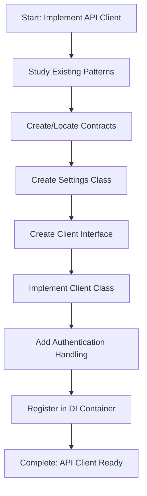

# Step: Implement External API Client

## Description

Implement a complete external API client for integrating with external HTTP APIs. Includes contracts, settings, interface, and implementation following project patterns.

## Purpose & Usage

Use this step when you need to:
- Integrate with a new external HTTP API
- Create API client with proper authentication handling
- Implement request/response contracts for external service

**Output**: Complete API client with contracts, settings, interface, and implementation.

## Quick Reference

| Auth Pattern | Use Case |
|--------------|----------|
| Apigee | Enterprise API gateway |
| ApiKey | Simple key authentication |
| OAuth | OAuth 2.0 flows |
| BearerToken | JWT/Bearer tokens |
| Custom | Custom authentication |

## Flow

