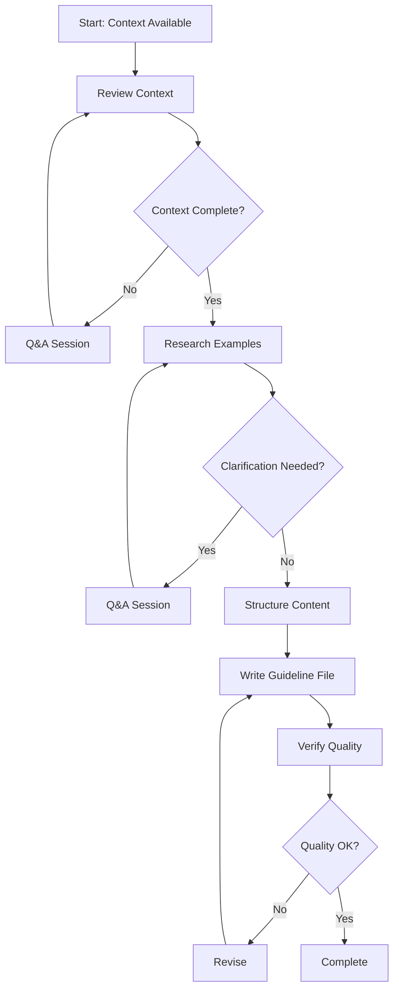

<!--
Step: Create Guideline File
Purpose: Write a guideline markdown file that answers a "How to" question with practical steps and examples
-->

# Step: Create Guideline File

## Description

Write a practical "How to" guideline document that provides clear steps, examples, and patterns for completing a specific action. This step takes the context gathered in a previous step and creates the actual guideline markdown file in the appropriate category folder.

## Purpose & Usage

Use this step when you need to:
- Create a new guideline document as part of the create-guideline template
- Write practical "How to" documentation for a specific action
- Fill in a guideline that is referenced but doesn't exist yet

**Output**: Guideline file at `.user-processes/guidelines/{category}/how-to-{name}.md`

## Quick Reference

| Input | From | Description |
|-------|------|-------------|
| `guidelineName` | Previous step | The action name (e.g., `implement-controllers`) |
| `guidelineCategory` | Previous step | Category folder (e.g., `api-design`) |
| `guidelinePurpose` | Previous step | The "How to" question this answers |

| Component | Purpose |
|-----------|---------|
| `qa-session.md` | Gather missing info if context incomplete |
| `mandatory-logging.md` | Log user interactions |

## Flow

