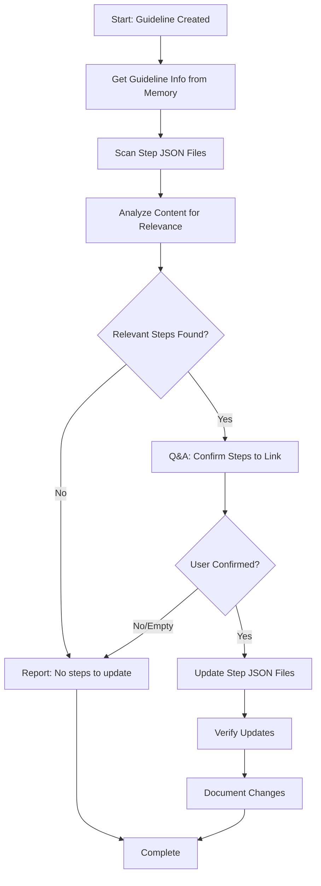

<!--
Step: Link Guideline to Steps
Purpose: Update step JSON files to add a newly created guideline to their userGuidelines array
-->

# Step: Link Guideline to Steps

## Description

After creating a guideline file, this step identifies which process steps would benefit from referencing the guideline and updates their JSON files to include it in the `userGuidelines` array. The step analyzes step content to find relevant matches and confirms with the user before making changes.

## Purpose & Usage

Use this step when you need to:
- Link a newly created guideline to existing process steps
- Update multiple step JSON files to reference the same guideline
- Ensure steps have access to relevant project-specific guidance

**Output**: Updated step JSON files with new `userGuidelines` entries

## Quick Reference

| Input | From | Description |
|-------|------|-------------|
| `guidelineFilePath` | Previous step | Path to the guideline file |
| `guidelinePurpose` | Previous step | What the guideline is for |
| `relatedSteps` (optional) | Parameters | Pre-identified steps to update |

| Component | Purpose |
|-----------|---------|
| `qa-session.md` | Confirm which steps to link |
| `mandatory-logging.md` | Log user interactions |

## Flow

