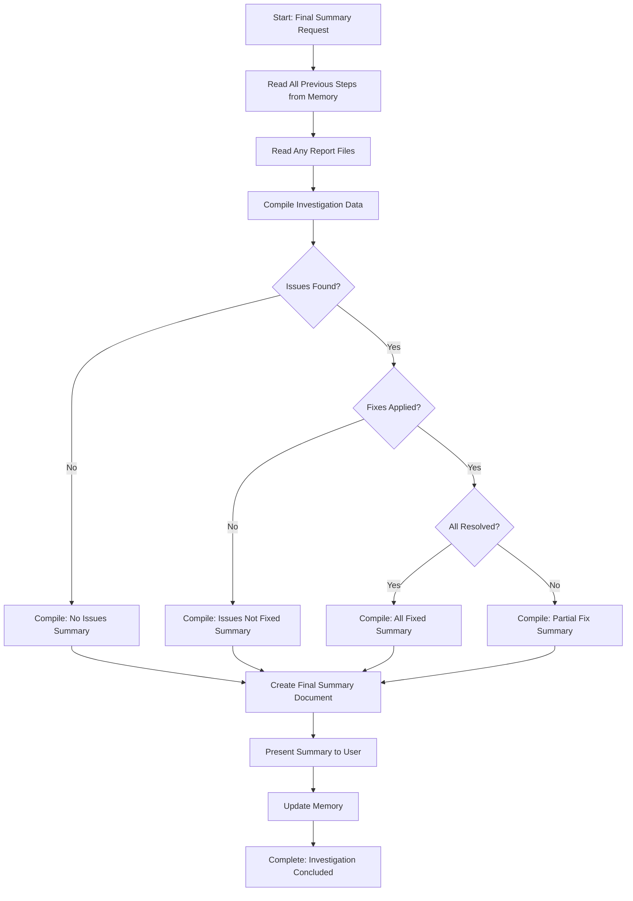

# Step: Final Summary

## Description

Provide a final comprehensive summary of an investigation that consolidates information from all previous steps. Present a clear, actionable conclusion of the investigation to the user.

## Purpose & Usage

Use this step when you need to:
- Consolidate investigation results into a single summary
- Present clear findings, fixes applied, and recommendations
- Conclude an investigation process

**Output**: Final summary document (`final-summary.md`), memory update with conclusion.

## Quick Reference

| Scenario | Summary Content |
|----------|-----------------|
| No issues found | Success message, verification passed |
| Issues found, not fixed | Issues summary, recommendations |
| Issues found and fixed | Fixes applied, verification status |

## Flow

