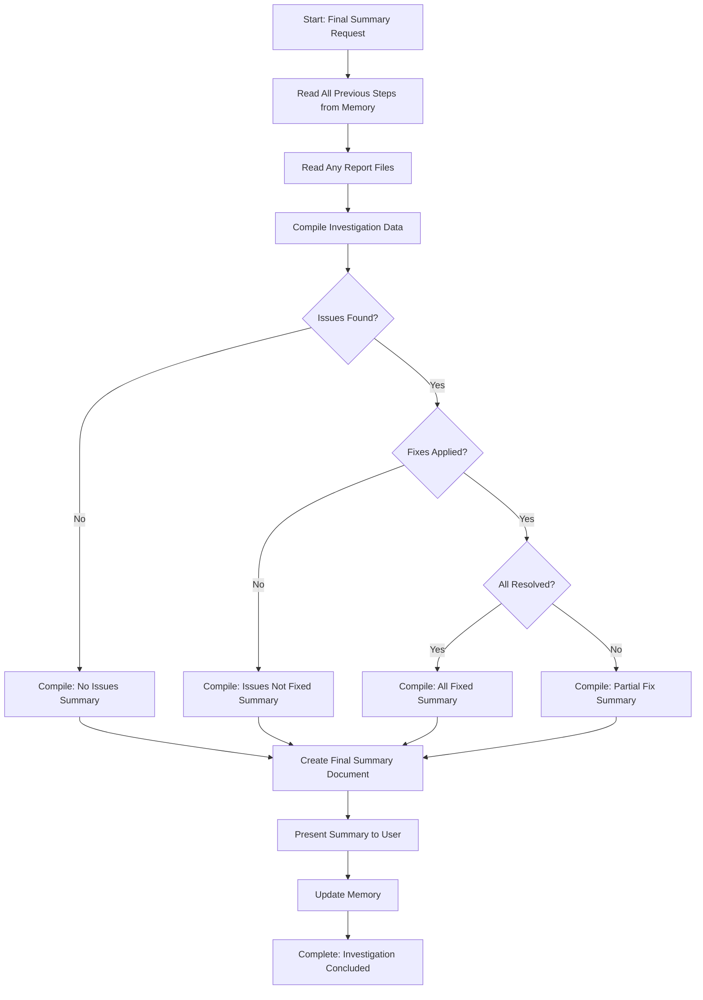

<!--
Step: Final Summary
Purpose: Provide a final comprehensive summary of an investigation that consolidates all previous steps into a clear, actionable conclusion.
-->

# Step: Final Summary

## Description

Provide a final comprehensive summary of an investigation that consolidates information from all previous steps. Present a clear, actionable conclusion of the investigation to the user.

## Purpose & Usage

Use this step when you need to:
- Consolidate investigation results into a single summary
- Present clear findings, fixes applied, and recommendations
- Conclude an investigation process

**Output**: Final summary document (`final-summary.md`), memory update with conclusion.

## Quick Reference

| Scenario | Summary Content |
|----------|-----------------|
| No issues found | Success message, verification passed |
| Issues found, not fixed | Issues summary, recommendations |
| Issues found and fixed | Fixes applied, verification status |

---

## Agent Layer

### Required Components

- [mandatory-logging.md](../_components/mandatory-logging.md) - Logging guidelines

### Output (Detailed)

- **Final summary document**: `final-summary.md` containing:
  - Executive summary with overall investigation status
  - Investigation scope
  - Files reviewed (count and list)
  - Findings summary
  - Issues found (if any) with counts and categorization
  - Fixes applied (if any) with details
  - Final verification status
  - Remaining issues (if any)
  - Recommendations (if any)
  - Clear conclusion
- **Memory update**: Summary with final summary document path, overall conclusion, final verification status, recommendations

### Guidance

<!-- @include: _components/mandatory-logging.md -->

**Specific Actions:**

Follow the substeps below. Read all investigation data from previous steps in memory, compile into organized sections, create summary document, and present to user.

**Files/Folders:**
- Read: `memory.md` (all previous step sections)
- Read: `process.md` (context parameters if not in memory)
- Read: `findings-report.md`, `issues-list.json`, `fix-proposals.md` (if created)
- Create: `final-summary.md` (comprehensive final summary document)
- Update: `memory.md` (current step section with summary path and conclusion)
- Update: `log.md` (actions taken, progress)

**Tools:**
- `read_file` - Read memory.md, process.md, report files
- `write` - Create final-summary.md
- `search_replace` - Update memory.md

**Best Practices:**
- Read systematically from all previous steps in memory.md
- Gather complete information before compiling summary
- Organize summary sections logically and clearly
- Handle all scenarios gracefully
- Ensure conclusion is clear and actionable

### Memory File Usage

**When to Use Memory:**
- Always use memory for this step - reads from all previous steps

**Memory Usage for This Step:**
- **Read from**: 
  - All previous step sections in memory.md:
    - Step 1: investigationScope, verificationCriteria
    - Step 2: files reviewed list, file count
    - Step 3: findings report path, issues list path, verification status
    - Step 4: fix proposals document path, approval status (if ran)
    - Step 5: applied changes, modified files (if ran)
    - Step 6: re-verification results, remaining issues (if ran)
- **Write to**: Current step section in memory.md
  - Information Produced:
    - Final summary document path
    - Overall conclusion
    - Final verification status
    - Recommendations

### Flow

### Substeps

- [ ] **Substep 1: Read All Previous Steps from Memory**
  - Read all step sections from memory.md
  - Gather: scope, files reviewed, findings, issues, fixes, verification status
  - Log: "Gathered data from {count} previous steps"

- [ ] **Substep 2: Read Any Report Files**
  - Read findings-report.md, issues-list.json, fix-proposals.md if they exist
  - Extract detailed information for summary

- [ ] **Substep 3: Compile Investigation Data**
  - Organize information by section
  - Determine overall status (no issues, issues found, issues fixed)
  - Prepare content for each summary section

- [ ] **Substep 4: Create Final Summary Document**
  - Create final-summary.md with:
    - Executive Summary
    - Investigation Scope
    - Files Reviewed
    - Findings Summary
    - Issues Found (if any)
    - Fixes Applied (if any)
    - Final Verification Status
    - Remaining Issues (if any)
    - Recommendations (if any)
    - Conclusion
  - Log: "Created final-summary.md"

- [ ] **Substep 5: Present Summary to User**
  - Present final-summary.md to user
  - Highlight key findings and conclusion

- [ ] **Substep 6: Update Memory**
  - Write to memory.md:
    - Final summary document path
    - Overall conclusion
    - Final verification status
    - Recommendations
