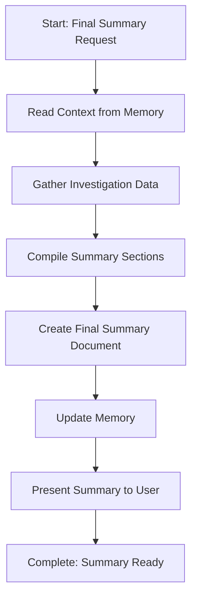

<!--
Step: Final Summary
Purpose: Provide a final comprehensive summary of an investigation that consolidates the investigation scope, what was reviewed, findings from verification, fixes applied (if any), final verification status, and any remaining issues or recommendations. Present a clear, actionable conclusion of the investigation to the user.
-->

# Step: Final Summary

## Required Components

- [mandatory-logging.md](_components/mandatory-logging.md) - Logging guidelines

## Description

Provide a final comprehensive summary of an investigation that consolidates information from all previous steps. Read investigation data from memory (scope, files reviewed, findings, issues, fixes, verification status), compile all information into organized sections, create a comprehensive final summary document, and present a clear conclusion to the user.

This step serves as the conclusion step for investigation processes, consolidating all work done during the investigation into a single, clear summary. It handles all scenarios: investigations where no issues were found, investigations where issues were found but not fixed, and investigations where issues were found and fixed.

## Output

- **Final summary document**: `final-summary.md` containing:
  - Executive summary with overall investigation status
  - Investigation scope
  - Files reviewed (count and list)
  - Findings summary
  - Issues found (if any) with counts and categorization
  - Fixes applied (if any) with details
  - Final verification status
  - Remaining issues (if any)
  - Recommendations (if any)
  - Clear conclusion
- **Memory update**: Summary written to memory.md with final summary document path, overall conclusion, final verification status, and recommendations

## Guidance

<!-- @include: _components/mandatory-logging.md -->

**Specific Actions:**

Follow the substeps below in sequence. The workflow involves reading all investigation data from previous steps in memory, compiling the information into organized sections, creating a comprehensive summary document, and presenting it to the user.

**Files/Folders:**
- Read: `memory.md` (all previous step sections to gather investigation data)
- Read: `process.md` (context parameters: investigationScope, verificationCriteria if not in memory)
- Read: `findings-report.md` (if created by previous step - for detailed findings)
- Read: `issues-list.json` (if created by previous step - for structured issues data)
- Read: `fix-proposals.md` (if created by previous step - for fix details)
- Create: `final-summary.md` (comprehensive final summary document)
- Update: `memory.md` (current step section with summary path and conclusion)
- Update: `log.md` (actions taken, progress, summary creation)

**Tools:**
- Use `read_file` to read memory.md and gather data from all previous steps
- Use `read_file` to read process.md for context parameters
- Use `read_file` to read any report files from previous steps (findings-report.md, fix-proposals.md)
- Use `read_file` to read issues-list.json if it exists
- Use `write` to create final-summary.md
- Use `search_replace` or `write` to update memory.md

**Best Practices:**
- Read systematically from all previous steps in memory.md
- Gather complete information before compiling summary
- Organize summary sections logically and clearly
- Include all relevant information from the investigation
- Present information in a clear, readable format
- Highlight key findings and conclusion prominently
- Handle all scenarios gracefully (no issues, issues not fixed, issues fixed)
- Ensure conclusion is clear and actionable
- Log progress for large investigations

## Memory File Usage

**When to Use Memory:**
- Always use memory for this step - reads from all previous steps
- Use when this step needs information from previous steps (investigation scope, findings, issues, fixes, verification status)
- Use when this step produces final summary that should be documented

**Memory Usage for This Step:**
- **Read from**: 
  - All previous step sections in memory.md:
    - Step 1 (Understand Context): investigationScope, verificationCriteria
    - Step 2 (Identify Files): files reviewed list, file count
    - Step 3 (Review, Verify, and Document): findings report path, issues list path, files reviewed count, items verified count, issues found count, verification status
    - Step 4 (Propose Fixes): fix proposals document path, approval status (if step ran)
    - Step 5 (Apply Approved Changes): applied changes, modified files (if step ran)
    - Step 6 (Re-verify After Changes): re-verification results, remaining issues (if step ran)
  - process.md - investigationScope, verificationCriteria (if not in memory)
- **Write to**: Current step section in memory.md
  - Information Produced:
    - Final summary document path: `final-summary.md`
    - Overall conclusion: summary of investigation outcome
    - Final verification status: all passed, issues found, or partial
    - Recommendations: any recommendations for future work (if applicable)
  - Decisions Made:
    - Summary organization and structure
    - Conclusion formulation
  - Files Modified/Created:
    - `final-summary.md`
    - memory.md (summary and conclusion)
  - Notes:
    - Any missing information from previous steps
    - Summary approach used

## Flow

### Substeps

- [ ] **Substep 1: Read Context from Memory**
  - Read from memory.md all previous step sections:
    - Step 1 (Understand Context) section: investigationScope, verificationCriteria
    - Step 2 (Identify Files) section: files reviewed list, file count, file identification results
    - Step 3 (Review, Verify, and Document) section: findings report path, issues list path, files reviewed count, items verified count, issues found count, issue counts by category and severity, verification status
    - Step 4 (Propose Fixes) section: fix proposals document path, approval status, approved issue IDs (if step ran)
    - Step 5 (Apply Approved Changes) section: applied changes, modified files list (if step ran)
    - Step 6 (Re-verify After Changes) section: re-verification results, remaining issues count (if step ran)
  - If information not in memory, read from process.md: investigationScope, verificationCriteria
  - Read findings-report.md if it exists (from Step 3) for detailed findings
  - Read issues-list.json if it exists (from Step 3) for structured issues data
  - Read fix-proposals.md if it exists (from Step 4) for fix details
  - Document context parameters in log.md
  - Verify that sufficient information is available to create summary

- [ ] **Substep 2: Gather Investigation Data**
  - Compile investigation scope from Step 1 or process.md
  - Compile verification criteria from Step 1 or process.md
  - Compile files reviewed:
    - Total count from Step 2 or Step 3
    - List of files from Step 2 or Step 3
  - Compile findings summary:
    - Overall verification status from Step 3
    - Total items verified from Step 3
    - Findings report reference (if available)
  - Compile issues summary (if issues were found):
    - Total issues found from Step 3
    - Issue counts by category from Step 3
    - Issue counts by severity from Step 3
    - Issues list reference (if available)
  - Compile fixes summary (if fixes were proposed/applied):
    - Fix proposals status from Step 4 (if step ran)
    - Approved fixes count from Step 4 (if step ran)
    - Applied changes from Step 5 (if step ran)
    - Modified files list from Step 5 (if step ran)
  - Compile final verification status:
    - If Step 6 ran: use re-verification results
    - If Step 6 did not run: use Step 3 verification status
    - Remaining issues count (if any)
  - Determine overall conclusion:
    - All items passed verification (no issues found)
    - Issues found but not fixed (if user rejected fixes or no fixes proposed)
    - Issues found and fixed (if fixes were applied and verified)
    - Partial resolution (if some issues remain after fixes)
  - Log data gathering completion in log.md

- [ ] **Substep 3: Compile Summary Sections**
  - Create executive summary section:
    - Investigation scope (brief)
    - Overall conclusion (one sentence)
    - Key metrics (files reviewed, items verified, issues found, fixes applied)
  - Create investigation scope section:
    - Full investigation scope description
    - Verification criteria used
  - Create files reviewed section:
    - Total files reviewed count
    - List of files reviewed (or reference to list if very long)
  - Create findings section:
    - Overall verification status
    - Total items verified
    - Summary of findings
    - Reference to findings-report.md if available
  - Create issues section (if issues were found):
    - Total issues found
    - Issue counts by category
    - Issue counts by severity
    - Summary of issue types
    - Reference to issues-list.json if available
  - Create fixes applied section (if fixes were applied):
    - Total fixes applied
    - Summary of changes made
    - List of modified files
    - Reference to fix-proposals.md if available
  - Create final verification status section:
    - Current verification status
    - Remaining issues count (if any)
    - Verification completion status
  - Create remaining issues section (if any issues remain):
    - Count of remaining issues
    - Summary of remaining issues
    - Reference to issues-list.json if available
  - Create recommendations section (if applicable):
    - Recommendations for addressing remaining issues
    - Recommendations for future work
    - Best practices or lessons learned
  - Create conclusion section:
    - Clear, actionable conclusion
    - Overall investigation outcome
    - Next steps (if applicable)
  - Log section compilation in log.md

- [ ] **Substep 4: Create Final Summary Document**
  - Create `final-summary.md` with:
    - Header: Final Summary for {investigationScope}
    - Executive Summary section (from Substep 3)
    - Investigation Scope section (from Substep 3)
    - Files Reviewed section (from Substep 3)
    - Findings section (from Substep 3)
    - Issues Found section (from Substep 3, if issues were found)
    - Fixes Applied section (from Substep 3, if fixes were applied)
    - Final Verification Status section (from Substep 3)
    - Remaining Issues section (from Substep 3, if any issues remain)
    - Recommendations section (from Substep 3, if applicable)
    - Conclusion section (from Substep 3)
  - Ensure document is well-organized and readable
  - Use clear headings and formatting
  - Include all relevant information from investigation
  - Present conclusion prominently
  - Verify all sections are complete and accurate
  - Document creation in log.md: "Created final-summary.md with all sections"

- [ ] **Substep 5: Update Memory**
  - Write to current step section in memory.md:
    - Final summary document path: `final-summary.md`
    - Overall conclusion: {summary of investigation outcome}
    - Final verification status: {all passed, issues found, or partial}
    - Recommendations: {any recommendations, if applicable}
  - Document summary approach used
  - Document any missing information from previous steps (if any)
  - Log memory update in log.md

- [ ] **Substep 6: Present Summary to User**
  - Display final-summary.md to user
  - Highlight key findings:
    - Overall conclusion
    - Total issues found (if any)
    - Fixes applied (if any)
    - Final verification status
  - Highlight conclusion section
  - Explain what the summary contains
  - Step complete - summary ready for user review
