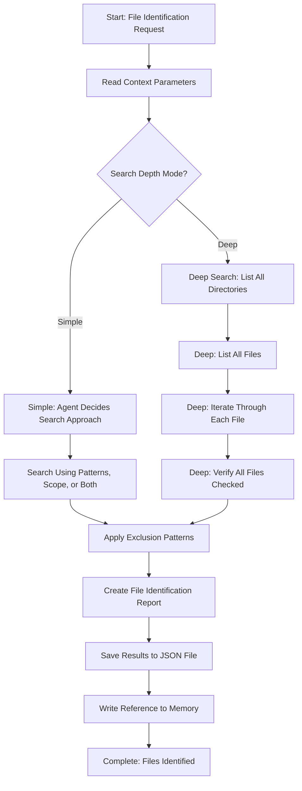

<!--
Step: Identify Files
Purpose: Identify which files and directories need to be processed based on flexible criteria (patterns, scope descriptions, or both). Supports simple (fast) and deep (exhaustive) search modes.
-->

# Step: Identify Files

## Description

Identify which files and directories need to be processed based on flexible criteria. Supports two search modes: Simple (fast, default) and Deep (exhaustive). Produces a comprehensive list of files ready for processing.

## Purpose & Usage

Use this step when you need to:
- Identify files matching specific patterns or scope descriptions
- Create a comprehensive list of files for subsequent processing
- Apply exclusion filtering to prevent unwanted files

**Output**: File list (`identified-files.json`), file identification report, memory reference.

## Quick Reference

| Search Mode | Use When |
|-------------|----------|
| Simple (default) | Large codebases, performance-critical, most cases |
| Deep | Critical operations requiring maximum completeness |

| Parameter | Description |
|-----------|-------------|
| `filePatterns` | Glob patterns to match |
| `scope` | Scope description for semantic search |
| `excludePatterns` | Patterns to exclude |
| `searchDepth` | "simple" (default) or "deep" |

---

## Agent Layer

### Required Components

- [mandatory-logging.md](../_components/mandatory-logging.md) - Logging guidelines

### Output (Detailed)

- **File list**: Comprehensive list of identified files (saved to `identified-files.json`)
  - If `includeMatchReason=false` (default): Array of file paths
  - If `includeMatchReason=true`: Array of objects with path and matchReason
- **File identification report**: Summary of search approach used, criteria applied, exclusions applied, file counts
- **Memory reference**: File count, path to JSON file, brief summary in memory.md

### Guidance

<!-- @include: _components/mandatory-logging.md -->

**Specific Actions:**

Follow the substeps below. Workflow depends on search depth mode (simple or deep).

**Files/Folders:**
- Read: `memory.md` or `process.md` (context parameters)
- Create: `identified-files.json` (results file)
- Create: `deep-search-tracking.json` (for deep search mode, temporary)
- Update: `memory.md` (current step section with reference to JSON files)
- Update: `log.md` (actions taken, progress reporting)

**Tools:**
- `read_file` - Read context parameters
- `glob_file_search` - Find files matching patterns
- `list_dir` - Explore directory structures
- `grep` - Search file contents
- `codebase_search` - Understand scope and identify targets
- `write` - Create results JSON file

**Best Practices:**
- Apply exclusions during discovery when possible (more efficient)
- Log progress periodically for large file sets (>1000 files)
- Use simple search (default) for most cases - it's fast and efficient
- Save results to separate JSON file to keep memory.md clean
- **Note**: For hidden directories (starting with `.`), `glob_file_search` may not find files. Always use `list_dir` as backup for hidden directories to ensure completeness.

### Memory File Usage

**When to Use Memory:**
- Always use memory for this step - file lists are needed by later steps

**Memory Usage for This Step:**
- **Read from**: Previous step section in memory.md or process.md
  - Context parameters: filePatterns, scope, excludePatterns, searchDepth, includeMatchReason
- **Write to**: Current step section in memory.md
  - Information Produced:
    - File count (total files identified)
    - Path to results JSON file (`identified-files.json`)
    - Brief summary (total files, excluded count)
  - Decisions Made:
    - Search approach used (patterns, scope, or combination)
    - Search depth mode selected
    - Exclusion patterns applied

### Flow

### Substeps

- [ ] **Substep 1: Read Context Parameters**
  - Read filePatterns, scope, excludePatterns, searchDepth, includeMatchReason
  - Determine search mode: "simple" (default) or "deep"
  - Document parameters in log.md

- [ ] **Substep 2: Handle Deep Search Mode** (if searchDepth = "deep")
  - List all files recursively
  - Create tracking JSON file
  - Iterate and check each file
  - Verify completeness

- [ ] **Substep 3: Handle Simple Search Mode** (if searchDepth = "simple" or not specified)
  - Agent decides search approach based on available parameters
  - If patterns available: Use glob_file_search
  - If scope available: Use codebase_search + list_dir + grep
  - If both: Agent decides how to combine

- [ ] **Substep 4: Apply Exclusion Patterns**
  - Apply common exclusions (node_modules, .git, dist, build, bin, obj, etc.)
  - Log exclusions applied and files removed count

- [ ] **Substep 5: Create File Identification Report**
  - Document search approach used
  - Include summary: total files found, excluded files count

- [ ] **Substep 6: Save Results to JSON File and Update Memory**
  - Save to `identified-files.json`
  - Write reference to memory.md
