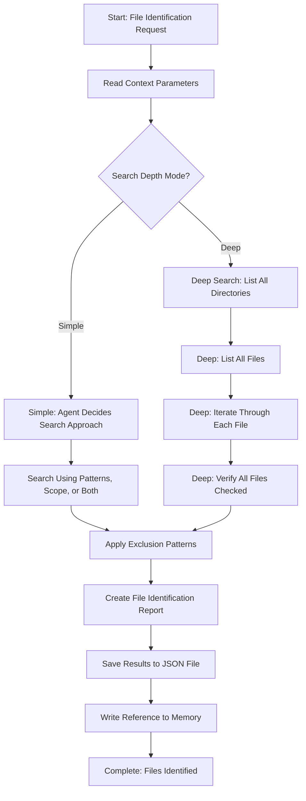

# Step: Identify Files

## Description

Identify which files and directories need to be processed based on flexible criteria. Supports two search modes: Simple (fast, default) and Deep (exhaustive). Produces a comprehensive list of files ready for processing.

## Purpose & Usage

Use this step when you need to:
- Identify files matching specific patterns or scope descriptions
- Create a comprehensive list of files for subsequent processing
- Apply exclusion filtering to prevent unwanted files

**Output**: File list (`identified-files.json`), file identification report, memory reference.

## Quick Reference

| Search Mode | Use When |
|-------------|----------|
| Simple (default) | Large codebases, performance-critical, most cases |
| Deep | Critical operations requiring maximum completeness |

| Parameter | Description |
|-----------|-------------|
| `filePatterns` | Glob patterns to match |
| `scope` | Scope description for semantic search |
| `excludePatterns` | Patterns to exclude |
| `searchDepth` | "simple" (default) or "deep" |

## Flow

