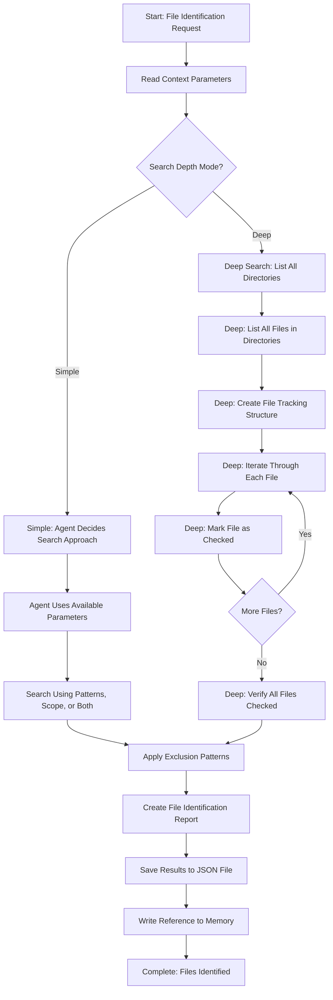

<!--
Step: Identify Files
Purpose: Identify which files and directories need to be processed based on flexible criteria (patterns, scope descriptions, or both). The step supports two search modes: Simple search (fast search using available tools) and Deep search (exhaustive, directory/file listing with tracking to ensure no files are missed). The step applies exclusion filtering and produces a comprehensive list of files ready for processing. The step is designed to scale efficiently for large codebases with thousands or tens of thousands of files through early filtering, progress reporting, and memory-efficient approaches. Deep search mode provides maximum completeness by listing all directories and files, then iterating through each with tracking.
-->

# Step: Identify Files

## Required Components

- [mandatory-logging.md](_components/mandatory-logging.md) - Logging guidelines

## Description

Identify which files and directories need to be processed based on flexible criteria (patterns, scope descriptions, or both). The step supports two search modes:

- **Simple search** (default, fast): Uses glob patterns, grep, and codebase_search for efficient file discovery. Best for large codebases and performance-critical operations.
- **Deep search** (exhaustive, complete): Lists all directories recursively, lists all files in each directory, iterates through each file marking as checked, and ensures no files are forgotten. Best for critical operations where completeness is paramount.

The step applies exclusion filtering to prevent matching unwanted files (node_modules, .git, build artifacts, etc.) and produces a comprehensive list of files ready for processing. The step is designed to scale efficiently for large codebases with thousands or tens of thousands of files through early filtering, progress reporting, and memory-efficient approaches.

The agent decides the search approach based on available parameters (patterns, scope, or both), allowing flexible and natural file discovery. Results are saved to a separate JSON file to keep memory.md clean, with only a reference stored in memory.

## Output

- **File list**: Comprehensive list of identified files (saved to separate JSON file)
  - If `includeMatchReason=false` (default): Array of file paths
  - If `includeMatchReason=true`: Array of objects with path and matchReason
- **File identification report**: Summary of search approach used, criteria applied, exclusions applied, file counts
- **Results JSON file**: `identified-files.json` containing the file list
- **Memory reference**: File count, path to JSON file, brief summary in memory.md

## Guidance

<!-- @include: _components/mandatory-logging.md -->

**Specific Actions:**

Follow the substeps below in sequence. The workflow depends on the search depth mode (simple or deep). For simple search, the agent decides the search approach based on available parameters. For deep search, the step exhaustively lists all files and checks each one systematically.

**Files/Folders:**
- Read: `memory.md` or `process.md` (context parameters: filePatterns, scope, excludePatterns, searchDepth, includeMatchReason)
- Create: `identified-files.json` (results file)
- Create: `deep-search-tracking.json` (tracking file for deep search mode, temporary)
- Update: `memory.md` (current step section with reference to JSON files)
- Update: `log.md` (actions taken, progress reporting)

**Tools:**
- Use `read_file` to read context parameters from memory.md or process.md
- Use `glob_file_search` to find files matching patterns
- Use `list_dir` to explore directory structures (for deep search or scope-based discovery)
- Use `grep` to search file contents (for scope-based discovery or file checking)
- Use `codebase_search` to understand scope and identify target directories/files
- Use `write` to create the results JSON file
- Use `search_replace` or `write` to update memory.md

**Best Practices:**
- Apply exclusions during discovery when possible (more efficient)
- Log progress periodically for large file sets (>1000 files)
- Use memory-efficient tools (glob_file_search, grep with files_only)
- For deep search, only use on scopes with <5000 files
- Use simple search (default) for most cases - it's fast and efficient
- Save results to separate JSON file to keep memory.md clean
- Record match reasons when includeMatchReason=true for transparency

## Memory File Usage

**When to Use Memory:**
- Always use memory for this step - file lists are needed by later steps
- Use when this step produces file identification results needed by subsequent steps
- Use when this step makes decisions about search approach that should be documented

**Memory Usage for This Step:**
- **Read from**: Previous step section in memory.md or process.md
  - Context parameters: filePatterns, scope, excludePatterns, searchDepth, includeMatchReason
- **Write to**: Current step section in memory.md
  - Information Produced:
    - File count (total files identified)
    - Path to results JSON file (e.g., `identified-files.json`)
    - Brief summary (total files, excluded count)
    - For deep search: Path to tracking JSON file (temporary, during iteration)
  - Decisions Made:
    - Search approach used (patterns, scope, or combination - as decided by agent)
    - Search depth mode selected (simple or deep)
    - Exclusion patterns applied
  - Files Modified/Created:
    - `identified-files.json` (results file)
    - `deep-search-tracking.json` (tracking file for deep search mode, temporary)
    - memory.md (reference to JSON files)
  - Notes:
    - Search approach documentation
    - Performance notes for large file sets

## Flow



### Substeps

- [ ] **Substep 1: Read Context Parameters**
  - Read from memory.md or process.md: filePatterns, scope, excludePatterns, searchDepth, includeMatchReason
  - Determine search mode: searchDepth = "simple" (default) or "deep"
  - Determine output detail: includeMatchReason = false (default, just file paths) or true (file paths + match explanations)
  - Document parameters in log.md

- [ ] **Substep 2: Handle Deep Search Mode (if searchDepth = "deep")**
  - **Deep Search: List All Files Recursively**
    - Determine root directory from scope or use repository root
    - Use list_dir on root directory to get all items (files and directories)
    - For each directory found, recursively call list_dir on it
    - Build complete file list (all file paths, not directories)
    - Apply directory-level exclusions early (skip node_modules, .git, dist, build, etc.)
    - Log total files found
  - **Deep Search: Create File Tracking Structure**
    - Create tracking JSON file (e.g., `deep-search-tracking.json`)
    - Initialize tracking structure: array of objects with file paths and status flags
    - JSON format:
      ```json
      [
        {"path": "src/api/controller.cs", "checked": false, "matched": false, "excluded": false, "matchReason": null},
        {"path": "src/models/user.cs", "checked": false, "matched": false, "excluded": false, "matchReason": null}
      ]
      ```
    - Each file starts with: checked=false, matched=false, excluded=false, matchReason=null
    - Log total files to check
  - **Deep Search: Iterate and Check Each File**
    - For each file in tracking JSON file:
      - Read tracking JSON file
      - Update file entry: mark checked=true
      - Check if file matches criteria using available parameters:
        - Agent decides best approach: use patterns (glob matching), scope (grep/codebase_search), or combination
        - If patterns available: check if file path matches any glob pattern
          - Use pattern matching logic (e.g., check if path matches **/*.cs)
          - If includeMatchReason=true: record which pattern matched (e.g., "matched pattern: **/*.cs")
        - If scope available:
          - Use grep with file path to check if file contains scope-related content
          - Or use codebase_search to understand if file is relevant
          - If includeMatchReason=true: record brief reason (e.g., "matches scope: found in target directory" or "contains matching content")
        - If both available: agent decides how to combine (both must match, or either can match)
      - If matches, update file entry: mark matched=true
      - If includeMatchReason=true: store match reason in file entry
      - Check exclusion patterns: if file path matches exclusion, mark excluded=true
      - Write updated tracking JSON file after each file
      - Log progress to log.md: "Checked file 150/500 (30%)..."
    - Continue until all files checked
  - **Deep Search: Verify Completeness**
    - Read tracking JSON file
    - Check that all files have checked=true
    - Report any unchecked files (should be 0)
    - Calculate completeness percentage: (filesChecked / totalFiles) * 100
    - Build final list from files with matched=true and excluded=false
    - Log verification results to log.md
  - Skip to substep 4 (Apply Exclusion Patterns) - exclusions already applied during iteration

- [ ] **Substep 3: Handle Simple Search Mode (if searchDepth = "simple" or not specified)**
  - **Simple Search: Agent Decides Search Approach**
    - Agent analyzes available parameters (filePatterns, scope, or both)
    - Agent decides best search approach based on what's available:
      - **If patterns available**: Use glob_file_search with patterns
        - Parse patterns (can be glob patterns or specific file names)
        - Apply common exclusions in glob pattern if possible
        - Use glob_file_search tool with each pattern
        - For each pattern:
          - Call glob_file_search with pattern
          - Get list of matching files
          - If includeMatchReason=true: for each file, record which pattern matched it (e.g., "matched pattern: **/*.cs")
          - Log pattern and file count to log.md
        - Combine results from all patterns (union, remove duplicates)
      - **If scope available**: Use semantic search approach
        - Log interpretation of scope to log.md for user verification
        - Use codebase_search tool to understand scope and identify target directories/files
        - Start with directory-level discovery to narrow scope
        - Use list_dir on target directories (from codebase_search results)
        - Use grep tool with `output_mode: files_with_matches` to find files matching scope criteria
        - For each file found:
          - If includeMatchReason=true: record brief reason why it matches scope
            - If found via directory listing: "matches scope: found in target directory"
            - If found via grep: "matches scope: contains matching content"
            - If found via codebase_search: "matches scope: identified by semantic search"
        - Combine results from multiple discovery methods (codebase_search, list_dir, grep)
        - Remove duplicates
      - **If both patterns and scope available**: Agent decides how to combine
        - Option 1: Use patterns first, then filter by scope
        - Option 2: Use scope first, then filter by patterns
        - Option 3: Use both independently and combine results (union)
        - Agent chooses approach based on which seems more efficient
    - Log search approach used and how many files found to log.md
    - Store discovered files as base list (with match reasons if includeMatchReason=true)

- [ ] **Substep 4: Apply Exclusion Patterns (if not already applied in deep search)**
  - Exclusions should be applied during discovery when possible
  - If additional excludePatterns provided:
    - Parse exclusion patterns (glob patterns)
    - Filter out files matching exclusion patterns efficiently
    - Apply common exclusions (node_modules, .git, dist, build, bin, obj, .next, coverage, etc.)
    - Log exclusions applied and files removed count to log.md
  - If no excludePatterns, apply default exclusions
  - Process exclusions in single pass, not multiple iterations

- [ ] **Substep 5: Create File Identification Report**
  - Document search approach used (patterns, scope, or combination - as decided by agent)
  - Include summary: total files found, excluded files count
  - **File List**:
    - If includeMatchReason=false: Simple list of file paths
    - If includeMatchReason=true: List of files with match reasons:
      - Format: `path/to/file.cs` - "matched pattern: **/*.cs"
      - Or: `path/to/file.cs` - "matches scope: contains 'Controller' class"
  - Document exclusions applied (count of files excluded)
  - If >500 files, write summary first, full list in separate section
  - For very large sets (>1000 files), include summary statistics rather than full details

- [ ] **Substep 6: Save Results to JSON File and Update Memory**
  - Save file list to separate JSON file (e.g., `identified-files.json`):
    - If includeMatchReason=false: Array of file paths:
      ```json
      [
        "src/api/controller.cs",
        "src/models/user.cs"
      ]
      ```
    - If includeMatchReason=true: Array of objects with path and matchReason:
      ```json
      [
        {"path": "src/api/controller.cs", "matchReason": "matched pattern: **/*.cs"},
        {"path": "src/models/user.cs", "matchReason": "matched pattern: **/*.cs"}
      ]
      ```
  - Write reference to JSON file in current step section in memory.md:
    - File count
    - Path to JSON file (e.g., `identified-files.json`)
    - Brief summary (total files, excluded count)
  - Update log.md with actions taken

