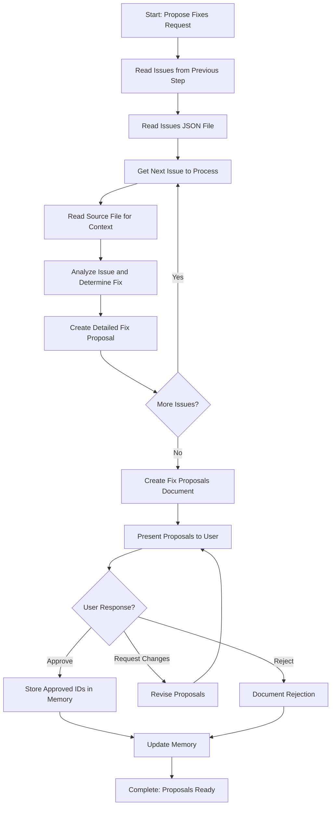

# Step: Propose Fixes

## Description

Propose specific fixes for issues identified during review and verification. Analyze each issue, determine the best fix approach, and provide detailed proposals. Present to user for approval before proceeding.

## Purpose & Usage

Use this step when you need to:
- Create detailed fix proposals for identified issues
- Get user approval before applying fixes
- Document fix approaches and rationale

**Output**: Fix proposals document (`fix-proposals.md`), approval status, memory update.

## Quick Reference

| Proposal Element | Description |
|------------------|-------------|
| Issue ID | Reference to the identified issue |
| Location | File path, line number |
| Current state | What exists now |
| Proposed fix | What should change |
| Instructions | Step-by-step fix instructions |
| Rationale | Why this fix addresses the issue |

## Flow

