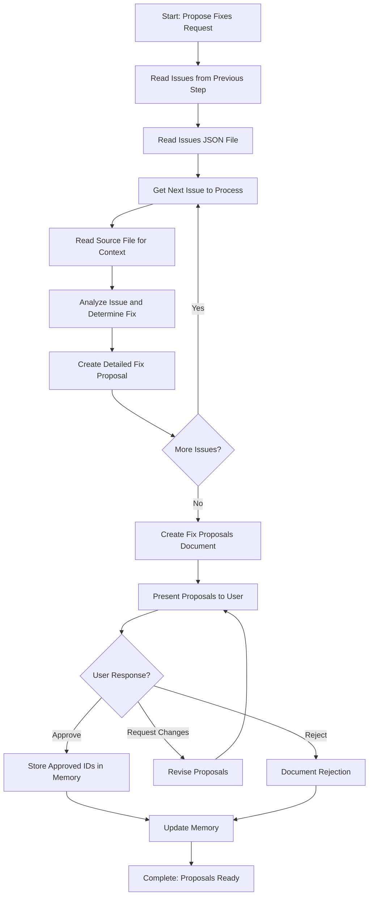

<!--
Step: Propose Fixes
Purpose: Propose specific fixes for issues identified during review and verification. Present fix proposals to user for approval.
-->

# Step: Propose Fixes

## Description

Propose specific fixes for issues identified during review and verification. Analyze each issue, determine the best fix approach, and provide detailed proposals. Present to user for approval before proceeding.

## Purpose & Usage

Use this step when you need to:
- Create detailed fix proposals for identified issues
- Get user approval before applying fixes
- Document fix approaches and rationale

**Output**: Fix proposals document (`fix-proposals.md`), approval status, memory update.

## Quick Reference

| Proposal Element | Description |
|------------------|-------------|
| Issue ID | Reference to the identified issue |
| Location | File path, line number |
| Current state | What exists now |
| Proposed fix | What should change |
| Instructions | Step-by-step fix instructions |
| Rationale | Why this fix addresses the issue |

---

## Agent Layer

### Required Components

- [mandatory-logging.md](../_components/mandatory-logging.md) - Logging guidelines

### Output (Detailed)

- **Fix proposals document**: `fix-proposals.md` containing:
  - Header with investigation scope
  - Summary with total issues, total proposals, categorization
  - For each fix proposal: Issue ID, location, issue description, current state, proposed fix, fix instructions, rationale
  - Approval section
- **Approval status**: List of approved issue IDs stored in memory.md
- **Memory update**: Summary with fix proposals document path, total proposals, approval status

### Guidance

<!-- @include: _components/mandatory-logging.md -->

**Specific Actions:**

Follow the substeps below. Read issues from previous step, analyze each issue with context, create detailed fix proposals, present to user, and process approval response.

**Files/Folders:**
- Read: `memory.md` (previous step section: issues list path)
- Read: `issues-list.json` (structured issues data)
- Read: `findings-report.md` (context from previous step)
- Read: Files containing issues (to understand context)
- Create: `fix-proposals.md` (comprehensive fix proposals document)
- Update: `memory.md` (current step section with proposals and approval status)
- Update: `log.md` (actions taken, progress, user interactions)

**Tools:**
- `read_file` - Read memory, issues-list, findings, source files
- `grep` or `codebase_search` - Understand issue context
- `write` - Create fix-proposals.md
- `search_replace` - Update memory.md

**Best Practices:**
- Read issues systematically - process each issue in the list
- For each issue, read the source file to understand full context
- Create detailed proposals with what, how, and why
- Log user interactions immediately when user responds
- Support iterative revision if user requests changes

### Memory File Usage

**When to Use Memory:**
- Always use memory for this step - fix proposals and approval status needed by later steps

**Memory Usage for This Step:**
- **Read from**: 
  - Previous step section in memory.md - issues list path, investigation context
- **Write to**: Current step section in memory.md
  - Information Produced:
    - Fix proposals document path
    - Total proposals created
    - Approval status
    - List of approved issue IDs

### Flow

### Substeps

- [ ] **Substep 1: Read Issues from Previous Step**
  - Read from memory.md: issues list path (issues-list.json reference)
  - Verify issues list exists and is not empty
  - Log: "Found {count} issues to propose fixes for"

- [ ] **Substep 2: Read Issues JSON File**
  - Read issues-list.json to get structured issues data
  - Extract all issue details

- [ ] **Substep 3: Create Fix Proposals for Each Issue**
  - For each issue:
    - Read source file to understand context
    - Determine best fix approach
    - Create detailed proposal with all elements
  - Log progress for each proposal created

- [ ] **Substep 4: Create Fix Proposals Document**
  - Create fix-proposals.md with all proposals
  - Include summary, individual proposals, approval section

- [ ] **Substep 5: Present Proposals and Get Approval**
  - Present fix-proposals.md to user
  - Explain approval options
  - Wait for user response
  - **IMMEDIATELY log user interaction**

- [ ] **Substep 6: Process Approval Response**
  - If approved: Store approved IDs in memory
  - If changes requested: Revise and re-present
  - If rejected: Document rejection
  - Update memory with results
