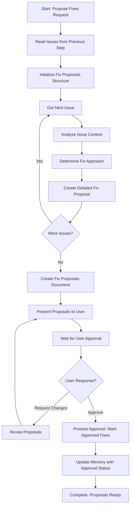

<!--
Step: Propose Fixes
Purpose: Propose specific fixes for issues identified during review and verification. For each issue, analyze the problem, determine the best fix approach, and provide detailed proposals including what needs to change, how to change it, and why this fix addresses the issue. Present all fix proposals to the user in a clear, actionable format and wait for approval before proceeding.
-->

# Step: Propose Fixes

## Required Components

- [mandatory-logging.md](_components/mandatory-logging.md) - Logging guidelines

## Description

Propose specific fixes for issues identified during review and verification. For each issue, analyze the problem, determine the best fix approach, and provide detailed proposals including what needs to change, how to change it, and why this fix addresses the issue. Present all fix proposals to the user in a clear, actionable format and wait for approval before proceeding.

This step reads issues from the previous step (review-verify-document), analyzes each issue with context from source files, creates detailed fix proposals, and presents them to the user for approval. The user can approve specific fixes by issue ID (or all by approving all IDs), and any fixes not explicitly approved remain unapproved. The user can also request modifications to proposals, which will trigger a revision cycle.

## Output

- **Fix proposals document**: `fix-proposals.md` containing:
  - Header with investigation scope
  - Summary with total issues, total proposals, categorization
  - For each fix proposal:
    - Issue ID and reference
    - Location (file path, line number)
    - Issue description (brief)
    - Current state (what exists now)
    - Proposed fix (detailed)
    - Fix instructions (step-by-step)
    - Rationale (why this fix addresses the issue)
  - Approval section (to be filled after user response)
- **Approval status**: List of approved issue IDs stored in memory.md
- **Memory update**: Summary written to memory.md with fix proposals document path, total proposals created, approval status, and list of approved issue IDs

## Guidance

<!-- @include: _components/mandatory-logging.md -->

**Specific Actions:**

Follow the substeps below in sequence. The workflow involves reading issues from the previous step, analyzing each issue with context, creating detailed fix proposals, presenting them to the user, and processing the user's approval response.

**Files/Folders:**
- Read: `memory.md` (previous step section: issues list path - issues-list.json reference)
- Read: `issues-list.json` (structured issues data from previous step)
- Read: `findings-report.md` (context from previous step)
- Read: `memory.md` (previous step section: investigationScope, verificationCriteria)
- Read: Files containing issues (to understand context for fix proposals)
- Create: `fix-proposals.md` (comprehensive fix proposals document)
- Update: `memory.md` (current step section with proposals and approval status)
- Update: `log.md` (actions taken, progress, user interactions)

**Tools:**
- Use `read_file` to read memory.md and issues-list.json from previous step
- Use `read_file` to read findings-report.md for context
- Use `read_file` to read files containing issues to understand context
- Use `grep` or `codebase_search` if needed to understand issue context
- Use `write` to create fix-proposals.md
- Use `search_replace` or `write` to update memory.md

**Best Practices:**
- Read issues systematically - process each issue in the list
- For each issue, read the source file to understand full context before proposing fixes
- Create detailed proposals with what, how, and why to give user enough information for informed decisions
- Proposals should be detailed enough that user can understand without reading original files
- Use clear, actionable language in fix instructions
- Categorize proposals if helpful (by file, by type, by severity)
- Log user interactions immediately when user responds (approvals, rejections, modification requests)
- Support iterative revision if user requests changes to proposals
- Store approval status clearly (list of approved issue IDs)

## Memory File Usage

**When to Use Memory:**
- Always use memory for this step - fix proposals and approval status are needed by later steps
- Use when this step produces fix proposals needed by subsequent steps (apply-fixes)
- Use when this step makes decisions about fix approaches that should be documented

**Memory Usage for This Step:**
- **Read from**: 
  - Previous step section in memory.md - issues list path (issues-list.json reference)
  - Previous step section in memory.md - investigationScope, verificationCriteria, context
  - process.md - investigationScope, verificationCriteria (if not in memory)
- **Write to**: Current step section in memory.md
  - Information Produced:
    - Fix proposals document path (e.g., `fix-proposals.md`)
    - Total proposals created
    - Approval status (pending, approved, or list of approved issue IDs)
    - List of approved issue IDs (if user approved fixes)
  - Decisions Made:
    - Fix approach selected for each issue
    - Proposal detail level and structure
  - Files Modified/Created:
    - `fix-proposals.md`
    - memory.md (proposals summary and approval status)
  - Notes:
    - Any assumptions made about fix approaches
    - Context considerations for fix proposals

## Flow

### Substeps

- [ ] **Substep 1: Read Issues from Previous Step**
  - Read from memory.md previous step section: issues list path (issues-list.json reference)
    - If JSON file reference exists, read issues-list.json
    - Get total issue count
  - Read findings-report.md for additional context
  - Read from memory.md previous step section: investigationScope, verificationCriteria
    - If not in memory, read from process.md
  - Understand investigation scope: what was being investigated
  - Understand verification criteria: what conditions were checked
  - Verify issues list is available and not empty
  - Document context parameters in log.md

- [ ] **Substep 2: Initialize Fix Proposals Structure**
  - Create tracking structure for fix proposals:
    - Issues to process (list from issues-list.json)
    - Fix proposals (empty list, to be populated)
    - Proposal status (pending approval)
  - Initialize counters:
    - Issues analyzed: 0
    - Fix proposals created: 0
  - Log initialization in log.md

- [ ] **Substep 3: Analyze Each Issue and Create Fix Proposals**
  - For each issue in the issues list:
    - Log progress: "Analyzing issue X of Y: {issue ID}"
    - Read issue details from issues-list.json:
      - Issue ID
      - Location (file path, line number)
      - Category and severity
      - Item description (what was found)
      - Issue description (what's wrong)
      - Criteria violated (list of criteria not met)
      - How it violates (explanation)
    - Read the file containing the issue using read_file to understand context:
      - Read surrounding code/content around the issue location
      - Understand the file structure and patterns
      - Consider related code/content that might be affected
    - Analyze the issue:
      - Understand what's wrong (current state)
      - Understand why it violates criteria (root cause)
      - Consider the file context and surrounding code/content
      - Consider impact of potential fixes on related code
    - Determine best fix approach:
      - What needs to change (specific change required)
      - How to change it (detailed instructions, code patterns if applicable, step-by-step if complex)
      - Why this fix addresses the issue (rationale explaining how fix resolves the violation)
    - Create fix proposal with:
      - Issue ID reference
      - Location (file path, line number)
      - Current state (what exists now, with context)
      - Proposed change (what should change, detailed)
      - Detailed fix instructions (step-by-step if complex, include code patterns if applicable)
      - Rationale (why this fix addresses the issue and resolves the criteria violation)
      - Estimated impact (if applicable - what else might be affected)
    - Add proposal to fix proposals list
    - Increment counters
    - Log proposal creation in log.md
  - Continue until all issues have proposals
  - Log completion: "Created {count} fix proposals for {count} issues"

- [ ] **Substep 4: Create Fix Proposals Document**
  - Create `fix-proposals.md` with:
    - Header: Fix Proposals for {investigationScope}
    - Summary section:
      - Investigation scope
      - Total issues found
      - Total proposals created
      - Issue counts by category (if applicable)
      - Issue counts by severity (if applicable)
    - For each fix proposal (organized by issue ID):
      - Issue ID and reference
      - Location (file path, line number)
      - Category and severity
      - Issue description (brief summary)
      - Current state (what exists now, with context)
      - Proposed fix (detailed description of what should change)
      - Fix instructions (step-by-step instructions, include code patterns if applicable)
      - Rationale (why this fix addresses the issue)
      - Estimated impact (if applicable)
    - Approval section (to be filled after user response):
      - Status: Pending Approval
      - Instructions for user on how to approve fixes
  - Update memory.md current step section with:
    - Fix proposals document path: `fix-proposals.md`
    - Total proposals created: {count}
    - Proposal status: pending approval
  - Document in log.md: "Created fix-proposals.md with {count} proposals"

- [ ] **Substep 5: Present Proposals to User and Wait for Approval**
  - Present fix-proposals.md to user
  - Explain that user can:
    - Approve specific fixes by issue ID (e.g., "approve issue-1, issue-3, issue-5")
    - Approve all fixes by approving all issue IDs (e.g., "approve all" or list all IDs)
    - Request modifications to specific proposals (e.g., "revise issue-2 to use approach X instead")
  - Wait for user response
  - **IMMEDIATELY log user interaction in log.md** (before processing response):
    - What the user requested (approve, modify, etc.)
    - Which issue IDs (if specific)
    - Any modification details (if requested)

- [ ] **Substep 6: Process User Approval Response**
  - If user requests modifications:
    - Identify which proposals need revision based on user feedback
    - Revise specific proposals:
      - Update fix approach, instructions, or rationale as requested
      - Maintain proposal structure and detail level
    - Update fix-proposals.md with revised proposals
    - Update memory.md with revision notes
    - Log revision in log.md
    - Return to Substep 5 (Present Proposals to User)
  - If user approves (all or specific fixes):
    - Parse user response to identify approved issue IDs:
      - If user approved all: mark all proposals as approved
      - If user approved specific IDs: mark only those proposals as approved
    - Any proposals not explicitly approved remain unapproved
    - Update fix-proposals.md with approval status:
      - Status: Approved
      - List of approved issue IDs
      - List of unapproved issue IDs (if any)
    - Update memory.md current step section with:
      - Approval status: approved
      - List of approved issue IDs: [list of IDs]
      - Total approved: {count}
      - Total unapproved: {count} (if any)
    - Log approval in log.md: "User approved {count} fixes: {list of IDs}"
    - Step complete - proposals ready for next step (apply-fixes)
