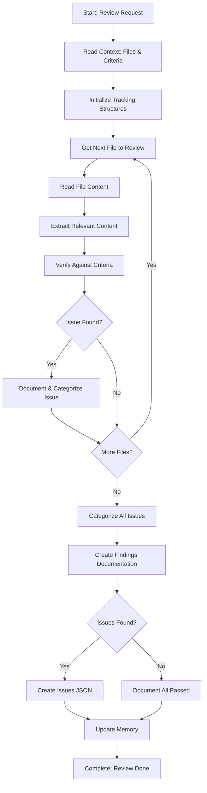

# Step: Review, Verify, and Document

## Description

Systematically review each identified file for content relevant to the investigation scope. Verify against criteria, identify issues, categorize them, and create comprehensive findings documentation.

## Purpose & Usage

Use this step when you need to:
- Review files against specific verification criteria
- Identify violations, issues, or items that don't meet criteria
- Create comprehensive findings documentation
- Prepare findings for proposing fixes or presenting results

**Output**: Findings report (`findings-report.md`), issues list (`issues-list.json` if issues found), memory update.

## Quick Reference

| Action | Tool |
|--------|------|
| Read context/files | `read_file` |
| Search for patterns | `grep` |
| Find related content | `codebase_search` |
| Create reports | `write` |

| Issue Category | Severity Levels |
|----------------|-----------------|
| Missing, Incorrect, Violation | Critical, High |
| Incomplete, Format Error, Other | Medium, Low |

## Flow

