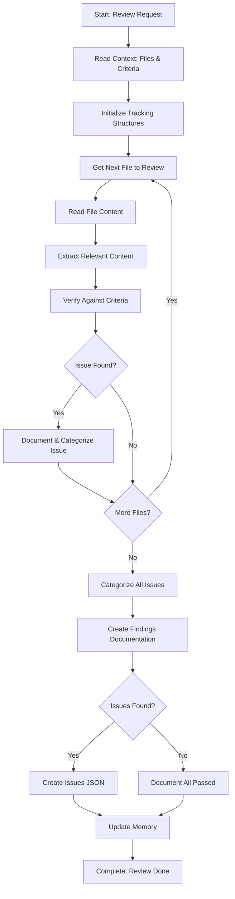

<!--
Step: Review, Verify, and Document
Purpose: Systematically review identified files for content relevant to the investigation scope, verify against criteria, identify issues, categorize them, and create comprehensive findings documentation. This step is the core verification step in investigation processes where files are reviewed, analyzed, and checked against specific criteria to identify violations or issues.
-->

# Step: Review, Verify, and Document

## Required Components

- [mandatory-logging.md](_components/mandatory-logging.md) - Logging guidelines

## Description

Systematically review each identified file for content relevant to the investigation scope. Read files, analyze content, extract relevant information, and verify against criteria. For each item found, verify whether it meets the criteria. Identify any violations, issues, or items that do not meet the criteria. Categorize issues by type and severity. Create a comprehensive summary of findings - if no issues were found, document that all items passed verification; if issues were found, document each issue with details including location, description, and how it violates the criteria. Prepare findings for presentation to the user.

This step is designed to be thorough and systematic, ensuring all identified files are reviewed and all relevant content is verified against the verification criteria. The step produces detailed documentation that can be used for proposing fixes or presenting final results.

## Output

- **Findings report**: Comprehensive report that includes:
  - Executive summary with overall status (issues found or no issues)
  - Review findings from each file (items found, items verified)
  - Verification results for each item (criteria checked, pass/fail status)
  - Issues found (if any) with details, categorization, and severity
  - Issue counts by category and severity
- **Issues list** (if issues found): Structured JSON file (`issues-list.json`) containing all issues with details for programmatic processing
- **Memory update**: Summary written to memory.md with file paths, counts, status, and references to report files

## Guidance

<!-- @include: _components/mandatory-logging.md -->

**Specific Actions:**

Follow the substeps below in sequence. The workflow involves reading files, analyzing content, verifying against criteria, identifying issues, categorizing them, and creating comprehensive documentation.

**Files/Folders:**
- Read: `memory.md` (previous step section: identified files list, JSON file reference)
- Read: `memory.md` (previous step section: investigationScope, verificationCriteria)
- Read: `process.md` (context parameters: investigationScope, verificationCriteria)
- Read: Files identified in previous step (from identified-files.json or memory reference)
- Create: `findings-report.md` (comprehensive findings report)
- Create: `issues-list.json` (structured issues data, if issues found)
- Update: `memory.md` (current step section with all findings and reports)
- Update: `log.md` (actions taken, progress, files reviewed)

**Tools:**
- Use `read_file` to read memory.md and process.md for context
- Use `read_file` to read identified-files.json from previous step
- Use `read_file` to read each identified file for review
- Use `grep` to search for specific patterns or content in files
- Use `codebase_search` to understand context or find related content
- Use `write` to create report files
- Use `search_replace` or `write` to update memory.md

**Best Practices:**
- Review files systematically - don't skip any identified files
- For each file, extract all content relevant to investigation scope
- Verify each relevant item against all applicable criteria
- Document findings clearly with file paths and line numbers when applicable
- Categorize issues consistently (use clear categories like: "Missing", "Incorrect", "Violation", "Incomplete", "Format Error", "Other")
- Assign severity levels consistently (e.g., "Critical", "High", "Medium", "Low")
- Create structured data (JSON) for issues to enable programmatic processing
- Create human-readable reports (Markdown) for presentation
- Log progress for large file sets (>50 files)
- Save issues data to separate JSON file to keep memory.md clean

## Memory File Usage

**When to Use Memory:**
- Always use memory for this step - findings are needed by later steps
- Use when this step produces review and verification results needed by subsequent steps
- Use when this step makes decisions about issue categorization that should be documented

**Memory Usage for This Step:**
- **Read from**: 
  - Previous step section in memory.md - identified files list, file count, JSON file reference
  - Previous step section in memory.md - investigationScope, verificationCriteria, context
  - process.md - investigationScope, verificationCriteria (if not in memory)
- **Write to**: Current step section in memory.md
  - Information Produced:
    - Findings report path (e.g., `findings-report.md`)
    - Issues list path (e.g., `issues-list.json`) - if issues found
    - Total files reviewed count
    - Total items verified count
    - Total issues found count (0 if none)
    - Issue counts by category
    - Issue counts by severity
    - Verification status (all passed, issues found, or partial)
  - Decisions Made:
    - Issue categorization scheme used
    - Severity levels assigned
    - Verification approach used
  - Files Modified/Created:
    - `findings-report.md`
    - `issues-list.json` (if issues found)
    - memory.md (findings summary)
  - Notes:
    - Any ambiguous criteria interpretations
    - Verification methodology used

## Flow



### Substeps

- [ ] **Substep 1: Read Context Parameters and File List**
  - Read from memory.md previous step section: identified files list
    - If JSON file reference exists, read identified-files.json
    - If file list is in memory directly, read from memory
    - Get total file count
  - Read from memory.md previous step section: investigationScope, verificationCriteria
    - If not in memory, read from process.md
  - Understand investigation scope: what content to look for in files
  - Understand verification criteria: what conditions must be met
  - Document context parameters in log.md
  - Verify that criteria are clear and actionable

- [ ] **Substep 2: Initialize Tracking Structures**
  - Create tracking structure for review progress:
    - Files to review (list from previous step)
    - Files reviewed (empty list, to be populated)
    - Items verified (empty list, to be populated)
    - Issues found (empty list, to be populated)
  - Initialize issue categorization structure:
    - Categories: e.g., "Missing", "Incorrect", "Violation", "Incomplete", "Format Error", "Other"
    - Severity levels: e.g., "Critical", "High", "Medium", "Low"
  - Initialize counters:
    - Files reviewed: 0
    - Items verified: 0
    - Issues found: 0
  - Log initialization in log.md

- [ ] **Substep 3: Review Each File Systematically**
  - For each file in the identified files list:
    - Log progress: "Reviewing file X of Y: {file path}"
    - Read file content using read_file
    - Analyze file content for relevance to investigation scope:
      - Extract all content that matches or relates to investigation scope
      - Use grep or codebase_search if needed to find relevant sections
      - Identify specific items (e.g., references, patterns, code sections, documentation sections)
    - For each relevant item found:
      - Document item location (file path, line number if applicable, section name)
      - Document item content or description
      - Verify item against verification criteria:
        - Check if item meets each applicable criterion
        - Determine if item passes or fails verification
        - If fails, identify which criteria are violated
      - Increment items verified counter
      - If verification fails:
        - Create issue record with:
          - Location: file path, line number (if applicable)
          - Item description: what was found
          - Issue description: what's wrong
          - Criteria violated: which criteria are not met
          - How it violates: explanation of the violation
        - Add issue to issues found list
        - Increment issues found counter
    - Mark file as reviewed
    - Increment files reviewed counter
    - Log file review completion in log.md
  - Continue until all files are reviewed
  - Log completion: "Reviewed {count} files, verified {count} items, found {count} issues"

- [ ] **Substep 4: Categorize and Assign Severity to Issues**
  - For each issue in issues found list:
    - Determine issue category based on issue type:
      - "Missing": Required item is absent
      - "Incorrect": Item exists but is wrong
      - "Violation": Item violates a rule or standard
      - "Incomplete": Item exists but is incomplete
      - "Format Error": Item has formatting or syntax issues
      - "Other": Doesn't fit other categories
    - Assign severity level based on impact:
      - "Critical": Blocks functionality or causes major problems
      - "High": Significant impact, should be fixed soon
      - "Medium": Moderate impact, should be addressed
      - "Low": Minor impact, nice to have fixed
    - Update issue record with category and severity
  - Count issues by category
  - Count issues by severity
  - Log categorization results in log.md

- [ ] **Substep 5: Create Findings Documentation**
  - Create `findings-report.md` with:
    - Header: Findings Report for {investigationScope}
    - Executive Summary:
      - Investigation scope
      - Files reviewed count
      - Items verified count
      - Overall verification status (all passed, issues found, or partial)
      - Total issues found (0 if none)
    - Review Findings:
      - For each file reviewed:
        - File path
        - Items found (list of relevant items extracted)
        - Items verified (list of items checked against criteria)
        - Issues found in this file (if any)
    - Verification Results:
      - Verification criteria used (list all criteria)
      - For each item verified:
        - Item location
        - Item description
        - Verification result (passed/failed)
        - Criteria checked (list of criteria applied)
        - If failed: which criteria were violated
    - Issues Found (if any):
      - Summary: Total issues, counts by category and severity
      - For each issue:
        - Issue ID
        - Location (file path, line number)
        - Category and Severity
        - Item Description (what was found)
        - Issue Description (what's wrong)
        - Criteria Violated (list)
        - How It Violates (explanation)
        - Full context (relevant code/content around the issue)
    - If no issues found:
      - Success message: "All items passed verification. No issues found."
  - If issues found, create `issues-list.json` with structured data:
    ```json
    {
      "totalIssues": 5,
      "issues": [
        {
          "id": "issue-1",
          "file": "path/to/file.md",
          "line": 42,
          "category": "Missing",
          "severity": "High",
          "itemDescription": "Missing required reference",
          "issueDescription": "Required reference to X is missing",
          "criteriaViolated": ["Criterion 1: All files must reference X"],
          "howItViolates": "File does not contain any reference to X"
        }
      ],
      "countsByCategory": {
        "Missing": 2,
        "Incorrect": 1,
        "Violation": 2
      },
      "countsBySeverity": {
        "Critical": 0,
        "High": 3,
        "Medium": 2,
        "Low": 0
      }
    }
    ```
  - Write to current step section in memory.md:
    - Findings report path: `findings-report.md`
    - Issues list path: `issues-list.json` (if issues found)
    - Total files reviewed: {count}
    - Total items verified: {count}
    - Total issues found: {count}
    - Issue counts by category: {object}
    - Issue counts by severity: {object}
    - Verification status: {all passed, issues found, or partial}
    - Issue categorization scheme: {list of categories used}
    - Severity levels: {list of severity levels used}
    - Verification approach: {description}
  - Document in log.md: "Created findings-report.md and issues-list.json (if issues found)"
