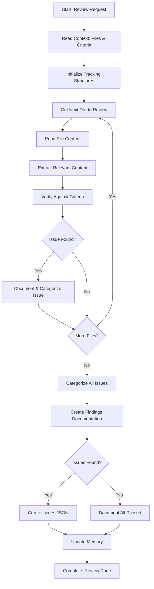

<!--
Step: Review, Verify, and Document
Purpose: Systematically review identified files for content relevant to the investigation scope, verify against criteria, identify issues, categorize them, and create comprehensive findings documentation.
-->

# Step: Review, Verify, and Document

## Description

Systematically review each identified file for content relevant to the investigation scope. Verify against criteria, identify issues, categorize them, and create comprehensive findings documentation.

## Purpose & Usage

Use this step when you need to:
- Review files against specific verification criteria
- Identify violations, issues, or items that don't meet criteria
- Create comprehensive findings documentation
- Prepare findings for proposing fixes or presenting results

**Output**: Findings report (`findings-report.md`), issues list (`issues-list.json` if issues found), memory update.

## Quick Reference

| Action | Tool |
|--------|------|
| Read context/files | `read_file` |
| Search for patterns | `grep` |
| Find related content | `codebase_search` |
| Create reports | `write` |

---

## Agent Layer

### Required Components

- [mandatory-logging.md](../_components/mandatory-logging.md) - Logging guidelines

### Output (Detailed)

- **Findings report**: Comprehensive report that includes:
  - Executive summary with overall status (issues found or no issues)
  - Review findings from each file (items found, items verified)
  - Verification results for each item (criteria checked, pass/fail status)
  - Issues found (if any) with details, categorization, and severity
  - Issue counts by category and severity
- **Issues list** (if issues found): Structured JSON file (`issues-list.json`) containing all issues with details for programmatic processing
- **Memory update**: Summary written to memory.md with file paths, counts, status, and references to report files

### Guidance

<!-- @include: _components/mandatory-logging.md -->

**Specific Actions:**

Follow the substeps below in sequence. The workflow involves reading files, analyzing content, verifying against criteria, identifying issues, categorizing them, and creating comprehensive documentation.

**Files/Folders:**
- Read: `memory.md` (previous step section: identified files list, JSON file reference)
- Read: `memory.md` (previous step section: investigationScope, verificationCriteria)
- Read: `process.md` (context parameters: investigationScope, verificationCriteria)
- Read: Files identified in previous step (from identified-files.json or memory reference)
- Create: `findings-report.md` (comprehensive findings report)
- Create: `issues-list.json` (structured issues data, if issues found)
- Update: `memory.md` (current step section with all findings and reports)
- Update: `log.md` (actions taken, progress, files reviewed)

**Tools:**
- Use `read_file` to read memory.md and process.md for context
- Use `read_file` to read identified-files.json from previous step
- Use `read_file` to read each identified file for review
- Use `grep` to search for specific patterns or content in files
- Use `codebase_search` to understand context or find related content
- Use `write` to create report files
- Use `search_replace` or `write` to update memory.md

**Best Practices:**
- Review files systematically - don't skip any identified files
- For each file, extract all content relevant to investigation scope
- Verify each relevant item against all applicable criteria
- Document findings clearly with file paths and line numbers when applicable
- Categorize issues consistently (use clear categories like: "Missing", "Incorrect", "Violation", "Incomplete", "Format Error", "Other")
- Assign severity levels consistently (e.g., "Critical", "High", "Medium", "Low")
- Create structured data (JSON) for issues to enable programmatic processing
- Create human-readable reports (Markdown) for presentation
- Log progress for large file sets (>50 files)
- Save issues data to separate JSON file to keep memory.md clean

### Memory File Usage

**When to Use Memory:**
- Always use memory for this step - findings are needed by later steps

**Memory Usage for This Step:**
- **Read from**: 
  - Previous step section in memory.md - identified files list, file count, JSON file reference
  - Previous step section in memory.md - investigationScope, verificationCriteria, context
  - process.md - investigationScope, verificationCriteria (if not in memory)
- **Write to**: Current step section in memory.md
  - Information Produced:
    - Findings report path (e.g., `findings-report.md`)
    - Issues list path (e.g., `issues-list.json`) - if issues found
    - Total files reviewed count
    - Total items verified count
    - Total issues found count (0 if none)
    - Issue counts by category
    - Issue counts by severity
    - Verification status (all passed, issues found, or partial)
  - Decisions Made:
    - Issue categorization scheme used
    - Severity levels assigned
    - Verification approach used
  - Files Modified/Created:
    - `findings-report.md`
    - `issues-list.json` (if issues found)
    - memory.md (findings summary)
  - Notes:
    - Any ambiguous criteria interpretations
    - Verification methodology used

### Flow

### Substeps

- [ ] **Substep 1: Read Context Parameters and File List**
  - Read from memory.md previous step section: identified files list
  - Read from memory.md previous step section: investigationScope, verificationCriteria
  - Understand investigation scope: what content to look for in files
  - Understand verification criteria: what conditions must be met
  - Document context parameters in log.md

- [ ] **Substep 2: Initialize Tracking Structures**
  - Create tracking structure for review progress
  - Initialize issue categorization structure:
    - Categories: "Missing", "Incorrect", "Violation", "Incomplete", "Format Error", "Other"
    - Severity levels: "Critical", "High", "Medium", "Low"
  - Initialize counters (files reviewed, items verified, issues found)

- [ ] **Substep 3: Review Each File Systematically**
  - For each file in the identified files list:
    - Log progress: "Reviewing file X of Y: {file path}"
    - Read file content using read_file
    - Analyze file content for relevance to investigation scope
    - For each relevant item found:
      - Document item location (file path, line number)
      - Verify item against verification criteria
      - If verification fails, create issue record
    - Mark file as reviewed, increment counters
  - Log completion: "Reviewed {count} files, verified {count} items, found {count} issues"

- [ ] **Substep 4: Categorize and Assign Severity to Issues**
  - For each issue, determine category and severity
  - Count issues by category and severity
  - Log categorization results

- [ ] **Substep 5: Create Findings Documentation**
  - Create `findings-report.md` with:
    - Executive Summary
    - Review Findings
    - Verification Results
    - Issues Found (if any) with full details
  - If issues found, create `issues-list.json`
  - Write summary to memory.md
  - Document in log.md
