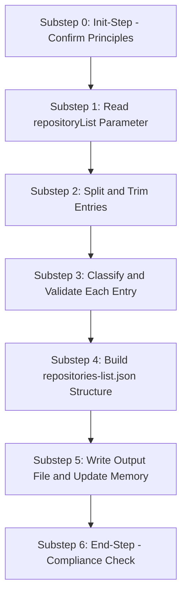

<!--
Step: Parse Repository List
Purpose: Parse a comma-separated repository list into a structured repositories-list.json file
-->

# Step: Parse Repository List

## Required Components

- [mandatory-logging.md](../../_components/mandatory-logging.md) - Logging guidelines

## Description

Parse a user-provided comma-separated string of repository references into a validated, structured `repositories-list.json` file that downstream steps can consume. Each entry is classified as either a remote URL, a local filesystem path, or unknown, validated for basic correctness, and enriched with metadata (name, source type). Invalid entries are preserved with `valid: false` rather than silently dropped.

## Purpose & Usage

Use this step when you need to:
- Prepare a structured repository list before spawning per-repository subprocesses
- Parse user-provided repository references into a normalized format
- Classify repositories as remote URLs or local paths for downstream handling

**Output**: Structured repository list (`repositories-list.json`) in the process folder, plus memory updates with summary statistics.

## Quick Reference

| Parameter | Type | Required | Description |
|-----------|------|----------|-------------|
| `repositoryList` | string | Yes | Comma-separated list of repository references |

| Source Type | Detection Rule |
|-------------|---------------|
| `remote-url` | Starts with `http://`, `https://`, `git@`, `ssh://`; or has `.git` suffix |
| `local-path` | Starts with `/`, `./`, `~`, or a drive letter (e.g., `C:`) |
| `unknown` | Cannot determine type |

| Output | Description |
|--------|-------------|
| `repositories-list.json` | Structured JSON with metadata and per-repository entries |
| Memory updates | repositoryCount, validCount, invalidCount, sourceTypeSummary, repositoriesListPath |

## Flow



### Substeps

- [ ] **Substep 0**: Init-Step - Read operating principles and confirm them for this step
- [ ] **Substep 1**: Read `repositoryList` parameter from process.json parameters or memory.json
- [ ] **Substep 2**: Split string by comma, trim whitespace, track empty entries as skipped
- [ ] **Substep 3**: Classify each entry by source type (remote-url, local-path, unknown), extract name, validate format
- [ ] **Substep 4**: Assemble the complete JSON structure with metadata and repositories array
- [ ] **Substep 5**: Write `repositories-list.json` to process folder, update memory.json and log.json
- [ ] **Substep 6**: End-Step - Verify compliance with operating principles

## Output Format

```json
{
  "type": "repositories-list",
  "metadata": {
    "generatedAt": "2026-04-05T00:00:00.000Z",
    "totalCount": 3,
    "bySourceType": {
      "remote-url": 2,
      "local-path": 1
    }
  },
  "repositories": [
    {
      "index": 0,
      "name": "repo-name",
      "rawEntry": "https://github.com/org/repo-name",
      "sourceType": "remote-url",
      "url": "https://github.com/org/repo-name",
      "localPath": null,
      "valid": true,
      "validationNote": null
    }
  ]
}
```

## Guidance

**Specific Actions:**
- Read the `repositoryList` parameter from process context
- Split by comma, trim whitespace from each entry
- For each entry, determine source type using prefix-based heuristics
- For remote URLs, extract repository name from last path segment (strip `.git` suffix)
- For local paths, extract directory name as repository name
- Validate each entry: non-empty after trim, basic format check
- Create `repositories-list.json` in the process folder
- Update memory.json with summary statistics

**Files/Folders:**
- Read: `process.json` or `memory.json` (to get repositoryList parameter)
- Create: `repositories-list.json` (in process folder)
- Update: `memory.json`, `log.json`

**Tools:**
- `read_file` - Read process context files
- `write` - Create repositories-list.json
- `list_dir` - Optionally validate local paths exist

**Best Practices:**
- Keep it lightweight -- no network calls, no cloning
- Handle edge cases: trailing commas, extra spaces, empty entries
- Preserve the original entry as `rawEntry` for debugging
- Mark invalid entries with `valid: false` but do not fail the step
- Let downstream steps decide how to handle invalid entries

## Memory File Usage

**When to Use Memory:**
- Read `repositoryList` parameter from process context (process.json or memory.json)
- Write summary statistics so downstream steps know what to expect

**Memory Usage for This Step:**
- **Read from**: Process parameters or previous step section in memory.json -- `repositoryList` string
- **Write to**: Current step section in memory.json
  - Information Produced: repositoryCount, validCount, invalidCount, sourceTypeSummary, repositoriesListPath
  - Decisions Made: Classification choices, validation decisions
  - Files Modified/Created: Path to repositories-list.json
