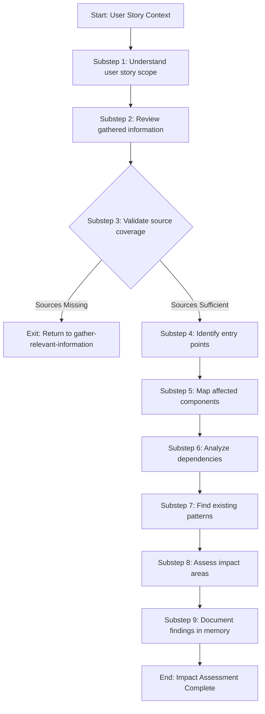

<!--
Step: analyze-affected-system
Purpose: Analyze current system to identify affected components, dependencies, patterns, and impact areas
-->

# Step: Analyze Affected System

## Required Components

- [mandatory-logging.md](_components/mandatory-logging.md) - Logging guidelines

## Description

Analyze the current system (codebase AND gathered information from various sources) to identify affected components, dependencies, patterns, and impact areas for implementing a user story. This step provides structured impact assessment to inform low-level design decisions.

This step reads information gathered in the previous `gather-relevant-information` step and systematically analyzes what parts of the system will be affected by the proposed changes.

## Purpose & Usage

**When to use:**
- Before creating a Low-Level Design (LLD) to understand what needs to change
- When starting work on a user story to assess scope and complexity
- When estimating effort by understanding impact footprint

**Prerequisites:**
- User story or feature description available
- Access to the target codebase
- Gathered information available from `gather-relevant-information` step

**Output:**
- Affected components (codebase components needing changes)
- External systems impact (services, APIs, infrastructure affected)
- Package dependencies (new/updated NuGet, NPM packages needed)
- Dependencies mapping (internal + external)
- Existing patterns (conventions to follow)
- Impact areas (categorized by: codebase, external services, infrastructure, packages, documentation)

## Quick Reference

| Attribute | Value |
|-----------|-------|
| **Category** | `planning` |
| **Substeps** | 9 |
| **Approval Required** | No |
| **Feedback Loop** | Returns to `gather-relevant-information` if sources missing |

### Sources Analyzed

| Source Type | Examples |
|-------------|----------|
| **Codebase** | Controllers, services, repositories, models |
| **External Services** | Other microservices, third-party APIs |
| **Infrastructure** | Databases, queues, caches, message brokers |
| **Package Dependencies** | NuGet packages, NPM packages, other package managers |
| **Documentation** | Wikis, READMEs, architecture docs, API specs |

## Flow

### Substeps

- [ ] **Substep 1: Understand user story scope** - Read user story and identify functionality being added/changed
- [ ] **Substep 2: Review gathered information** - Analyze information collected in previous step
- [ ] **Substep 3: Validate source coverage** - Check if critical sources are available (conditional exit if missing)
- [ ] **Substep 4: Identify entry points** - Find where the change originates in our system
- [ ] **Substep 5: Map affected components** - Trace through codebase AND external systems
- [ ] **Substep 6: Analyze dependencies** - Map internal, external, AND package dependencies
- [ ] **Substep 7: Find existing patterns** - Search for similar implementations
- [ ] **Substep 8: Assess impact areas** - Categorize all impacts by area and type
- [ ] **Substep 9: Document findings** - Write comprehensive analysis to memory

**Notes:**
- Substep 3 is a validation checkpoint - if sources are missing, the step exits and returns to `gather-relevant-information`
- All other substeps execute sequentially

