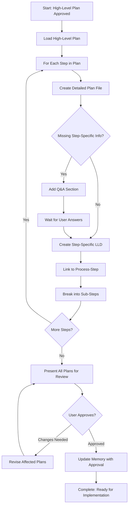

# Step: Create Detailed Step Plans

## Description

Generate detailed implementation plans for each step in an approved high-level plan. This step breaks down high-level steps into actionable sub-steps, identifies step-specific missing information through Q&A sections, creates step-specific Low Level Designs, and links each detailed plan to a process-step that will execute it.

## Purpose & Usage

Use this step when you need to:
- Break down approved high-level plan steps into detailed, actionable plans
- Create step-specific Low Level Designs with architecture diagrams
- Identify and gather missing technical details through Q&A
- Link each plan to the process-step that will execute it
- Get user approval before proceeding to implementation

**Output**: Detailed plan files (`plans/{user-story-name}/step-{n}-{step-name}.md`), memory update with plans index and approval status.

## Quick Reference

| Action | Tool |
|--------|------|
| Read high-level plan | `read_file` on plan.md |
| Verify process-steps exist | `list_dir` on ~/.claude/agentic-processes/steps/ |
| Create detailed plan files | `write` |
| Update memory | `search_replace` |

**Plan File Naming**: `step-{n}-{step-name}.md` (e.g., `step-1-api-layer.md`)

**Process-Step Link Format**: `@step:category/step-name`

## Flow

