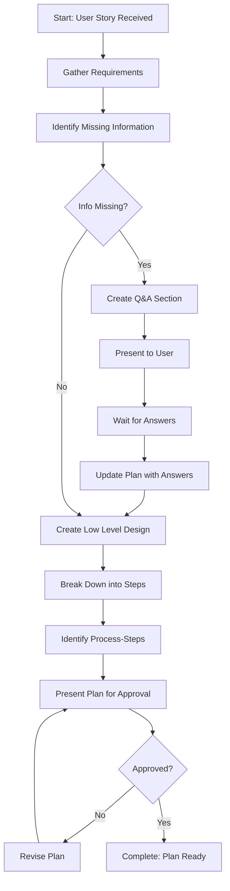

<!--
Step: Create High-Level Plan
Purpose: Generate a comprehensive task plan with complexity ratings, LLD, and Q&A for missing information
-->

# Step: Create High-Level Plan

## Description

Create a comprehensive high-level plan for user story implementation. Generates a structured plan document with overview, requirements, Q&A section, Low Level Design, and implementation steps with complexity ratings.

## Purpose & Usage

Use this step when you need to:
- Create a comprehensive plan for a user story
- Identify missing information before implementation
- Design the technical approach with LLD diagrams
- Break down work into complexity-rated steps

**Output**: Plan directory (`plans/{user-story-name}/`), high-level plan file (`plan.md`), memory update.

## Quick Reference

| Complexity Rating | Description |
|-------------------|-------------|
| 1-3 | Low - Straightforward implementation |
| 4-6 | Medium - Some complexity, well-defined approach |
| 7-9 | High - Needs detailed breakdown, potential challenges |

**Critical Rules:**
- Never assume unspecified information → Create Q&A section
- Wait for Q&A answers before completing LLD
- Flag complexity 7+ steps for further breakdown

---

## Agent Layer

### Required Components

- [mandatory-logging.md](../_components/mandatory-logging.md) - Logging guidelines

### Output (Detailed)

- New directory created: `plans/{user-story-name}/`
- High-level plan file: `plans/{user-story-name}/plan.md`
- Plan includes:
  - Overview and requirements
  - Q&A section if information is missing
  - Comprehensive Low Level Design with diagrams (after Q&A)
  - Major implementation steps with complexity ratings (1-9 scale)
  - Required process-steps identified and validated
  - List of missing process-steps if any
- Memory file updated with plan directory path

### Guidance

<!-- @include: _components/mandatory-logging.md -->

**Specific Actions:**

1. **Gather Requirements**
   - Extract user story title, description, and acceptance criteria
   - Identify affected components (API, Service, Repository, etc.)
   - Understand the feature's purpose and goals

2. **Identify Missing Information**
   - Check for: external APIs, infrastructure setup, third-party libraries, business rules, data structures
   - List any assumptions that need user confirmation
   - **Create Q&A section with specific questions** - Do not proceed with LLD until answers are provided

3. **Wait for Q&A Answers (if needed)**
   - Present the plan with Q&A section to the user
   - Wait for explicit answers to all questions
   - Update the plan with provided information

4. **Create Low Level Design (after Q&A resolved)**
   - Document current system design with diagrams
   - Document proposed changes with diagrams
   - Show data flow, component interactions, architectural patterns
   - Include class diagrams, sequence diagrams as appropriate

5. **Break Down into Major Steps**
   - Identify all major implementation steps
   - Typical pattern: API Layer → Service Layer → Repository Layer → Unit Tests → Integration Tests → Documentation
   - Rate complexity for each step (1-9 scale)
   - Steps with complexity 7+ must be flagged for further breakdown

6. **Identify Required Process-Steps**
   - For each implementation step, determine which process-step will execute it
   - Check if required process-steps exist
   - List any missing process-steps

7. **Present Plan for Approval**
   - Present complete plan to user
   - Wait for approval before proceeding
   - **IMMEDIATELY log user interaction**

**Files/Folders:**
- Create: `plans/{user-story-name}/plan.md`
- Update: `memory.md`, `log.md`

**Tools:**
- `read_file` - Read user story context
- `codebase_search` - Find relevant patterns
- `write` - Create plan file
- `list_dir` - Explore existing components

### Memory File Usage

**When to Use Memory:**
- Always use memory for this step - plan details needed by later steps

**Memory Usage for This Step:**
- **Write to**: Current step section in memory.md
  - Information Produced:
    - Plan directory path
    - Q&A status (complete or pending)
    - Implementation steps summary
    - Process-steps validation results

### Flow

### Substeps

- [ ] **Substep 1**: Gather requirements from user story context
- [ ] **Substep 2**: Identify missing information and create Q&A section
- [ ] **Substep 3**: Wait for Q&A answers (if needed)
- [ ] **Substep 4**: Create Low Level Design with diagrams
- [ ] **Substep 5**: Break down into complexity-rated steps
- [ ] **Substep 6**: Identify and validate required process-steps
- [ ] **Substep 7**: Present plan for approval
- [ ] **Substep 8**: Process approval response
