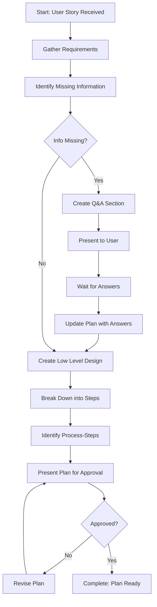

# Step: Create High-Level Plan

## Description

Create a comprehensive high-level plan for user story implementation. Generates a structured plan document with overview, requirements, Q&A section, Low Level Design, and implementation steps with complexity ratings.

## Purpose & Usage

Use this step when you need to:
- Create a comprehensive plan for a user story
- Identify missing information before implementation
- Design the technical approach with LLD diagrams
- Break down work into complexity-rated steps

**Output**: Plan directory (`plans/{user-story-name}/`), high-level plan file (`plan.md`), memory update.

## Quick Reference

| Complexity Rating | Description |
|-------------------|-------------|
| 1-3 | Low - Straightforward implementation |
| 4-6 | Medium - Some complexity, well-defined approach |
| 7-9 | High - Needs detailed breakdown, potential challenges |

**Critical Rules:**
- Never assume unspecified information → Create Q&A section
- Wait for Q&A answers before completing LLD
- Flag complexity 7+ steps for further breakdown

## Flow

