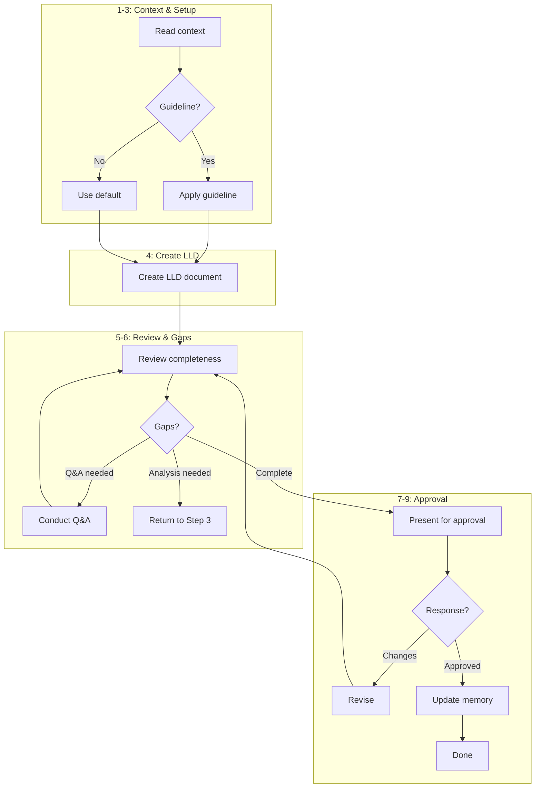

# Step: Create Low-Level Design

## Required Components

- [mandatory-logging.md](../_components/mandatory-logging.md) - Logging guidelines
- [qa-session.md](../_components/qa-session.md) - Q&A session workflow

## Description

Create a comprehensive low-level design (LLD) document that serves as the technical specification for implementing a user story. The step is guideline-driven - the actual LLD content and structure are defined by the team's guideline, with a default fallback structure available.

## Purpose & Usage

Use this step when you need to:
- Create the final LLD document after gathering information and analyzing the system
- Produce technical specifications that will guide implementation
- Document architecture, data flow, and technical decisions for user approval

**Output**: LLD document at `plans/{user-story-name}/lld.md`, memory update with approval status.

## Quick Reference

| Action | Tool |
|--------|------|
| Read context | `read_file` on memory.json |
| Check guideline | `read_file` on `~/.claude/agentic-processes/guidelines/planning/how-to-write-low-level-design.md` |
| Create LLD | `write` |
| Search patterns | `codebase_search` |

**Guideline**: `~/.claude/agentic-processes/guidelines/planning/how-to-write-low-level-design.md`

**Prerequisites**:
- User story context (from understand-context step)
- Gathered information (from gather-relevant-information step)
- System analysis report (from analyze-affected-system step)

## Flow

