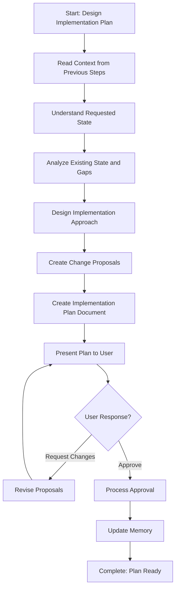

<!--
Step: Design Implementation Plan
Purpose: Design a comprehensive implementation plan for implementing or updating a concept (pattern, structure, standard, or approach) across non-code files. The plan includes understanding the requested state, designing how files should be modified or created, and creating detailed change proposals for both existing file modifications and new file creation.
-->

# Step: Design Implementation Plan

## Required Components

- [mandatory-logging.md](_components/mandatory-logging.md) - Logging guidelines

## Description

This step designs a comprehensive implementation plan for implementing or updating a concept across **non-code files** such as documentation, processes, AI agentic files, best practices, and configuration files.

The step takes context from previous steps (concept definition, existing state analysis, identified gaps) and creates a detailed implementation plan with specific change proposals. Each proposal includes detailed instructions for either modifying existing files or creating new files.

**Important**: This step is designed for concepts/patterns/standards applied to non-code files, NOT for code development. For code development tasks, use a code-focused planning step instead.

## Output

- **Implementation plan document** (`implementation-plan.md`) containing:
  - Requested state specification (how files should look after implementation)
  - Step-by-step implementation approach
  - Change proposals for:
    - Modifications to existing files (with detailed instructions)
    - Creation of new files (with content specifications)
  - Rationale for each change proposal
  - Verification approach (how to confirm implementation is complete)
- **Memory update**: Summary written to memory.md with plan document path, total change proposals, and plan summary

## Guidance

<!-- @include: _components/mandatory-logging.md -->

### Specific Actions

#### 1. Read Context from Previous Steps

- Read from `memory.md`:
  - Concept definition, characteristics, requirements, success criteria (from understanding step)
  - Findings report path, current state, existing implementations, gaps identified (from analysis step)
- Read from `process.md`:
  - `conceptDescription`: Description of the concept to implement
  - `requestedState`: (optional) How files should look after implementation
  - `verificationCriteria`: (optional) Criteria to verify successful implementation
- Read the findings report to understand current state

#### 2. Understand Requested State

- If `requestedState` parameter is provided:
  - Use it as the specification for how files should look after implementation
  - Clarify any ambiguities
- If `requestedState` is NOT provided:
  - Derive requested state from concept description and characteristics
  - Design how files should look to fully implement the concept
  - Consider examples and patterns from concept definition
- Document requested state specification clearly
- Ensure requested state addresses all gaps identified in findings

#### 3. Analyze Existing State and Gaps

- Review findings report from previous step
- Understand current implementation state (if any)
- Identify specific gaps that need to be addressed
- List files that need modification
- List files that need to be created
- Map gaps to change proposals needed

#### 4. Design Implementation Approach

- Break down implementation into logical steps
- Determine order of changes (dependencies, prerequisites)
- Identify which files to modify first
- Identify which files to create first
- Consider impact of changes on related files
- Design verification approach (how to confirm implementation is complete)

#### 5. Create Change Proposals

**For existing files that need modification:**
- Read the file to understand current content
- Identify specific changes needed
- Create detailed change proposal with:
  - **Change ID**: Unique identifier (e.g., `MOD-001`)
  - **File path**: Full path to the file
  - **Type**: `modification`
  - **Current state**: What exists now (relevant excerpt)
  - **Requested state**: What should exist
  - **Change description**: What needs to change
  - **Detailed instructions**: Step-by-step how to make the change
  - **Rationale**: Why this change is needed

**For new files that need creation:**
- Determine file path and name
- Design file content based on concept requirements
- Create detailed change proposal with:
  - **Change ID**: Unique identifier (e.g., `NEW-001`)
  - **File path**: Where to create the file
  - **Type**: `new_file`
  - **Content specification**: What should be in the file
  - **Content structure**: Organization of the file
  - **Rationale**: Why this file is needed

#### 6. Create Implementation Plan Document

Create `implementation-plan.md` with these sections:

```markdown
# Implementation Plan for {conceptName}

## Summary
- **Concept**: {name and description}
- **Current State**: {summary from findings}
- **Requested State**: {specification}
- **Total Files to Modify**: {count}
- **Total Files to Create**: {count}
- **Total Change Proposals**: {count}

## Requested State Specification
{Detailed description of how files should look after implementation}

## Implementation Approach
{Step-by-step approach, order of changes, dependencies}

## Change Proposals

### Modifications to Existing Files
{List of modification proposals with full details}

### New Files to Create
{List of new file proposals with full details}

## Verification Criteria
{How to verify implementation is complete}

## Approval
**Status**: Pending Approval
{Instructions for user on how to approve}
```

#### 7. Present Plan and Get Approval

- Present implementation-plan.md to user
- Explain approval options:
  - Approve all proposals
  - Approve specific proposals by Change ID
  - Request modifications to specific proposals
  - Request clarification
- Wait for user response
- **IMMEDIATELY log user interaction** before processing response

#### 8. Process Approval Response

- If user requests modifications:
  - Revise specific proposals
  - Update implementation-plan.md
  - Log revision in log.md
  - Return to step 7 (present again)
- If user approves:
  - Mark approved proposals in implementation-plan.md
  - Update memory.md with approval status and approved Change IDs
  - Log approval in log.md
  - Step complete - plan ready for next step

### Files/Folders

**Read:**
- `memory.md` - Previous step outputs (concept definition, findings)
- `process.md` - Process parameters (conceptDescription, requestedState, verificationCriteria)
- Findings report from previous step
- Target files that need modification

**Create:**
- `implementation-plan.md` - The implementation plan document

**Update:**
- `memory.md` - Plan summary and approval status
- `log.md` - Step actions and user interactions

### Tools

- `read_file` - Read context from memory, process, findings, and target files
- `write` - Create implementation-plan.md
- `search_replace` - Update memory.md and log.md
- `codebase_search` - Find related files if needed
- `grep` - Search for patterns in files

### Best Practices

- **Be specific**: Change proposals should be detailed enough for next step to apply without ambiguity
- **Consider dependencies**: Order changes to avoid breaking things
- **Think holistically**: Consider impact on related files
- **Provide rationale**: Explain why each change is needed
- **Keep proposals atomic**: Each proposal should be self-contained
- **Use consistent IDs**: Makes it easy for user to approve specific proposals

## Memory File Usage

**When to Use Memory:**
- Always use memory for this step - implementation plan is needed by next step

**Memory Usage for This Step:**
- **Read from**:
  - Previous concept understanding step - concept definition, characteristics, requirements, success criteria
  - Previous analysis step - findings report path, current state, existing implementations, gaps, files to create
  - process.md - conceptDescription, requestedState, verificationCriteria
- **Write to**: Current step section in memory.md
  - Information Produced:
    - Implementation plan document path (`implementation-plan.md`)
    - Requested state specification
    - Total change proposals (count of modifications and new files)
    - List of files to modify (file paths)
    - List of files to create (file paths)
    - Approval status (pending/approved)
    - List of approved Change IDs (if approved)
  - Decisions Made:
    - Requested state design (if not provided in parameters)
    - Implementation approach selected
    - Change proposal structure and organization
  - Files Modified/Created:
    - `implementation-plan.md`
    - `memory.md` (plan summary)
  - Notes:
    - Any assumptions made about requested state
    - Rationale for implementation approach
    - Dependencies between changes

## Flow



### Substeps

- [ ] **Substep 1**: Read context from memory.md (concept definition, findings, gaps)
- [ ] **Substep 2**: Read process parameters (conceptDescription, requestedState, verificationCriteria)
- [ ] **Substep 3**: Read findings report to understand current state
- [ ] **Substep 4**: Understand/derive requested state specification
- [ ] **Substep 5**: Analyze gaps and map to change proposals needed
- [ ] **Substep 6**: Design implementation approach (order, dependencies)
- [ ] **Substep 7**: Create change proposals for existing files (modifications)
- [ ] **Substep 8**: Create change proposals for new files (creation)
- [ ] **Substep 9**: Create implementation-plan.md document
- [ ] **Substep 10**: Present plan to user and explain approval options
- [ ] **Substep 11**: Process user response (approve/modify/clarify)
- [ ] **Substep 12**: Update memory.md with plan summary and approval status

## Examples

### Example 1: Documentation Standard Implementation

**Concept**: Consistent header structure across all markdown files

**Change Proposals Created**:
```markdown
### MOD-001: Update README.md
- **File**: docs/README.md
- **Type**: modification
- **Current state**: No metadata header
- **Requested state**: Add YAML front matter with title, description, last_updated
- **Instructions**: Add metadata block at line 1 before existing content
- **Rationale**: Required by documentation standard

### NEW-001: Create Documentation Template
- **File**: docs/templates/doc-template.md
- **Type**: new_file
- **Content specification**: Template with YAML front matter, standard sections
- **Rationale**: Provides consistent starting point for new docs
```

### Example 2: Process Template Structure

**Concept**: Consistent memory file section in all process templates

**Change Proposals Created**:
```markdown
### MOD-001: Update feature-development.md template
- **File**: .processes/templates/feature-development.md
- **Type**: modification
- **Current state**: Memory File section missing step breakdown
- **Requested state**: Add per-step memory guidance
- **Instructions**: Add bullet points listing what each step stores in memory
- **Rationale**: Helps users understand memory usage pattern
```

## Common Pitfalls

### 1. Vague Change Proposals
**Problem**: Proposals like "update the file to match the concept"
**Solution**: Be specific - include exact content to add/modify, line numbers if helpful

### 2. Missing Dependencies
**Problem**: Proposing changes that depend on other changes without noting the dependency
**Solution**: Always note dependencies in implementation approach section

### 3. Forgetting New Files
**Problem**: Only proposing modifications when new files are also needed
**Solution**: During gap analysis, explicitly consider if new files are required

### 4. Not Logging User Interactions
**Problem**: Processing user feedback without logging first
**Solution**: Always log user interaction BEFORE making any changes in response

### 5. Overly Complex Plans
**Problem**: Creating a plan so detailed it's hard to follow
**Solution**: Group related changes, use clear Change IDs, keep proposals atomic

### 6. Ignoring Existing State
**Problem**: Proposing changes without understanding current file content
**Solution**: Always read target files and note current state in proposals

