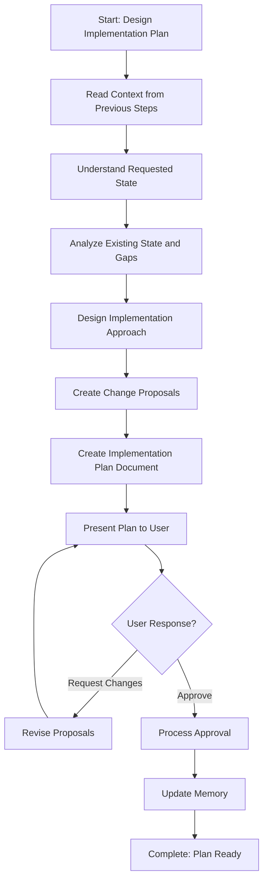

<!--
Step: Design Implementation Plan
Purpose: Design a comprehensive implementation plan for implementing or updating a concept across non-code files. Includes understanding requested state, designing file modifications/creations, and creating detailed change proposals.
-->

# Step: Design Implementation Plan

## Description

Design a comprehensive implementation plan for implementing or updating a concept across non-code files. Creates detailed change proposals for both existing file modifications and new file creation.

## Purpose & Usage

Use this step when you need to:
- Design an implementation plan for a concept/pattern/standard
- Create detailed change proposals for file modifications
- Specify new files to be created
- Get user approval before applying changes

**Output**: Implementation plan document (`implementation-plan.md`), memory update with approval status.

## Quick Reference

| Action | Tool |
|--------|------|
| Read context | `read_file` on memory.md, process.md |
| Read target files | `read_file` |
| Create plan document | `write` |
| Update memory | `search_replace` |

---

## Agent Layer

### Required Components

- [mandatory-logging.md](../_components/mandatory-logging.md) - Logging guidelines

### Output (Detailed)

- **Implementation plan document** (`implementation-plan.md`) containing:
  - Requested state specification (how files should look after implementation)
  - Step-by-step implementation approach
  - Change proposals for:
    - Modifications to existing files (with detailed instructions)
    - Creation of new files (with content specifications)
  - Rationale for each change proposal
  - Verification approach (how to confirm implementation is complete)
- **Memory update**: Summary written to memory.md with plan document path, total change proposals, and plan summary

### Guidance

<!-- @include: _components/mandatory-logging.md -->

**Specific Actions:**

1. **Read Context from Previous Steps**
   - Read from `memory.md`: Concept definition, findings, gaps
   - Read from `process.md`: conceptDescription, requestedState, verificationCriteria
   - Read the findings report to understand current state

2. **Understand Requested State**
   - If `requestedState` parameter provided: Use as specification
   - If NOT provided: Derive from concept description and characteristics
   - Document requested state specification clearly

3. **Analyze Existing State and Gaps**
   - Review findings report from previous step
   - Identify files that need modification vs. creation
   - Map gaps to change proposals needed

4. **Design Implementation Approach**
   - Break down into logical steps
   - Determine order of changes (dependencies)
   - Design verification approach

5. **Create Change Proposals**
   - For modifications: Change ID, file path, type, current/requested state, instructions, rationale
   - For new files: Change ID, file path, type, content specification, rationale

6. **Present Plan and Get Approval**
   - Present implementation-plan.md to user
   - Explain approval options
   - Wait for user response
   - Log user interaction before processing

**Files/Folders:**
- Read: `memory.md`, `process.md`, findings report, target files
- Create: `implementation-plan.md`
- Update: `memory.md`, `log.md`

**Tools:**
- `read_file` - Read context from memory, process, findings, target files
- `write` - Create implementation-plan.md
- `search_replace` - Update memory.md and log.md

**Best Practices:**
- Be specific: Change proposals should be detailed enough for next step to apply without ambiguity
- Consider dependencies: Order changes to avoid breaking things
- Provide rationale: Explain why each change is needed
- Keep proposals atomic: Each proposal should be self-contained
- Use consistent IDs: Makes it easy for user to approve specific proposals

### Memory File Usage

**When to Use Memory:**
- Always use memory for this step - implementation plan is needed by next step

**Memory Usage for This Step:**
- **Read from**:
  - Previous concept understanding step - concept definition, characteristics, requirements
  - Previous analysis step - findings report path, current state, gaps
  - process.md - conceptDescription, requestedState, verificationCriteria
- **Write to**: Current step section in memory.md
  - Information Produced:
    - Implementation plan document path
    - Requested state specification
    - Total change proposals (count)
    - List of files to modify/create
    - Approval status
    - List of approved Change IDs (if approved)

### Flow



### Substeps

- [ ] **Substep 1**: Read context from memory.md (concept definition, findings, gaps)
- [ ] **Substep 2**: Read process parameters (conceptDescription, requestedState, verificationCriteria)
- [ ] **Substep 3**: Read findings report to understand current state
- [ ] **Substep 4**: Understand/derive requested state specification
- [ ] **Substep 5**: Analyze gaps and map to change proposals needed
- [ ] **Substep 6**: Design implementation approach (order, dependencies)
- [ ] **Substep 7**: Create change proposals for existing files (modifications)
- [ ] **Substep 8**: Create change proposals for new files (creation)
- [ ] **Substep 9**: Create implementation-plan.md document
- [ ] **Substep 10**: Present plan to user and explain approval options
- [ ] **Substep 11**: Process user response (approve/modify/clarify)
- [ ] **Substep 12**: Update memory.md with plan summary and approval status

### Change Proposal Format

**For Modifications:**
```markdown
### MOD-001: Update {filename}
- **File**: path/to/file.md
- **Type**: modification
- **Current state**: What exists now
- **Requested state**: What should exist
- **Detailed instructions**: Step-by-step how to make the change
- **Rationale**: Why this change is needed
```

**For New Files:**
```markdown
### NEW-001: Create {filename}
- **File**: path/to/new-file.md
- **Type**: new_file
- **Content specification**: What should be in the file
- **Rationale**: Why this file is needed
```
