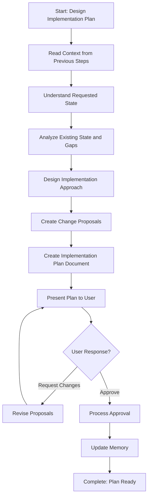

# Step: Design Implementation Plan

## Description

Design a comprehensive implementation plan for implementing or updating a concept across non-code files. Creates detailed change proposals for both existing file modifications and new file creation.

## Purpose & Usage

Use this step when you need to:
- Design an implementation plan for a concept/pattern/standard
- Create detailed change proposals for file modifications
- Specify new files to be created
- Get user approval before applying changes

**Output**: Implementation plan document (`implementation-plan.md`), memory update with approval status.

## Quick Reference

| Action | Tool |
|--------|------|
| Read context | `read_file` on memory.json, process.md |
| Read target files | `read_file` |
| Create plan document | `write` |
| Update memory | `search_replace` |

**Change Proposal Format:**
- Modifications: `MOD-XXX` with file path, current state, requested state, instructions, rationale
- New files: `NEW-XXX` with file path, content specification, rationale

## Flow

