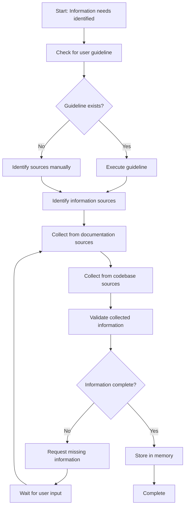

<!--
Step: Gather Relevant Information
Purpose: Collect relevant information from various sources using team's guideline-based approach
-->

# Step: Gather Relevant Information

## Required Components

- [mandatory-logging.md](../_components/mandatory-logging.md) - Logging guidelines

## Description

Collect relevant information from various sources (documentation, code patterns, specifications, SME input) using the team's configured guideline-based approach to support upcoming design, analysis, or implementation work.

## Purpose & Usage

**Purpose**: Gather all relevant information needed for downstream activities by systematically collecting from identified sources using team-defined methods.

**Use When**:
- Before creating a low-level design - gather existing patterns, related documentation, similar implementations
- Before implementing a feature - collect code examples, API specs, relevant conventions
- When analyzing a system - gather architecture docs, codebase patterns, constraints
- When preparing technical documentation - collect source materials, references

**Output**:
- Memory update with gathered information:
  - `sources` - List of sources consulted with their type
  - `documentation` - Relevant documentation found
  - `codePatterns` - Code patterns and examples identified
  - `specifications` - Specs and requirements collected
  - `additionalContext` - SME input or other contextual information

## Quick Reference

| Aspect | Details |
|--------|---------|
| Category | planning |
| Pattern | Guideline-based |
| Guideline | `~/.claude/agentic-processes/guidelines/planning/how-to-gather-relevant-information.md` |
| Fallback | Manual source identification and collection |
| Source Types | documentation, codePatterns, specifications, smeInput |

## Flow

### Substeps

- [ ] **Substep 1**: Check for user guideline - Look for `~/.claude/agentic-processes/guidelines/planning/how-to-gather-relevant-information.md`
- [ ] **Substep 2**: Identify information sources - Determine what sources to collect from based on guideline or context
- [ ] **Substep 3**: Collect from documentation sources - Gather relevant documentation, specs, architecture decisions
- [ ] **Substep 4**: Collect from codebase sources - Search for patterns, similar implementations, conventions
- [ ] **Substep 5**: Validate collected information - Ensure information is sufficient for the intended purpose
- [ ] **Substep 6**: Request missing information (conditional) - Ask user for any missing context or sources
- [ ] **Substep 7**: Store in memory - Save gathered information organized by source type to memory.json

