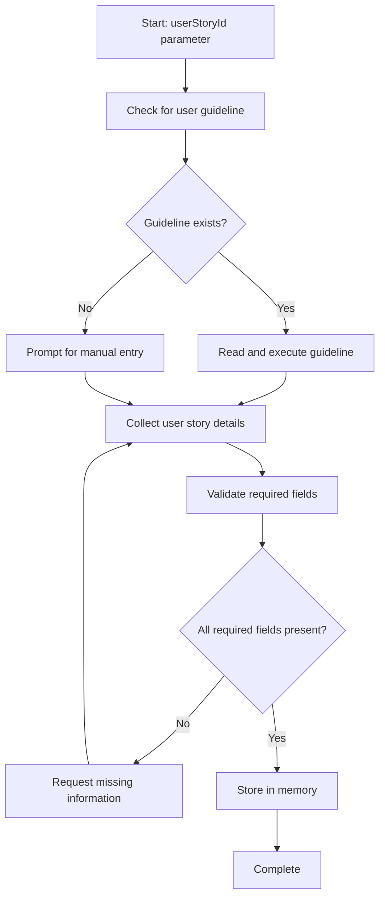

<!--
Step: Get User Story Parameters
Purpose: Collect user story details from userStoryId using team's guideline-based approach
-->

# Step: Get User Story Parameters

## Required Components

- [mandatory-logging.md](../_components/mandatory-logging.md) - Logging guidelines

## Description

Collect user story details (title, description, acceptance criteria) from a userStoryId using the team's configured guideline-based approach. This step supports various methods: Jira, Azure DevOps, GitHub, manual entry, or requirements documents.

## Purpose & Usage

**Purpose**: Retrieve complete user story information needed for downstream processes like low-level design, development, and test planning.

**Use When**:
- Beginning of LLD process when user story details need to be fetched
- Any process that requires retrieving user story information from a reference ID
- When kicking off development work that references an external user story

**Output**:
- Memory update with user story details:
  - `title` - User story title
  - `description` - Full description/as-a-user statement
  - `acceptanceCriteria` - List of acceptance criteria
  - `source` - Where the info came from
  - `additionalContext` - Extra context (optional)

## Quick Reference

| Aspect | Details |
|--------|---------|
| Category | planning |
| Pattern | Guideline-based |
| Guideline | `.user-processes/guidelines/planning/how-to-get-user-story-parameters.md` |
| Fallback | Manual entry via user prompt |
| Required Fields | title, description, acceptanceCriteria, source |

## Flow

### Substeps

- [ ] **Substep 1**: Check for user guideline - Look for `.user-processes/guidelines/planning/how-to-get-user-story-parameters.md`
- [ ] **Substep 2**: Execute guideline or request manual entry - Get user story details using available method
- [ ] **Substep 3**: Validate required fields - Ensure title, description, acceptanceCriteria, source are present
- [ ] **Substep 4**: Request missing information (conditional) - Ask for any missing required fields
- [ ] **Substep 5**: Store in memory - Save userStory object to memory.json

