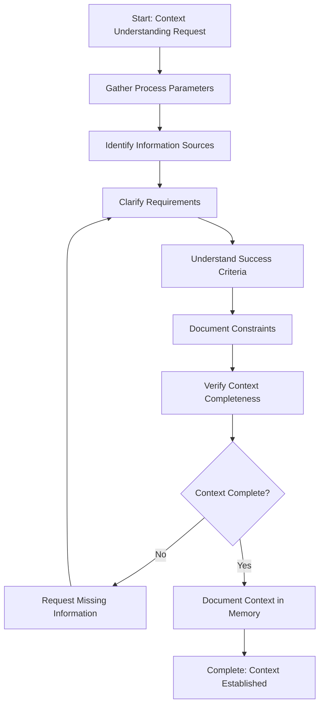

# Step: Understand Context

## Description

Fully understand the context, sources, and requirements for a task or process. This step establishes a clear foundation by gathering all necessary context information before proceeding with work.

## Purpose & Usage

Use this step when you need to:
- Start a new process and gather all necessary context
- Understand requirements, constraints, and success criteria
- Document parameters, sources, and decisions before proceeding

**Output**: Context documentation in memory.json with parameters, sources, requirements, success criteria, and constraints.

## Quick Reference

| Action | Tool |
|--------|------|
| Read process parameters | `read_file` on process.md |
| Find relevant files | `codebase_search`, `grep` |
| Explore directories | `list_dir` |
| Document context | Update memory.json |

## Flow

