# Process Step: Implement Service Layer

## Required Components

- [mandatory-logging.md](_components/mandatory-logging.md) - Logging guidelines
- [pre-implementation-patterns.md](_components/pre-implementation-patterns.md) - Pattern verification
- `.user-processes/guidelines/code-conventions.instructions.md` - Code conventions
- `.user-processes/guidelines/solid.instructions.md` - SOLID principles
- `.user-processes/guidelines/service-flow-pattern.instructions.md` - Service flow patterns

## Metadata
- **Step Name**: implement-service-layer
- **Prerequisites**: 
  - Service requirements and business operations defined
  - Domain models defined (if applicable)
  - Understanding of business rules and validation logic
- **Dependencies**: 
  - Repository layer (if data access needed)
  - External service integrations (if applicable)

## Context Parameters

When invoking this step, provide:

- `components` (required): List of service components to implement. Each component should specify:
  - `type`: Type of component (e.g., "Manager", "Calculator", "Checker", "Validator", "Publisher", "Subscriber", "Configuration", "Util")
  - `name`: Name of the component (e.g., "User", "Loan", "Eligibility", "PaymentProcessor")
  - `operations`: List of operations/methods to implement (if applicable)
  - `businessRules`: Specific business rules or logic to implement (if applicable)
  - `dependencies`: Required dependencies for this component (if applicable)

## Description

Implements business logic in the service layer following SOLID principles and clean architecture patterns. This step can implement one or multiple service components including managers, calculators, checkers, validators, publishers, subscribers, configurations, and utility services. These components implement the core business logic that orchestrates operations between repositories, external services, and applies domain rules.

## Guidance

<!-- @include: _components/mandatory-logging.md -->

<!-- @include: _components/pre-implementation-patterns.md -->

**Service-Specific Pattern Checks:**
- [ ] Search for similar managers/calculators/validators in `Service/` subdirectories
- [ ] Check naming conventions (e.g., `UserManager`, `LoanCalculator`, `EligibilityChecker`)
- [ ] Search `Contracts.Internal/Arguments/` for similar argument models
- [ ] Search `Contracts.Internal/Results/` for similar result models
- [ ] Review naming patterns for arguments (e.g., `Create*Arguments`, `Update*Arguments`)
- [ ] Check how existing services interact with repositories
- [ ] Review patterns for calling external APIs
- [ ] Check event publishing patterns (if using publishers)
- [ ] Review data mapping approaches (arguments → domain → results)
- [ ] Review `Contracts.Internal/Configuration/` for existing patterns
- [ ] Check DI registration patterns for service components
- [ ] Note reusable helper classes in `Service/Utils/`

## Flow Diagram

```mermaid
flowchart TD
    Start([Start: Implement Service Layer]) --> ParseComponents[Parse Components List]
    ParseComponents --> ComponentLoop{For Each Component}
    
    ComponentLoop -->|Next Component| IdentifyType[Identify Component Type & Location]
    
    IdentifyType --> CheckInterface{Needs Interface?}
    CheckInterface -->|Yes| CreateInterface[Create Interface<br/>in Interfaces/ folder]
    CheckInterface -->|No| CheckContracts{Needs Contracts?}
    CreateInterface --> CheckContracts
    
    CheckContracts -->|Yes| CreateContracts[Create Arguments & Results<br/>in Contracts.Internal/]
    CheckContracts -->|No| ImplementComponent[Implement Service Component]
    CreateContracts --> ImplementComponent
    
    ImplementComponent --> AddDetails[Add:<br/>- AutoCtor attribute<br/>- Dependencies injection<br/>- Business logic<br/>- Logging<br/>- Error handling<br/>- Async/await]
    
    AddDetails --> RegisterDI[Register in DI Container<br/>Specify lifetime]
    
    RegisterDI --> MoreComponents{More Components<br/>to Implement?}
    MoreComponents -->|Yes| ComponentLoop
    MoreComponents -->|No| VerifyAll[Verify All Implementations]
    
    VerifyAll --> CheckSOLID{SOLID Principles<br/>Followed?}
    CheckSOLID -->|No| FixIssues[Fix Architecture Issues]
    FixIssues --> CheckSOLID
    CheckSOLID -->|Yes| CheckLogging{Logging &<br/>Error Handling<br/>Complete?}
    
    CheckLogging -->|No| AddLogging[Add Missing Logging/Error Handling]
    AddLogging --> CheckLogging
    CheckLogging -->|Yes| CheckInteractions{Component<br/>Interactions<br/>Work?}
    
    CheckInteractions -->|No| FixInteractions[Fix Dependencies & Interactions]
    FixInteractions --> CheckInteractions
    CheckInteractions -->|Yes| CompileCheck{Code<br/>Compiles?}
    
    CompileCheck -->|No| FixErrors[Fix Compilation Errors]
    FixErrors --> CompileCheck
    CompileCheck -->|Yes| End([End: Service Layer Implemented])
    
    style Start fill:#e1f5e1
    style End fill:#e1f5e1
    style ImplementComponent fill:#fff4e1
    style CreateInterface fill:#e1f0ff
    style CreateContracts fill:#e1f0ff
    style VerifyAll fill:#ffe1f0
    style CheckSOLID fill:#fffacd
    style CheckLogging fill:#fffacd
    style CheckInteractions fill:#fffacd
    style CompileCheck fill:#fffacd
```

## Input Requirements

This step requires understanding of each component to implement:

1. **Component Specifications** (from `components` parameter)
   - Component type and purpose (from each component's `type` and `name`)
   - Operations/methods to implement (from each component's `operations` if applicable)
   - Input data needed (Arguments for managers, parameters for calculators/checkers)
   - Output data returned (Results for managers, return values for calculators/checkers)

2. **Business Logic** (from each component's `businessRules` or gathered during execution)
   - Validation rules to enforce
   - Calculation logic
   - Business constraints
   - Error conditions and handling
   - Event publishing/subscription logic (for publishers/subscribers)

3. **Dependencies** (from each component's `dependencies` or identified during execution)
   - Required repositories for data access
   - External service dependencies
   - Configuration requirements
   - Other service components (managers, calculators, checkers, validators)

## Output

Creates artifacts based on component type:

### For Managers (`Service/Managers/`)
- Interface: `Service/Managers/Interfaces/I{Name}Manager.cs`
- Implementation: `Service/Managers/{Name}Manager.cs`
- Arguments: `Contracts.Internal/Arguments/{Operation}Arguments.cs`
- Results: `Contracts.Internal/Results/{Operation}Result.cs`

### For Calculators (`Service/Calculators/`)
- Implementation: `Service/Calculators/{Name}Calculator.cs`
- Pure calculation functions with no side effects

### For Checkers (`Service/Checkers/`)
- Implementation: `Service/Checkers/{Name}Checker.cs`
- Business rule verification logic

### For Validators (`Service/Validators/`)
- Implementation: `Service/Validators/{Name}Validator.cs`
- Input validation logic

### For Publishers (`Service/Publishers/`)
- Implementation: `Service/Publishers/{Name}Publisher.cs`
- Event/message publishing logic

### For Subscribers (`Service/Subscribers/`)
- Implementation: `Service/Subscribers/{Name}Subscriber.cs`
- Event/message handling logic

### For Configurations (`Service/Configurations/`)
- Implementation: `Service/Configurations/{Name}Configuration.cs`
- Configuration and settings management

### For Utilities (`Service/Utils/`)
- Implementation: `Service/Utils/{Name}Util.cs`
- Utility and helper functions

### Common Characteristics
All implementations should include:
- Dependency injection via AutoCtor
- Async/await patterns for I/O operations
- Structured logging
- Error handling

## Reference Existing Patterns

**Existing Service Components**: `Service/`
- Study existing implementations in the appropriate subdirectory:
  - `Service/Managers/` - Business logic managers
  - `Service/Calculators/` - Calculation services
  - `Service/Checkers/` - Validation and verification services
  - `Service/Validators/` - Input validation
  - `Service/Publishers/` - Event publishers
  - `Service/Subscribers/` - Event subscribers
  - `Service/Configurations/` - Configuration services
  - `Service/Utils/` - Utility services
- Follow established patterns for:
  - Constructor injection
  - Method naming conventions
  - Error handling approaches
  - Logging patterns

**Reference Documentation**:
- `.user-processes/guidelines/solid.instructions.md` - SOLID principles
- `.user-processes/guidelines/code-conventions.instructions.md` - Coding standards
- `.user-processes/guidelines/service-flow-pattern.instructions.md` - Service flow

**Best Practices**: Project-specific best practices (add to your project's knowledge base)
- Service layer design patterns
- Business logic organization
- Testing strategies

## Execution Steps

**For each component in the `components` list:**

1. **Determine Component Type and Location**
   - [ ] Identify component type from component's `type` field
   - [ ] Determine target directory within `Service/` folder based on type

2. **Create Interface** (if applicable - mainly for Managers)
   - [ ] Define interface in appropriate location (e.g., `Service/Managers/Interfaces/`)
   - [ ] Specify method signatures and return types

3. **Create Contracts** (if applicable - mainly for Managers)
   - [ ] Create Arguments classes in `Contracts.Internal/Arguments/`
   - [ ] Create Results classes in `Contracts.Internal/Results/`
   - [ ] Use `required` and `init` properties for immutability

4. **Implement Service Component**
   - [ ] Create implementation file in appropriate `Service/` subdirectory
   - [ ] Add `[AutoConstruct]` attribute and make partial
   - [ ] Inject all dependencies via private readonly fields
   - [ ] Implement business logic based on component's `operations` and `businessRules`
   - [ ] Add structured logging
   - [ ] Implement error handling
   - [ ] Follow async/await patterns for I/O operations

5. **Register Service** (`WebApi/Registrars/` or startup)
   - [ ] Register with DI container
   - [ ] Specify appropriate lifetime (Scoped, Transient, Singleton)

**After all components are implemented:**

6. **Verify All Implementations**
   - [ ] Check SOLID principles followed for all components
   - [ ] Verify proper dependency injection
   - [ ] Ensure comprehensive logging
   - [ ] Validate error handling
   - [ ] Confirm async/await usage where needed
   - [ ] Test interactions between components if they depend on each other

## Success Criteria

- [ ] All service components implemented in correct directories based on their types
- [ ] Interfaces created for components that need them (e.g., Managers)
- [ ] Arguments/Results created following immutability patterns (where applicable)
- [ ] All implementations follow SOLID principles
- [ ] AutoCtor used for dependency injection in all components
- [ ] Async/await patterns used correctly for I/O operations
- [ ] Comprehensive structured logging added to all components
- [ ] Error handling implemented consistently across components
- [ ] All components registered with DI container with appropriate lifetimes
- [ ] Code compiles without errors
- [ ] Component interactions work correctly if they depend on each other
- [ ] Ready for unit testing (next step)

## Notes

- This step implements business logic across various service layer components
- Keep business logic independent of ASP.NET Core framework and UI concerns
- Design for testability - all dependencies should be mockable
- Follow existing project patterns for consistency
- Choose the correct component type for the task:
  - **Managers**: Orchestrate business operations, coordinate between repositories and services
  - **Calculators**: Pure calculation functions, no side effects
  - **Checkers**: Verify business rules and conditions
  - **Validators**: Validate input data
  - **Publishers**: Publish events/messages to message bus
  - **Subscribers**: Handle incoming events/messages
  - **Configurations**: Manage configuration and settings
  - **Utils**: Shared utility and helper functions
- If business rules or requirements are unclear, gather them interactively before implementation
- Context parameters guide the implementation but can be supplemented with additional questions if needed
