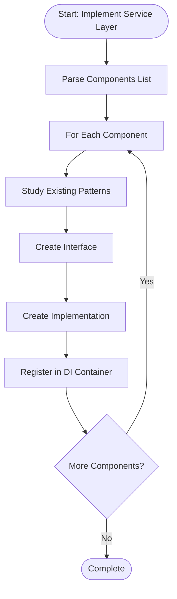

# Step: Implement Service Layer

## Description

Implement business logic in the service layer following SOLID principles and clean architecture patterns. Creates service components including managers, calculators, checkers, validators, publishers, subscribers, and utility services.

## Purpose & Usage

Use this step when you need to:
- Implement new service layer components with business logic
- Create managers, calculators, validators, or other service types
- Add business operations that orchestrate repositories and external services
- Implement domain rules and validation logic

**Output**: Service component files in `Service/` directory with interfaces and implementations.

## Quick Reference

| Component Type | Purpose | Example |
|----------------|---------|---------|
| Manager | Orchestrate business operations | `UserManager`, `LoanManager` |
| Calculator | Compute values/decisions | `InterestCalculator`, `EligibilityCalculator` |
| Checker | Validate conditions | `EligibilityChecker`, `LimitChecker` |
| Validator | Validate input data | `RequestValidator`, `DataValidator` |
| Publisher | Publish events | `NotificationPublisher` |
| Subscriber | Handle events | `PaymentSubscriber` |

## Flow

