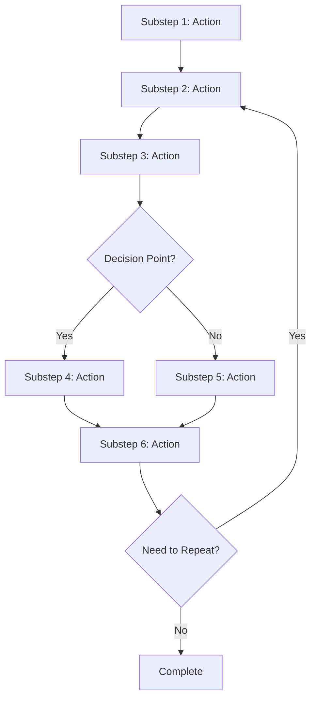

<!--
Step: [Step Name]
Purpose: [What this step accomplishes]
-->

# Step: [Step Name]

## Required Components

[List all framework components that must be read alongside this step. Agents must read these files when reading this step. Note: User guidelines should be specified in the step's JSON file in the guidance.userGuidelines field.]

- [mandatory-logging.md](_components/mandatory-logging.md) - Logging guidelines
- [pre-implementation-patterns.md](_components/pre-implementation-patterns.md) - Pattern verification (if step involves creating new implementations)

## Description

[Provide a clear, concise description of what needs to be done in this step. Be specific about the objective and scope.]

## Output

[Clearly define what this step produces. Examples:]
- Files created (with paths)
- Documentation written
- Decisions made
- Configurations updated
- Code implemented

## Guidance

[Provide detailed guidance on how to complete this step, including:]

<!-- @include: _components/mandatory-logging.md -->

**Specific Actions:**
- Action 1: [Detailed instruction]
- Action 2: [Detailed instruction]
- Action 3: [Detailed instruction]

**Files/Folders:**
- Work in: `[Path to directory or file]`
- Create: `[Path to new files]`
- Update: `[Path to existing files]`

**Code Patterns:**
- Follow [specific pattern or convention]
- Use [specific framework or library]
- Reference [existing examples in codebase]

**Tools:**
- Use [tool name] for [purpose]
- Run [command] to [accomplish task]

**Best Practices:**
- [Step-specific best practices]
- Reference relevant best practices files listed in Required Components section

## Memory File Usage

[Provide guidance on when and how this step should use the process memory file]

**When to Use Memory:**
- Use when this step produces information needed by later steps
- Use when this step needs information from previous steps
- Use when this step makes decisions that should be documented

**Memory Usage for This Step:**
- **Read from**: Step {N} section in memory.json - [What information to retrieve from which step]
- **Write to**: Current step section in memory.json - [What information to store]
  - Information Produced: [What was created/discovered]
  - Decisions Made: [Technical/architectural decisions]
  - Files Modified/Created: [List of files changed]
  - Notes: [Additional context or references to previous steps]

## Flow

### Substeps

- [ ] **Substep 1**: [Action description - be specific about what to do]
- [ ] **Substep 2**: [Action description - include any tools or commands]
- [ ] **Substep 3**: [Action description - mention expected results]
- [ ] **Substep 4**: [Action description] (conditional - only if decision point is Yes)
- [ ] **Substep 5**: [Action description] (conditional - only if decision point is No)
- [ ] **Substep 6**: [Action description - final verification or completion]

**Notes:**
- Substeps should be concrete, actionable tasks
- Mark conditional substeps clearly
- Include verification or validation substeps
- Order substeps sequentially (except for conditional branches)

---

## Template Instructions

When creating a new step from this template:

1. **Replace all placeholders** in brackets with actual content
2. **Customize the flow diagram** to match your step's substeps
3. **Add/remove substeps** as needed for your step
4. **Include examples** from real project scenarios (optional)
5. **Document common pitfalls** you've encountered (optional)
6. **Remove these instructions** before saving

**Remember:**
- Steps are self-contained and cannot reference other steps (but can reference shared components)
- Use shared components to reduce duplication (see `_components/` directory)
- Provide rich, detailed guidance since steps are reused
- Use project-specific paths, tools, and conventions
- Make substeps actionable and specific
- Examples and Common Pitfalls sections are optional - include them only if they add value
- List all required components in the "Required Components" section at the top