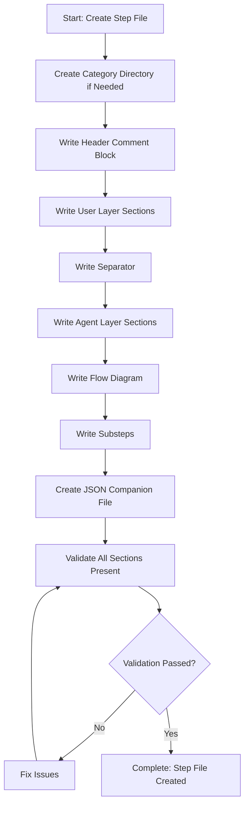

<!--
Step: Create Step File
Purpose: Create the step file with all sections including header comment, description, output, guidance, memory file usage, flow diagram, and substeps
-->

# Step: Create Step File

## Description

Create a step file in `.processes/steps/{{stepCategory}}/` with proper filename and all required sections. The step must be self-contained and follow the step-template.md structure.

## Purpose & Usage

Use this step when you need to:
- Create a new process step file
- Define a self-contained unit of work for the framework
- Establish standardized guidance for a specific action

**Output**: Complete step file with all sections, validation reports.

## Quick Reference

| Section | Required | Purpose |
|---------|----------|---------|
| Header comment | Yes | Step name and purpose |
| Description | Yes | What the step does |
| Purpose & Usage | Yes | When to use (User Layer) |
| Output | Yes | What the step produces |
| Guidance | Yes | Detailed instructions (Agent Layer) |
| Flow diagram | Yes | Visual workflow |
| Substeps | Yes | Actionable tasks |

---

## Agent Layer

### Required Components

- [mandatory-logging.md](../_components/mandatory-logging.md) - Logging guidelines

### Output (Detailed)

- Step file created: `.processes/steps/{{stepCategory}}/{{stepName}}.md`
- Header comment block with step name and purpose
- All required sections properly formatted
- JSON companion file with structured metadata
- Validation reports

### Guidance

<!-- @include: _components/mandatory-logging.md -->

**Specific Actions:**
- Create file: `.processes/steps/{{stepCategory}}/{{stepName}}.md` using kebab-case
- Create category directory if needed
- Write all required sections following the layered structure:
  - **User Layer**: Description, Purpose & Usage, Quick Reference
  - **Agent Layer**: All detailed guidance, flow, substeps

**Files/Folders:**
- Create: `.processes/steps/{{stepCategory}}/{{stepName}}.md`
- Create: `.processes/steps/{{stepCategory}}/{{stepName}}.json`
- Reference: `.processes/steps/step-template.md`

### Flow

### Substeps

- [ ] **Substep 1**: Create category directory if it doesn't exist
- [ ] **Substep 2**: Write header comment block with step name and purpose
- [ ] **Substep 3**: Write User Layer sections (Description, Purpose & Usage, Quick Reference)
- [ ] **Substep 4**: Write separator (`---`) and Agent Layer header
- [ ] **Substep 5**: Write Agent Layer sections (Required Components, Output, Guidance, Memory File Usage)
- [ ] **Substep 6**: Write Flow diagram with mermaid code
- [ ] **Substep 7**: Write Substeps section with actionable tasks
- [ ] **Substep 8**: Create JSON companion file with metadata
- [ ] **Substep 9**: Validate all sections are present and properly formatted

### Memory File Usage

**Write to**: Current step section in memory.md
- Information Produced: Step file path, validation results
- Files Modified/Created: Step file, JSON companion
