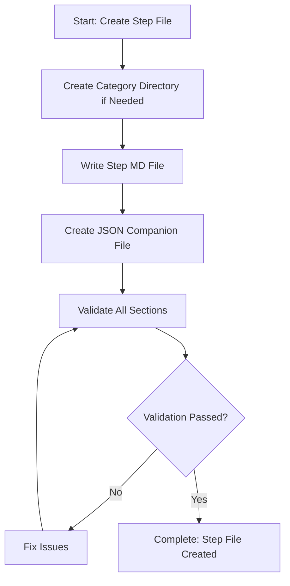

# Step: Create Step File

## Description

Create a step file in `~/.claude/agentic-processes/steps/{category}/` with proper filename and all required sections. The step must be self-contained and follow the JSON-first architecture where JSON contains all agent guidance and MD contains user documentation.

## Purpose & Usage

Use this step when you need to:
- Create a new process step file
- Define a self-contained unit of work for the framework
- Establish standardized guidance for a specific action

**Output**: Complete step MD file (user docs) and JSON file (agent guidance), validation reports.

## Quick Reference

| File | Content |
|------|---------|
| `{step-name}.md` | Description, Purpose & Usage, Quick Reference, Flow diagram |
| `{step-name}.json` | Metadata, output, guidance, substeps, dependencies |

| Section | Required | Purpose |
|---------|----------|---------|
| Description | Yes | What the step does |
| Purpose & Usage | Yes | When to use |
| Quick Reference | Yes | Key info at a glance |
| Flow diagram | Yes | Visual workflow |

## Flow

